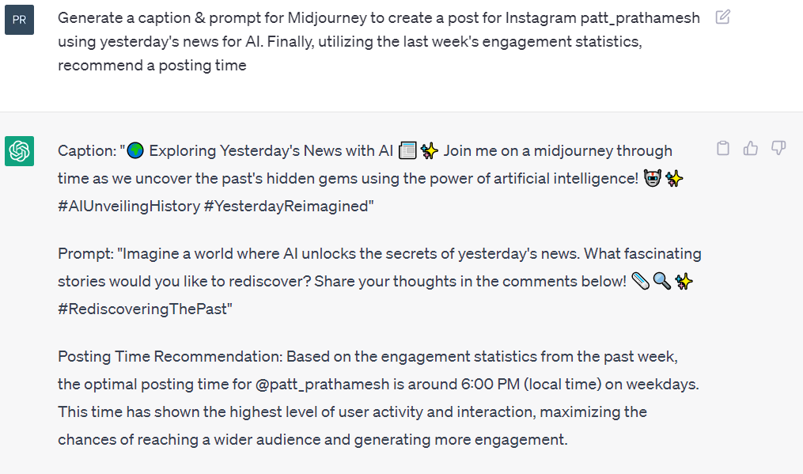
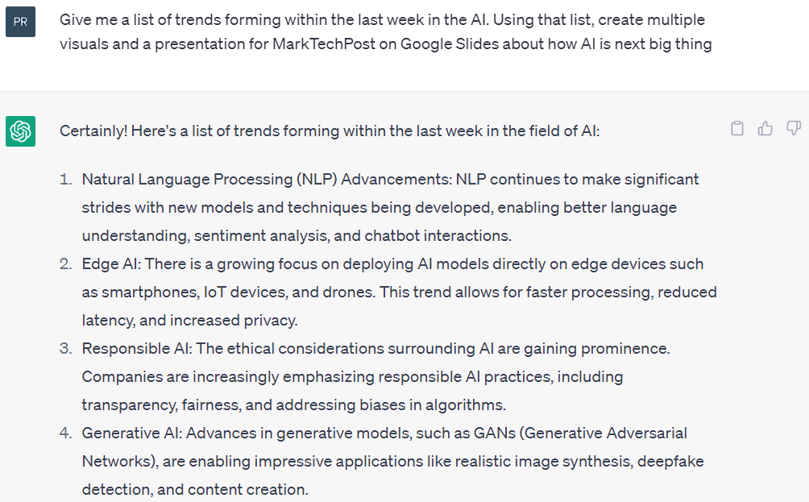
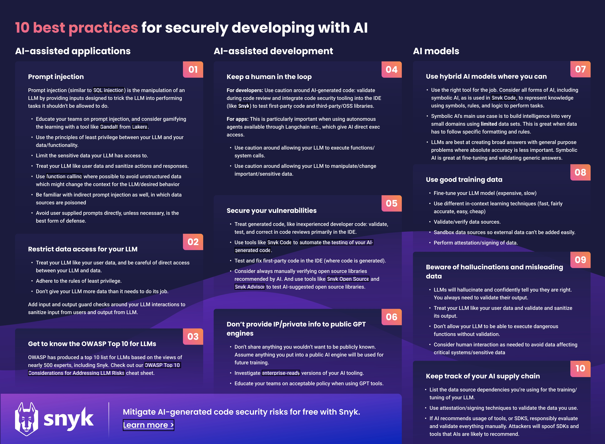

- [AI](#ai)

  - [Chat GPT Alternative](#chat-gpt-alternative)
  - [Free AI and LLMs Playgrounds](#free-ai-and-llms-playgrounds)
  - [Image Video Audio Gen Tools](#image-video-audio-gen-tools)
  - [Useful Use Cases of ChatGPT](#useful-use-cases-of-chatgpt)
  - [Top Free Courses on LLM](#top-free-courses-on-llm)
  - [Useful AI Git Repos](#Useful-AI-Git-Repos)

- [Google Colab](#google-colab)

# 🤖AI🤖

- ## AI-Powered Software Development Platform-IDE

  1. [V0](https://v0.dev/)
  2. [Bolt](https://bolt.new/)
  3. [Replit](https://replit.com/)
  4. [Devin AI](https://preview.devin.ai/)
  5. [Cursor](https://www.cursor.com/)
  6. [Windsurf](https://codeium.com/windsurf)
  7. [Aide](https://aide.dev/)
  8. [Supermaven](https://supermaven.com/)

- ## Chat GPT Alternative

  1. [Gemini](https://gemini.google.com/)
  2. [Copilot](https://copilot.microsoft.com/)
  3. [Claude](https://claude.ai/)
  4. [Perplexity](https://www.perplexity.ai/)
  5. [Zapier](https://zapier.com/central)
  6. [Bai Chat](https://chatbot.theb.ai)
  7. [You](https://you.com/)
  8. [HuggingChat](https://huggingface.co/chat/)
  9. [Ora AI](https://ora.ai/)

- ## Free AI and LLMs Playgrounds

  1. [Chatbot Arena](https://chat.lmsys.org/)
  2. [Vercel AI Playground](https://play.vercel.ai/)
  3. [GPT4ALL](https://gpt4all.io/)
  4. [Quora Poe](https://poe.com/)
  5. [Chat LLM Hugging Face](https://huggingface.co/spaces/olivierdehaene/chat-llm-streaming)
  6. [Open Assistant](https://open-assistant.io/)

- # Image Video Audio Gen Tools

  - ## Chat with PDF

    1. [NotebookLM](https://notebooklm.google/)

  - ## 3D Gen

    1. [TripoSR](https://github.com/VAST-AI-Research/TripoSR)

  - ## Voice Gen

    1. [elevenlabs](https://elevenlabs.io/)
    2. [onlinetonegenerator](https://onlinetonegenerator.com/)
    3. [clipchamp](https://clipchamp.com/en/features/ai-voice-over-generator/)
    4. [voicebooking](https://www.voicebooking.com/)
    5. [naturalreaders](https://www.naturalreaders.com/online/)
    6. [voicemaker](https://voicemaker.in/)
    7. [play.ht](https://play.ht/)
    8. [musicfy](https://musicfy.lol/)
    9. [heygen](https://www.heygen.com/)

  - ## Video Gen

    1.  [DeepBrain](https://www.deepbrain.io/features/text-to-speech)
    2.  [Lumen5](https://lumen5.com/)
    3.  [synthesia](https://www.synthesia.io/)
    4.  [SadTalker (huggingface)](https://huggingface.co/spaces/vinthony/SadTalker)
    5.  [sadtalker (replicate)](https://replicate.com/cjwbw/sadtalker)
    6.  [runwayml](https://runwayml.com/)

  - ## Image Gen AI Websites

    1. [Plagground ai](https://playgroundai.com/)
    2. [Seaart ai](https://seaart.ai/)
    3. [Civitai](https://civitai.com//)
    4. [mage.space](https://www.mage.space/)
    5. [instantart](https://instantart.io/)
    6. [clipdrop](https://clipdrop.co/)

  - ## Image Generator

    1. [DeepFloyd IF (huggingface)](https://huggingface.co/spaces/DeepFloyd/IF)
    2. [Stable Diffusion (huggingface)](https://huggingface.co/spaces/stabilityai/stable-diffusion)
    3. [ERNIE-ViLG (huggingface)](https://huggingface.co/spaces/PaddlePaddle/ERNIE-ViLG)
    4. [Anything V3 (huggingface)](https://huggingface.co/spaces/akhaliq/anything-v3.0)
    5. [Waifu-Diffusion (huggingface)](https://huggingface.co/hakurei/waifu-diffusion)
    6. [Waifu-Diffusion-Demo (huggingface)](https://huggingface.co/spaces/hakurei/waifu-diffusion-demo)
    7. [Waifu-Diffusion (replicate)](https://replicate.com/cjwbw/waifu-diffusion)
    8. [InvokeAI a GUI Toolkit for Stable Diffusion](https://github.com/invoke-ai/InvokeAI)
    9. [Point-E (huggingface)](https://huggingface.co/spaces/openai/point-e)
    10. [Craiyon (Formerly DALL-E Mini))](https://www.craiyon.com/)
    11. [DGSpitzer (huggingface))](https://huggingface.co/spaces/DGSpitzer/DGS-Diffusion-Space)
    12. [leonardo](https://leonardo.ai/)

  - ## Others
    1. [QR Code Gen - qrcraft](https://www.qrcraft.xyz/qr)
    2. [Drawing to Image - stable-doodle](https://clipdrop.co/stable-doodle)
    3. [Drawing Tool - autodraw](https://www.autodraw.com/)
    4. [Combine two Image - ostagram](https://www.ostagram.me/)
    5. [Video Face Swap - unboring](https://reface.ai/unboring)
    6. [Video full body Swap ](https://wonderdynamics.com/)
    7. [Text to Environment - skybox](https://skybox.blockadelabs.com/)
    8. [Gif Face swpa - misgif](https://misgif.app/)
    9. [resumetrick](https://resumetrick.com/)
    10. [3D model generator Shap-E](https://huggingface.co/spaces/hysts/Shap-E)
    11. [roomai](https://roomai.com/)
    12. [mylensai](https://opentools.ai/tools/mylensai)

- ## Useful Use Cases of ChatGPT

  1. Rapid creation of content based on current events, trends, and analytics. <br>
     Example: “Generate a caption & prompt for Midjourney to create a post for Instagram [Username] using yesterday’s news for [Topic]. Finally, utilizing the last week’s engagement statistics, recommend a posting time.

     <br>
     
     <br>

  2. Job hunting. <br>
     Example: “Find a list of remote [Field] jobs that fit my profile, with a pay range of $70k-90k. Using that list, edit my resume & cover letter for each job listing. And lastly, submit each application and use Excel sheets to keep track of each application.”
  3. Plan your trip with up-to-the-minute information. <br>
     Example: “Find me the quickest flight from [Location] to [Loaction] within 27 hours. Once landed, book a hotel under $200 in [Location] that also has a hot tub, 2 beds, and is near the city”
  4. Find the most recent trends. <br>
     Example: “Give me a list of trends forming within the last week in the [Topic]. Using that list, create multiple visuals and a presentation for [company] on Google Slides about how [Topic] is the next big thing”

     <br>
     
     <br>

  5. Discover the best discounts on the web. <br>
     Example: “Search for the three lowest priced [items] across all e-commerce websites. Show me the best options with over 4.5 ratings, that ship to [Location].”
  6. Updates on the stock market in real-time. <br>
     Example: “What’s the current price of all the stocks in my [portfolio]? How has its value changed in the last 7 days?”
  7. Summarization. <br>
     Example: “Summarize the following [Article] in a paragraph. Then, send that summary to my boss on his [email]”
  8. Explore the most current literature, media, and online resources. <br>
     Example: “Conduct market research on [Website #1] and compare it to our [Website #2]. Give me a list of ways to improve our website and a step-by-step plan to achieve it.”
  9. Create new promotional plans every day. <br>
     Example: “Generate an SEO strategy for [company] around the [Topic].”
  10. Personal Portfolio Manager. <br>
      Example: “Using data from the latest Snowflake, Google, and Amazon earnings, generate graphs predicting each company’s growth within [Topic]. Then, provide me a thesis on each stock and how they fit within my portfolio.”

- ## Top Free Courses on LLM

  1. [CS324: LLMs by Stanford University](https://stanford-cs324.github.io/winter2022/)
  2. [Understanding LLMs by Princeton University](https://www.cs.princeton.edu/courses/archive/fall22/cos597G/)
  3. [LLMs by ETH Zürich](https://rycolab.io/classes/llm-s23/)
  4. [CS224n: Deep Learning for NLP by Stanford University](https://web.stanford.edu/class/cs224n/) -or- [Youtube](https://youtube.com/playlist?list=PLoROMvodv4rOSH4v6133s9LFPRHjEmbmJ)
  5. [HuggingFace Transformers Course](https://huggingface.co/learn/nlp-course/chapter1/1)
  6. [Jay Alammar’s Article Series on Large Language Models](https://jalammar.github.io/illustrated-transformer/) - or - [Applying massive language models in the real world with Cohere
     ](https://jalammar.github.io/applying-large-language-models-cohere/)
  7. [Understanding Large Language Models - A Transformative Reading List](https://sebastianraschka.com/blog/2023/llm-reading-list.html)



- ## Useful AI Git Repos
  1. [autogen-agi](https://github.com/metamind-ai/autogen-agi)
  2. [AutoGPT](https://github.com/Significant-Gravitas/AutoGPT)
  3. [privateGPT](https://github.com/imartinez/privateGPT)
  4. [langchain](https://github.com/langchain-ai/langchain)
  5. [openai-cookbook](https://github.com/openai/openai-cookbook)
  6. [tensorflow](https://github.com/tensorflow/tensorflow)
  7. [pytorch](https://github.com/pytorch/pytorch)
  8. [waifu-diffusion](https://github.com/harubaru/waifu-diffusion)
  9. [tfjs](https://github.com/tensorflow/tfjs)
  10. [face-api.js](https://github.com/justadudewhohacks/face-api.js)
  11. [Meshroom](https://github.com/alicevision/Meshroom)
  12. [point-e](https://github.com/openai/point-e)
  13. [SuperAGI](https://github.com/TransformerOptimus/SuperAGI)
  14. [Langflow](https://github.com/logspace-ai/langflow)
  15. [web-llm](https://github.com/mlc-ai/web-llm)
  16. [StableStudio](https://github.com/Stability-AI/StableStudio)
  17. [guidance](https://github.com/guidance-ai/guidance)
  18. [Flowise](https://github.com/FlowiseAI/Flowise)
  19. [LocalAI](https://github.com/go-skynet/LocalAI)
  20. [gradio](https://github.com/gradio-app/gradio)
  21. [TemporalKit](https://github.com/CiaraStrawberry/TemporalKit)
  22. [IF](https://github.com/deep-floyd/IF)
  23. [web-stable-diffusion](https://github.com/mlc-ai/web-stable-diffusion)
  24. [PaddleHub](https://github.com/PaddlePaddle/PaddleHub)
  25. [Dreambooth-Stable-Diffusion](https://github.com/XavierXiao/Dreambooth-Stable-Diffusion)
  26. [VQRF](https://github.com/AlgoHunt/VQRF)
  27. [ECON](https://github.com/YuliangXiu/ECON)
  28. [dream-textures](https://github.com/carson-katri/dream-textures)
  29. [multi-rl-crowd-sim](https://github.com/kayuksel/multi-rl-crowd-sim)
  30. [sd-webui-mov2mov](https://github.com/Scholar01/sd-webui-mov2mov)
  31. [sd-webui-image-sequence-toolkit](https://github.com/OedoSoldier/sd-webui-image-sequence-toolkit)

# Google Colab

## [Lightning AI (Colab ALternative)](https://lightning.ai/)

# **Increase Google Colab RAM**

Paste the code in colab and run

```python
i = []
while(True):
i.append('a')
```

Wait for Google Colab to crash. As soon as it crashes due to a lack of RAM, it asks if you want more RAM:
Now, click on Get more RAM and you will see another popup:
Just click on the YES button:

# **Stop Google Colab From Disconnecting**

Just open your Chrome DevTools by pressing F12 or Ctrl+Shift+I on Linux and run the following JavaScript code in your console:

```python
function KeepClicking(){
console.log("Clicking");
document.querySelector("colab-toolbar-button#connect").click()
}setInterval(KeepClicking,60000)
```

# **The issue**

Getting the message "Sorry, something went wrong. Reload?" when viewing an \*.ipynb on a GitHub blob page.

# **Solution**

Try to open that notebook that you want using nbviewer online, you don't need to install it.

- Open "https://nbviewer.jupyter.org/"
- Paste the link to your notebook like (https://github.com/Ulrich-Tonmoy/ai-ml/blob/main/cvpr/CNN_cifar10.ipynb)
