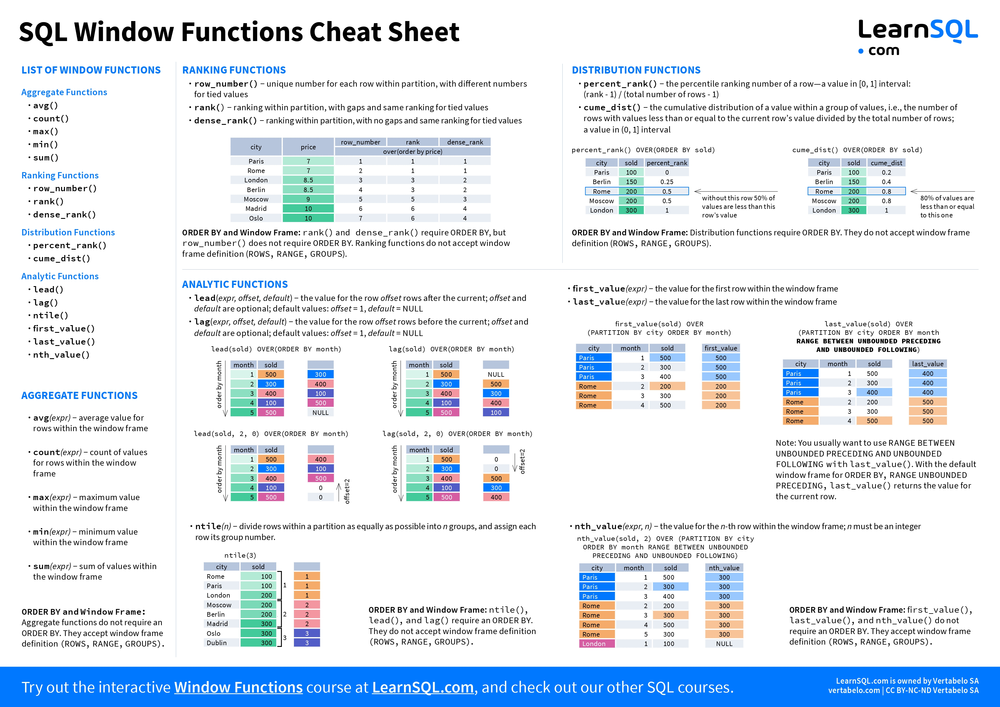
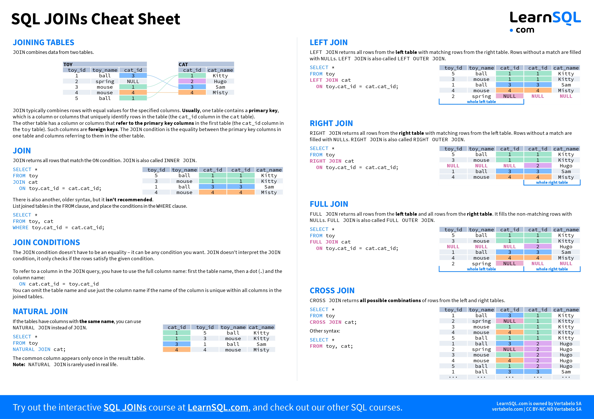
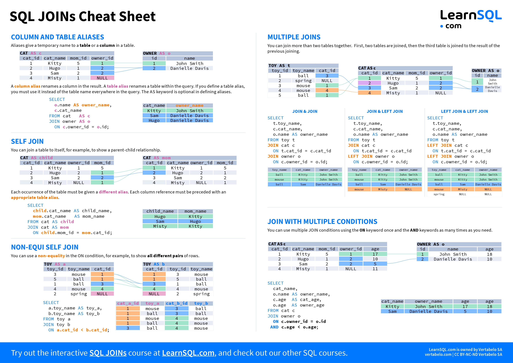

# **Backend**

- [ASP.NET](#aspnet)
- [MongoDb](#mongodb)
- [SQL](#sql)

# ASP.NET

- [C#](#csharp)
- [Entity Framework](#entity-framework)
- [Configuration](#configuration)
- [Library List](#library-list)
- [Links](#links)

## CSharp

### Polymorphism

- **Method Overriding:**
  Method overriding allows a derived class with `override` to provide a specific implementation of a method that is already defined in its base class with `virtual`. This enables you to invoke the method on objects of the derived class through a reference to the base class, and the overridden method will be executed based on the actual type of the object at runtime.

  **Preventing Derived class from overriding virtual members**
  For example, if class X has the virtual method "A," class Y is derived from X, and class Z "s "is derived from Y, class Z inherits the virtual method "A" and overrides it with `sealed`.

- **Method Overloading:**
  Method overloading allows you to define multiple methods with the same name but with different parameter lists. This enables you to provide different implementations of a method based on the number or types of parameters passed to it.

### Encapsulation

- **Access Modifiers:**

  - `public:` The member is accessible from any code in the same assembly or referencing assembly.
  - `private:` The member is accessible only within the same class or struct.
  - `protected:` The member is accessible within the same class or subclass (derived class).
  - `internal:` The member is accessible within the same assembly.
  - `protected internal:` The member is accessible within the same assembly or from within a derived class located in any assembly.

### Class types

- **Abstract Class:** An abstract class is designed to be a base class for other classes. It cannot be instantiated on its own (i.e. that cannot create an object). It allows you to define common functionality in the base class that can be shared by its derived classes. Can have none abstract in the body.
- **Static Class:** Can not create object of static class. In this type of class all methods, variables etc should be static. Static class can be access globally. Use for any Math operations, file manipulation, string manipulation, Configuration etc.
- **Interface:** An interface in C# is a contract that defines a set of method and property signatures. It outlines a common set of behaviors that classes must implement, promoting code consistency, polymorphism, and flexibility in software design.

### Abstract Class vs Interface

Abstract classes can contain abstract methods, which are methods without implementation also contain non-abstract methods. Abstract methods must be implemented in any non-abstract derived class. Non-abstract methods can have implementations and will be inherited by derived classes.

An interface in is a contract that defines a set of methods, properties, and events that a class must implement. Interfaces are similar to abstract classes in that they cannot be directly instantiated. They are used to define a behavior that can be implemented by multiple unrelated classes.

- Abstract classes can contain implemented methods, while interfaces only contain method signatures.
- Classes can implement multiple interfaces, but they can inherit from only one abstract class.
- Abstract classes can have constructors, while interfaces cannot.
- Abstract classes can have fields and properties, while interfaces can only have properties.
- Abstract classes are typically used for creating a base class for other classes to inherit from, while interfaces are used for defining a contract that classes must implement.

## Entity Framework

### EF Core ALL Relationships

- 1:1

  Lets say we have two Model Character and Weapon. A Character can only equip one weapon and one weapon can only be equipped by a Character. So, it's a one-to-one relationship.

  Both Model will have references to each other but the one that can't exist without the other Model will have Id references of the other Model.

  Here a Character can exist without a Weapon but the Weapon only exist because theres a Character to equip it so, weapon have one more variable CharacterId.

  If it was other way then there would be one more variable in Character Model as WeaponId and CharacterId from weapons Model will be removed.

  ```cs
  // Character can exist without a weapon
  public class Character
  {
      public Guid Id { get; set; }
      public Weapon Weapon { get; set; }
  }

  // weapon cant exist without a character
  public class Weapon
  {
      public Guid Id { get; set; }
      public Character Character { get; set; }
      public Guid CharacterId { get; set; }
  }
  ```

- 1:n

  Lets say we have two Model User and Character. A User can have many Characters but a Character can only have one User. So, it's a one-to-many relationship.

  Since it's a one-to-many relationship then User will have list reference of Character
  and Character will have only one User reference and UserId.

  ```cs
  // 1 user can have many characters
  public class User
  {
      public Guid Id { get; set; }
      List<Character> Characters { get; set; }
  }

  // character has only one user
  public class Character
  {
      public Guid Id { get; set; }
      public User User { get; set; }
      public Guid UserId { get; set; }
  }
  ```

- n:n

  Lets say we have two Model Character and Skill. A Character can have many Skills and a Skill can have be used by many Characters. So, it's a many-to-many relationship. So both Model will have list references of each other.

  ```cs
  public class Character
  {
      public Guid Id { get; set; }
      public List<Skill> Skills { get; set; }
  }

  public class Skill
  {
      public Guid Id { get; set; }
      public List<Character> Characters { get; set; }
  }
  ```

## Configuration

### Rate Limiter

```cs
// program.cs
builder.Services
    .AddRateLimiter(o =>
    o.AddFixedWindowLimiter(policyName: "fixed",
    options =>
    {
        options.PermitLimit = 10;
        options.Window = TimeSpan.FromSeconds(5);
        options.QueueLimit = 2;
    }));

app.UseRateLimiter();

// WeatherController.cs
[EnableRateLimiting("fixed")]
public class WeatherController: Controller
{
    // HTTP Methods
}
```

## Library List

- [uno](https://github.com/unoplatform/uno)
- [QuestPDF](https://github.com/QuestPDF/QuestPDF)
- [ShareX](https://github.com/ShareX/ShareX)
- [OpenRA](https://github.com/OpenRA/OpenRA)
- [QRCoder](https://github.com/codebude/QRCoder)
- [Windows-Auto-Night-Mode](https://github.com/AutoDarkMode/Windows-Auto-Night-Mode)
- [Ryujinx](https://github.com/Ryujinx/Ryujinx)

## Links

- ### Tools

  - [.NET language playground](https://sharplab.io/) - [SharpLab (Source)](https://github.com/ashmind/SharpLab)
  - [.NET Source Browser](https://source.dot.net/)

- ### Learning
  - [Code Maze](https://code-maze.com/)
  - [Dot Net Tutorials](https://dotnettutorials.net/)
  - [I❤️.NET](https://ilovedotnet.org/)
  - [Milan Jovanović](https://www.youtube.com/@MilanJovanovicTech/videos)
  - [Nick Chapsas](https://www.youtube.com/@nickchapsas/videos)
  - [ Patrick God](https://www.youtube.com/@PatrickGod/videos)

# MongoDb

#### Install

    $ npm i mongoose

#### Connect

```js
import mongoose from "mongoose";

const connectionString = "string from mongodb atlas";

mongoose.connect(connectionString, {
  useNewUrlParser: true,
  useCreateIndex: true,
  useFindAndModify: false,
  useUnifiedTopology: true,
});
```

#### Defining a schema

```js
const userSchema = new mongoose.Schema({
  fullName: {
    type: String,
    maxlength: 20,
    required: [true, "Name cant be Empty"],
  },
  phone: Number,
  verified: { type: Boolean, default: false },
});
```

##### SchemaTypes

- String
- Number
- Date
- Buffer
- Boolean
- Mixed
- ObjectId
- Array

For more
[SchemaTypes](http://mongoosejs.com/docs/schematypes.html)

#### Query

[all query](https://mongoosejs.com/docs/api/query.html)

A model is a constructor compiled from a schema. Model instances represent a collection of documents.

##### Create a model

```js
const User = mongoose.model("User", userSchema);

const u = User.create({ fullName: "Name", phone: 0123456789, verified: true });

const u = User.insert({ fullName: "Name", phone: 0123456789, verified: true });
```

##### $find all

```js
User.find({});
```

##### $find by name

```js
User.find({ fullName: "Name" });
```

##### $find by multiple values

```js
User.find({ fullName: "Name", id: "123" });
```

##### $find one by id

```js
User.findOne({ _id: id });
```

##### $update one by id

```js
User.findOneAndUpdate({ _id: id }, updateData, {
  new: true,
  runValidators: true,
  overwrite: true, // it will remove all the old data without default values and add the new data under the id
});
```

##### $delete one by id

```js
User.findOneAndDelete({ _id: id });
```

##### $delete one by id

```js
User.findByIdAndRemove(id);
```

# SQL







