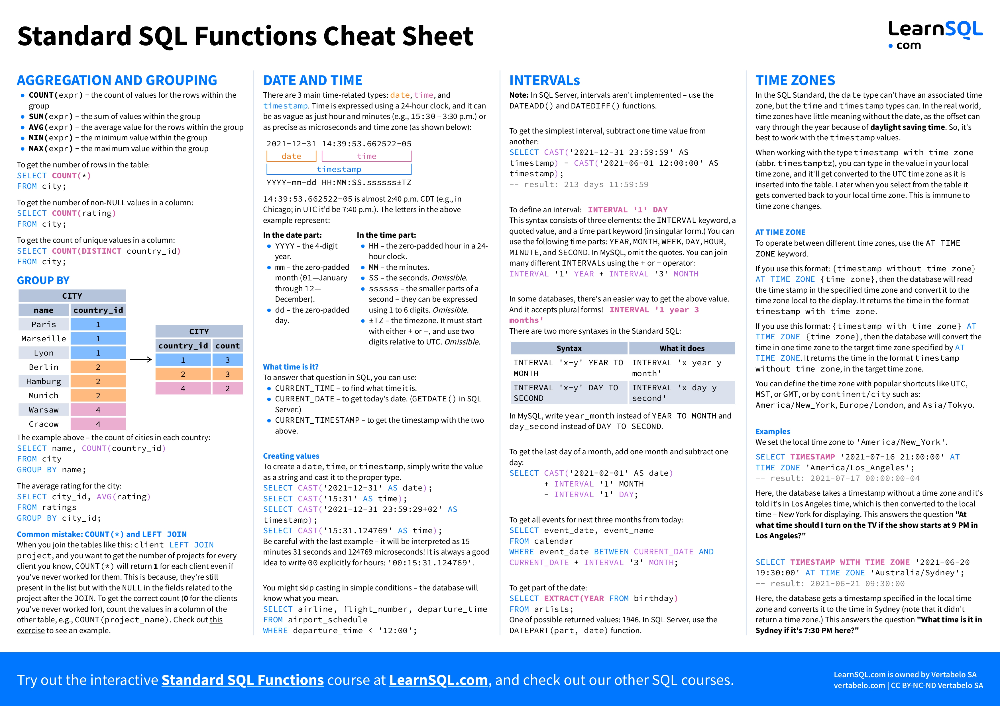

# MongoDb & SQL

- [MongoDb](#mongodb)
- [SQL](#sql)

# MongoDb

#### Install

    $ npm i mongoose

#### Connect

```js
import mongoose from "mongoose";

const connectionString = "string from mongodb atlas";

mongoose.connect(connectionString, {
  useNewUrlParser: true,
  useCreateIndex: true,
  useFindAndModify: false,
  useUnifiedTopology: true,
});
```

#### Defining a schema

```js
const userSchema = new mongoose.Schema({
  fullName: {
    type: String,
    maxlength: 20,
    required: [true, "Name cant be Empty"],
  },
  phone: Number,
  verified: { type: Boolean, default: false },
});
```

##### SchemaTypes

- String
- Number
- Date
- Buffer
- Boolean
- Mixed
- ObjectId
- Array

For more
[SchemaTypes](http://mongoosejs.com/docs/schematypes.html)

#### Query

[all query](https://mongoosejs.com/docs/api/query.html)

A model is a constructor compiled from a schema. Model instances represent a collection of documents.

##### Create a model

```js
const User = mongoose.model("User", userSchema);

const u = User.create({ fullName: "Name", phone: 0123456789, verified: true });

const u = User.insert({ fullName: "Name", phone: 0123456789, verified: true });
```

##### $find all

```js
User.find({});
```

##### $find by name

```js
User.find({ fullName: "Name" });
```

##### $find by multiple values

```js
User.find({ fullName: "Name", id: "123" });
```

##### $find one by id

```js
User.findOne({ _id: id });
```

##### $update one by id

```js
User.findOneAndUpdate({ _id: id }, updateData, {
  new: true,
  runValidators: true,
  overwrite: true, // it will remove all the old data without default values and add the new data under the id
});
```

##### $delete one by id

```js
User.findOneAndDelete({ _id: id });
```

##### $delete one by id

```js
User.findByIdAndRemove(id);
```

# SQL



