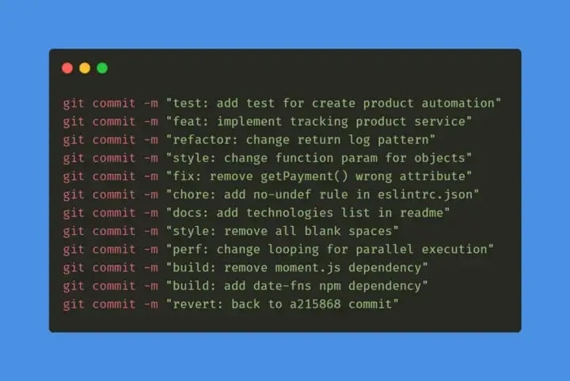
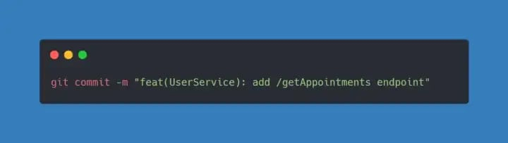
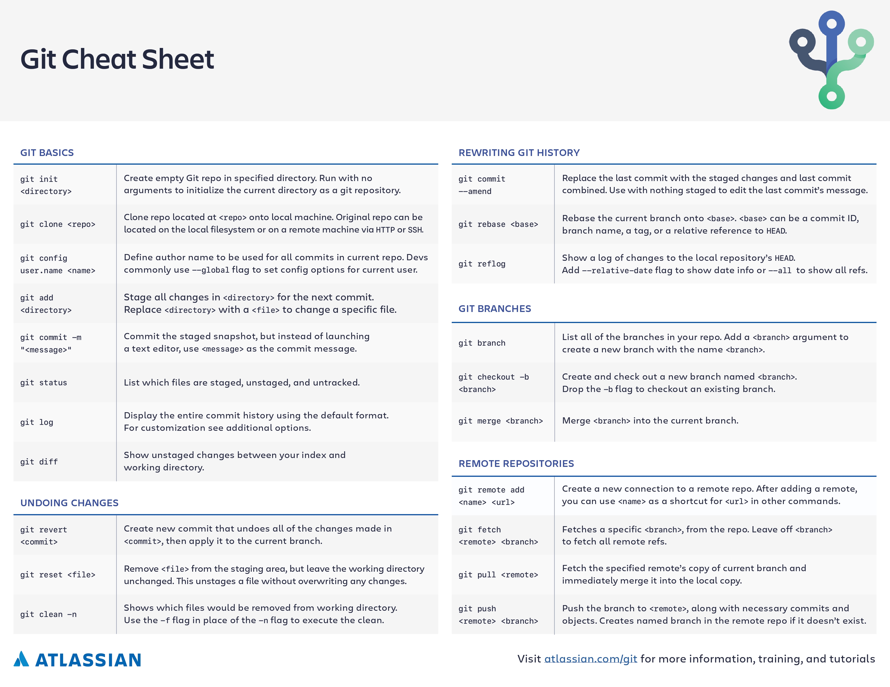
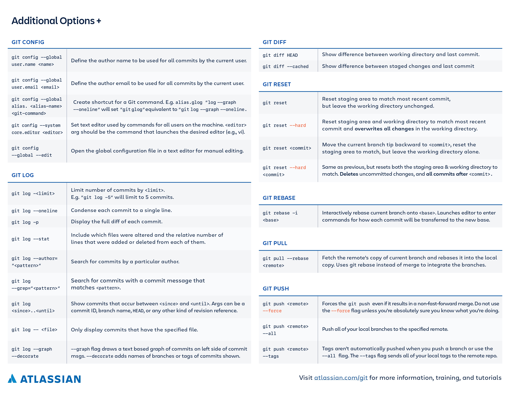

# GIT

## Git Commit Patterns

- [gitmoji](https://gitmoji.dev/)

- <code>🧪test</code>: indicates any type of creation or alteration of test codes.  
  **Example:** Creation of unit tests.

- <code>✨feat</code>: indicates the development of a new feature for the project.  
  **Example:** Adding a service, functionality, endpoint, etc.

- <code>♻️refactor</code>: used when there is a code refactoring that does not have any impact on the system logic/rules.  
  **Example:** Code changes after a code review

- <code>🎨style</code>: used when there are code formatting and style changes that do not change the system in any way.  
  **Example:** Change the style-guide, change the lint convention, fix indentations, remove white spaces, remove comments, etc…

- <code>🛠️fix</code>: used when correcting errors that are generating bugs in the system.  
  **Example:** Apply a handling for a function that is not behaving as expected and returning an error.

- <code>🧹chore</code>: indicates changes to the project that do not affect the system or test files. These are developmental changes.  
  **Example:** Change rules for eslint, add prettier, add more file extensions to .gitignore

- <code>📝docs</code>: used when there are changes in the project documentation.  
  **Example:** add information in the API documentation, change the README, etc.

- <code>🏗️build</code>: used to indicate changes that affect the project build process or external dependencies.  
  **Example:** Gulp, add/remove npm dependencies, etc…

- <code>⚡️perf</code>: indicates a change that improved system performance.  
  **Example:** change ForEach to While, etc…

- <code>👷ci/cd</code>: used for changes in CI configuration files.  
  **Example:** Circle, Travis, BrowserStack, etc…

- <code>⏪️revert</code>: indicates the reversal of a previous commit.

## Example with Emoji

| Commit type                             | Emoji                                                     |
| :-------------------------------------- | :-------------------------------------------------------- |
| Initial commit                          | :tada: `:tada:`                                           |
| Version tag                             | :bookmark: `:bookmark:`                                   |
| New feature                             | :sparkles: `:sparkles:`                                   |
| Bugfix                                  | :bug: `:bug:`                                             |
| Metadata                                | :card_index: `:card_index:`                               |
| Documentation                           | :books: `:books:`                                         |
| Documenting source code                 | :bulb: `:bulb:`                                           |
| Performance                             | :zap: `:zap:`                                             |
| Style                                   | :lipstick: `:lipstick:`                                   |
| Fix Lint Error                          | :rotating_light: `:rotating_light:`                       |
| Adding a test                           | :white_check_mark: `:white_check_mark:`                   |
| Make a test pass                        | :heavy_check_mark: `:heavy_check_mark:`                   |
| Improve format/structure                | :art: `:art:`                                             |
| Refactor code                           | :recycle: `:recycle:`                                     |
| Removing code/files                     | :fire: `:fire:`                                           |
| Continuous Integration                  | :green_heart: `:green_heart:`                             |
| Security                                | :lock: `:lock:`                                           |
| Upgrading dependencies                  | :arrow_up: `:arrow_up:`                                   |
| Downgrading dependencies                | :arrow_down: `:arrow_down:`                               |
| Update code due to external API changes | :alien: `:alien:`                                         |
| Typos Fix                               | :pencil: `:pencil:`                                       |
| Critical hotfix                         | :ambulance: `:ambulance:`                                 |
| Deploying stuff                         | :rocket: `:rocket:`                                       |
| Fixing on MacOS                         | :apple: `:apple:`                                         |
| Fixing on Linux                         | :penguin: `:penguin:`                                     |
| Fixing on Windows                       | :window: `:window:`                                       |
| Work in progress                        | :construction: `:construction:`                           |
| Adding CI build system                  | :construction_worker: `:construction_worker:`             |
| Analytics or tracking code              | :chart_with_upwards_trend: `:chart_with_upwards_trend:`   |
| Removing a dependency                   | :heavy_minus_sign: `:heavy_minus_sign:`                   |
| Adding a dependency                     | :heavy_plus_sign: `:heavy_plus_sign:`                     |
| Docker                                  | :whale: `:whale:`                                         |
| Configuration files                     | :wrench: `:wrench:`                                       |
| Package.json in JS                      | :package: `:package:`                                     |
| Merging branches                        | :twisted_rightwards_arrows: `:twisted_rightwards_arrows:` |
| Bad code / need improv.                 | :hankey: `:hankey:`                                       |
| Reverting changes                       | :rewind: `:rewind:`                                       |
| Breaking changes                        | :boom: `:boom:`                                           |
| Code review changes                     | :ok_hand: `:ok_hand:`                                     |
| Accessibility                           | :wheelchair: `:wheelchair:`                               |
| Move/rename repository                  | :truck: `:truck:`                                         |

## Cache clear

- If after adding .env to gitignore still it gets added to the commit then try this command  
  `git rm .env --cached`

