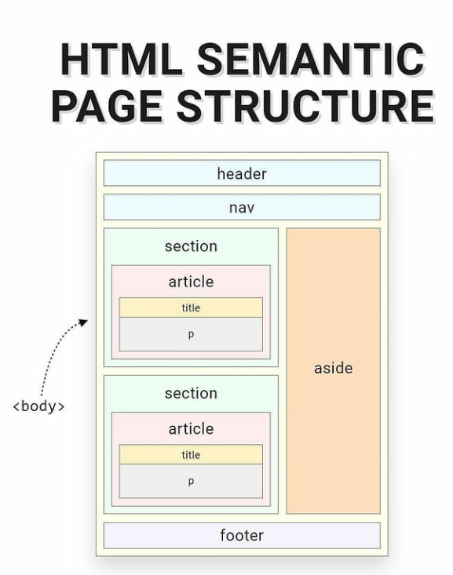

## Useful input types

## HTML structure

<p align="center">
  
</p>

```js
/* Enabling design mode will make the entire web page editable, just by clicking and typing. To use it,
open up the console and run: */

document.designMode = "on";
```

```html
<input type="range" min="1" max="5" value="2" />
<input type="search" />
<input type="tel" />
<input type="time" />
<input type="color" />
<input type="datetime-local" />
<input type="week" />
<input type="month" />
<input type="url" />
```

## HTML Tricks

```html
<!-- Can give tooltip to any tag with title -->

<p title="Tooltip">Tooltip</p>
```

```html
<!-- different favicon for light and dark mode -->

<head>
  <link
    rel="icon"
    type="image/svg+xml"
    href="dark-icon.svg"
    media="(prefers-color-scheme:dark)"
  />
  <link
    rel="icon"
    type="image/svg+xml"
    href="light-icon.svg"
    media="(prefers-color-scheme:light)"
  />
</head>
```

```html
<!-- When you need to run some calculations on your inputs and get a result instantly, you can use the <output> element to display the results without writing any external JS -->

<form
  oninput="total.value=Number(amount.value) + (Number(amount.value) * Number(tip.value)/100)"
>
  <input type="number" id="amount" value="0" /> +
  <input type="number" id="tip" value="0" /> =
  <output name="total" for="amount tip"></output>
</form>
```

```html
<!-- You can add a special <meta> tag inside of your document head to refresh the page at a set interval or to redirect users to different websites after a set delay -->

<!-- refresh after 30s -->
<meta http-equiv="refresh" content="30" />

<!-- redirect after 30s -->
<meta http-equiv="refresh" content="30;https://www.youtube.com/" />
```

```html
<!-- For users who are on mobile devices, you can use the <input/> tag with a capture attribute to open the user's camera and allow them to take a photo or video to upload to your website. On desktop the default behavior of uploading files is kept -->

<!-- Opens back facing camera to take video -->
<input type="file" capture="environment" accept="video/*" />

<!-- Opens front facing camera to take photo -->
<input type="file" capture="user" accept="image/*" />
```

```html
<!-- When you have lots of images in your website but you don't wanna wait a longer time for the browser to load all the images then show the content of the site you can lazy load images it will show other content of the site then slowly load images  -->


```

```html
<!-- Disable right click for the entire website -->
<body oncontextmenu="return false"></body>

<!-- Disable right click for a specific element-->
<section oncontextmenu="return false"></section>
```

```html
<!-- input suggestion -->
<input list="lists" />
<datalist id="lists">
  <option value="1"></option>
  <option value="2"></option>
  <option value="3"></option>
</datalist>
```

```html
<!-- multiple image with different widths have a single scaling -->
<picture>
  <source media="{min-width:650px}" srcset="image.png" />
  <source media="{min-width:550px}" srcset="image.png" />
  
</picture>
```

```html
<!-- This lets the page be rendered first and then render the images slowly -->

```

```html
<!-- This is useful where you have many anchors tag but their base url is same -->
<head>
    <base href="http://twitter.com/" target="_blank"> />
</head>
<body>
    <a href="Elon musk">
</body>
```

```html
<!-- This will redirect the user to provided url in 4s and then set to 0 for an immediate redirect -->
<head>
  <meta http-equiv="refresh" content="4;URL=URL" />
</head>
```

## Useful HTML attributes you may not know

1. Dialog/Modal

   ```html
   <dialog>
     <form>
       <input type="text" />
       <button formmethod="dialog" type="submit">Cancel</button>
       <button type="submit">Submit</button>
     </form>
   </dialog>
   ```

   ```js
   const dialog = document.querySelector("dialog");
   dialog.show(); // Opens a non-modal dialog
   dialog.showModal(); // Opens a modal

   dialog.addEventListener("click", (e) => {
     const dialogDimensions = dialog.getBoundingClientRect();
     if (
       e.clientX < dialogDimensions.left ||
       e.clientX > dialogDimensions.right ||
       e.clientY < dialogDimensions.top ||
       e.clientY > dialogDimensions.bottom
     ) {
       dialog.close(); // Closes the dialog
     }
   });
   ```

2. Accordion

   ```html
   <details>
     <summary>Open</summary>
     <p>lorem ipsem</p>
   </details>
   ```

3. Progress bar

   ```html
   <label for="prog">Download</label> <progress id="prog" value="50" max="100"></progress>
   ```

4. Autocomplete

   ```html
   <input list="lists">
    <datalist id="lists">
      <option>op1</option>
      <option>op2</option>
      <option>op3</option>
    </datalist>
   </input>
   ```

5. Popover

   ```html
   <button popovertarget="pop">Open</button>
   <div id="pop" popover>
     <p>lorem ipsem</p>
   </div>
   ```

6. Multiple

   ```html
   <input type="file" multiple />
   ```

   The multiple attribute allows the user to enter multiple values on an input. It is a boolean attribute valid for file or email input types and the select element.
   For an email input, if and only if the multiple attribute is specified, the value can be a list of comma-separated email addresses. Any whitespace is removed from each address in the list.
   For a file input, the user can select multiple files in the as usual (holding down Shift or Crtl).

7. Accept

   ```html
   <input type="file" accept=".png, .jpg" />
   ```

   The input element has the accept attribute that allows you to specify the types of files the user can upload.
   You need to pass it a string containing a comma-separated list of unique file type specifiers.
   You can also use it to specify only audio, image, or video format.

8. Contenteditable

   ```html
   <div contenteditable="true">I'm a cool editable div ;)</div>
   ```

   contenteditable is a global attribute (common to all HTML elements) that makes the HTML content editable by the user or not. However, be careful with changes only made to visible content vs the DOM content.

9. Spellcheck

   ```html
   <p contenteditable="true" spellcheck="true">Thanks furr checkinng my speling :)</p>
   ```

   The spellcheck is another global attribute that you can use to check spelling and grammar on HTML elements such as input fields and other editable elements.
   Note: Typically non-editable elements are not checked for spelling errors, even if the spellcheck attribute is set to true and the browser supports spellchecking.

10. Translate

    ```html
    <footer><p translate="no">LearnPine</p></footer>
    ```

    translate tells the browser whether the content should be translated or not.
    For instance, you can use it to prevent Google Translate from automatically trying to translate your company's or brand's name.

11. Poster
    ```html
    <video controls src="https://bit.ly/3nWh78w" poster="posterImage.png"></video>
    ```
    Use the poster attribute to specify an image to be shown while the video is downloading, or until the user hits the play button.
    If the image isn't specified, nothing is displayed until the first frame is available, then the first frame is shown as the poster frame.
12. Download
    ```html
    <a href="index.html" download="fileName">Download me :)</a>
    ```
    Use the download attribute combined with an `a` element to instruct browsers to download a URL instead of navigating to it, so the user will be prompted to save it as a local file.
    You can also specify the file name.
13. Style
    ```html
    <body>
      <style contenteditable style="display:block; white-space:pre;">
        html {
          background: #bada55;
        }
      </style>
    </body>
    ```

## Semantic HTML tags

- `<header>` and `<footer>`: These elements represent the header and footer of a document or a section.
- `<nav>`: This element is used for the part of the website that contains navigation links.
- `<article>`: This element represents a self-contained composition in a document, like a blog post, a news story, or a forum post.
- `<section>`: This element represents a standalone section of a document, which doesn’t have a more specific semantic element to represent it.
- `<aside>`: This element is used for content that is indirectly related to the main content, like a sidebar or pull quotes.
- `<figure>` and `<figcaption>`: These elements are used for representing a piece of self-contained flow content, optionally with a caption.
- `<details>`: Defines additional details that the user can view or hide.
- `<summary>`: Defines a visible heading for a `<details>` element.
- `<main>`: Specifies the main content of a document.
- `<mark>`: Defines marked/highlighted text.
- `<time>`: Defines a date/time

## [Basic HTML tags](https://way2tutorial.com/html/example/html_cheat_sheet.php)

```html
<p hidden></p>
hide the content of the element
```

```html
<video poster="image.png"></video> Shown while the video isn't playing
```

```html
<optgroup></optgroup>
is a great way to add a little definition between groups of options inside a select box
```

```html
<acronym></acronym> is a way to define or further explain a group of words. When you hover
over text that has the acronym tag used, a box appears below with the text from the title
tag.
```

```html
<wbr></wbr> Defines a word break opportunity in a long string of text.
```

```html
<address></address>
Describes an address information
```

```html
<article></article>
Defines an article
```

```html
<aside></aside>
Describes contain set(or write) on aside place in page contain
```

```html
<audio></audio> Specific audio content
```

```html
<video></video> Used to embed video content.
```

```html
<base /> Define a base URL for all the links with in a web page
```

```html
<bb></bb> Define browser command, that command invoke as per client action
```

```html
<bdo></bdo> Specific direction of text display
```

```html
<blockquote></blockquote>
Specifies a long quotation
```

```html
<canvas></canvas> Specifies the display graphics on HTML web document
```

```html
<caption></caption>
Define a table caption
```

```html
<cite></cite> Specifies a text citation
```

```html
<code></code> Specifies computer code text
```

```html
<command></command> Define a command button, invoke as per user action
```

```html
<datalist></datalist> Define a list of pre-defined options surrounding input tag
```

```html
<details></details>
Define a additional details hide or show as per user action
```

```html
<embed /> Define a embedding external application using a relative plug-in
```

```html
<figcaption></figcaption>
Represents a caption text corresponding with a figure element
```

```html
<kbd></kbd>Used to identify text that are represents keyboard input.
```

```html
<legend></legend>
Used to add a caption (title) to a group of related form elements that are grouped
together into the fieldset tag.
```

```html
<map></map>Defines an clickable image map.
```

```html
<mark></mark>Used to highlighted (marked) specific text.
```

```html
<menu></menu> Used to display a unordered list of items/menu of commands.
```

```html
<meter></meter>Used to measure data within a given range.
```

```html
<param />
Provides parameters for embedded object element.
```

```html
<pre></pre>
Used to represents preformatted text.
```

```html
<progress></progress>Represents the progress of a task.
```

```html
<samp></samp> Represents text that should be interpreted as sample output from a computer
program.
```

```html
<sub></sub> Represents inline subscript text.
```

```html
<sup></sup>Represents inline superscript text.
```

```html
<time></time>Represents the date and/or time in an HTML document.
```

[HTML Table Generator](https://way2tutorial.com/html/table_generator.php)
<br>
[HTML Marquee Generator](https://way2tutorial.com/html/marquee_generator.php)
<br>
[HTML Marquee Falling Text Code Generator](https://way2tutorial.com/html/marquee_falling_text_generator.php)

## Reserved Characters in HTML

| Character | Decimal Entity | Name Entity | Description           |
| --------- | -------------- | ----------- | --------------------- |
|           | &#160;         |             | None Breaking Space   |
| "         | &#34;          | &quot;      | Double Quotation mark |
| '         | &#39;          | &apos;      | Single Quotation mark |
| &         | &#38;          | &amp;       | ampersand             |
| <         | &#60;          | &lt;        | less-than             |
| >         | &#62;          | &gt;        | greater-than          |
| #         | &#35;          |             | Hass Sign             |
| %         | &#37;          |             | Percentage Sign       |
| (         | &#40;          |             | Left Parenthesis      |
| )         | &#41;          |             | Right Parenthesis     |
| \*        | \*             |             | Left Parenthesis      |
| +         | &#43;          |             | Plus Sign             |
| -         | &#45;          |             | Hyphen                |
| /         | &#47;          |             | Slash                 |

## Copyright,Trademark and Registered Entities

| Character | Decimal Entity | Name Entity | Description       |
| --------- | -------------- | ----------- | ----------------- |
| ©         | &#169;         | &copy;      | Copyright Symbol  |
| ™         | &#8482;        | &trade;     | Trademark Symbol  |
| ®         | &#174;         | &reg;       | Registered Symbol |

## Currency Symbols

| Character | Decimal Entity | Name Entity | Description            |
| --------- | -------------- | ----------- | ---------------------- |
| ¢         | &#162;         | &cent;      | Cent Currency(�)       |
| £         | &#163;         | &pound;     | English Pound Currency |
| ¤         | &#164;         | &curren;    | General Currency       |
| ¥         | &#165;         | &yen;       | Japanese Yen           |
| €         | &#8364;        | &euro;      | European Euro          |
| $         | &#36;          | $           | Dollar Sign            |
| ₣         | &#8355;        | ₣           | Franc Sign             |

## Quotation Mark and Apostrophe Entities

| Character | Decimal Entity | Name Entity | Description                |
| --------- | -------------- | ----------- | -------------------------- |
| '         | &#8216;        | &lsquo;     | Left/Opening single quote  |
| '         | &#8217;        | &rsquo;     | Right/Closing single quote |
| "         | &#8220;        | &ldquo;     | Left/Opening double quote  |
| "         | &#8221;        | &rdquo;     | Right/Closing double quote |

## Arrow Entities

| Character | Decimal Entity | Name Entity | Description     |
| --------- | -------------- | ----------- | --------------- |
| ←         | &larr;         |             | Leftward Arrow  |
| ↑         | &uarr;         |             | Upward Arrow    |
| →         | &rarr;         |             | Rightward Arrow |
| ↓         | &darr;         |             | Downward Arrow  |

## Suit Entities

| Character | Decimal Entity | Name Entity | Description  |
| --------- | -------------- | ----------- | ------------ |
| ♠         | &spades;       |             | Spade Suit   |
| ♣         | &clubs;        |             | Club Suit    |
| ♥         | &hearts;       |             | Heart Suit   |
| ♦         | &diams;        |             | Diamond Suit |
