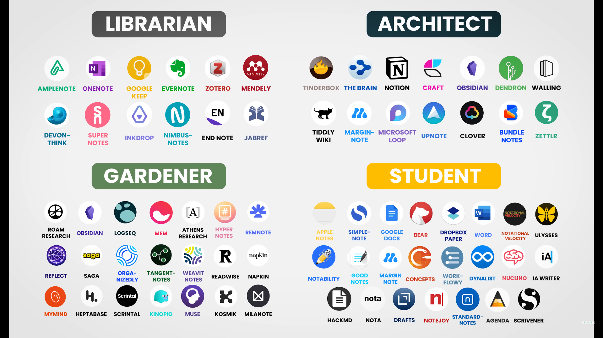

# <p align="center">Other Tool Links</p>

- [Workspace tools](#workspace-tools)
- [VS Code](#vs-code)
- [Neovim](#neovim)
- [Windows](#windows)
- [Programming Languages](#programming-languages)
- [AI-Powered App Builders](#ai-powered-app-builders)
- [AI Code Editors](#ai-code-editors)
- [Code Editors](#code-editors)
- [Note-taking Apps](#note-taking-apps)
- [Other Tools](#other-tools)
- [Other Repos](#other-repos)

# Workspace tools

- [MSSQL](https://www.microsoft.com/en-us/sql-server/sql-server-downloads) - [SSMS](https://learn.microsoft.com/en-us/sql/ssms/download-sql-server-management-studio-ssms) - [Visual Studio](https://visualstudio.microsoft.com/downloads/) - [VS Code](https://code.visualstudio.com/) - [Notepad++](https://notepad-plus-plus.org/downloads/) - [Git](https://git-scm.com/downloads) - [GitHub Desktop](https://github.com/desktop/desktop)
- [nvm](https://github.com/nvm-sh/nvm) - [nvm windows](https://github.com/coreybutler/nvm-windows) - [bun](https://bun.sh/) - [Python](https://www.python.org/downloads/) - [Rust](https://www.rust-lang.org/tools/install) - [LLVM](https://github.com/llvm/llvm-project/releases) - [Zig](https://ziglang.org/download/) - [Vulkan](https://vulkan.lunarg.com/) - [GitButler](https://github.com/gitbutlerapp/gitbutler)
- [Tor](https://www.torproject.org/) - [Firefox](https://www.mozilla.org/en-US/firefox/new/) - [Chrome](https://www.google.com/chrome/) - [Brave](https://brave.com/) - [Vivaldi](https://vivaldi.com/) - [Opera](https://www.opera.com/) - [Arc](https://arc.net/) - [Zen](https://www.zen-browser.app/) - [Ladybird](https://ladybird.org/) - [Servo](https://servo.org/)
- [Potplayer](https://potplayer.daum.net/) - [VLC media player](https://www.videolan.org/) - [OBS Studio](https://obsproject.com/) - [PowerToys](https://github.com/microsoft/PowerToys) - [UniGetUI](https://github.com/marticliment/WingetUI)
- [RectifyPad](https://github.com/Lixkote/RectifyPad) - [Files](https://github.com/files-community/files) - [File Pilot](https://filepilot.tech/) - [DWMBlurGlass](https://github.com/Maplespe/DWMBlurGlass) - [YASB Reborn](https://github.com/amnweb/yasb) - [Lively Wallpaper](https://apps.microsoft.com/detail/9ntm2qc6qws7)
- [moewalls](https://moewalls.com/landscape/aurora-over-the-lake-live-wallpaper/) - [Windhawk](https://windhawk.net/)
- [Crapfixer](https://github.com/builtbybel/Crapfixer) - [Microsoft PC Manager](https://pcmanager.microsoft.com/en-us) - [TinyTask](https://tinytask.net/) - [windirstat](https://windirstat.net/) - [Partition Wizard](https://www.partitionwizard.com/download.html)

- ## MS 365
- [Office Deployment Tool](https://www.microsoft.com/en-US/download/details.aspx?id=49117) & [Install Office LTSC preview](https://learn.microsoft.com/en-gb/office/ltsc/preview/install-ltsc-preview)
- Download `Office Deployment Tool` extract to a folder by double clicking the exe.
- Remove all xml & create a `configuration.xml` file and paste the bellow:
  ```xml
  <Configuration>
    <Add OfficeClientEdition="64"  Channel="PerpetualVL2024">
      <Product ID="ProPlus2024Volume" PIDKEY="2TDPW-NDQ7G-FMG99-DXQ7M-TX3T2" >
          <Language ID="en-us" />
      <ExcludeApp ID="Access" />
      <ExcludeApp ID="Lync" />
      <ExcludeApp ID="OneDrive" />
      <ExcludeApp ID="OneNote" />
      <ExcludeApp ID="Outlook" />
      <ExcludeApp ID="Publisher" />
      </Product>
    </Add>
    <RemoveMSI />
    <Property Name="AUTOACTIVATE" Value="1" />
  </Configuration>
  ```
- Then run the terminal as admin and run the below command:

  ```properties
  ./setup /configure ./configuration.xml
  ```

- [LibreOffice](https://www.libreoffice.org/) - [WPS](https://www.wps.com/) - [FreeOffice](https://www.freeoffice.com/) - [OfficeSuite](https://officesuite.com/)

- ## Terminal
- [Monaspace](https://monaspace.githubnext.com/) - [JetBrains Mono Fonts](https://www.jetbrains.com/lp/mono/) - [Nerd Fonts](https://www.nerdfonts.com/font-downloads)
- [WSL](https://apps.microsoft.com/detail/windows-subsystem-for-linux/9P9TQF7MRM4R) - [Terminal](https://apps.microsoft.com/detail/windows-terminal/9N0DX20HK701) - [Powershell](https://apps.microsoft.com/detail/powershell/9MZ1SNWT0N5D) - [Oh My Posh](https://ohmyposh.dev/) - [Oh My ZSH](https://ohmyz.sh/) - [Ghostty](https://github.com/ghostty-org/ghostty)
- [Windows Terminal Themes](https://windowsterminalthemes.dev/) - [Terminal Splash](https://terminalsplash.com/) - [Dracula Theme](https://draculatheme.com/windows-terminal)
- [Starship](https://starship.rs/) - [starship.toml](./assets/tools/terminal/starship.toml) -> `C:\Users\{Name}\.config`

  - For Powershell
    - In the Document folder create a Folder name `PowerShell`.
    - Inside the folder Create a file name `Microsoft.PowerShell_profile.ps1` with `ps1` extension
    - And paste `Invoke-Expression (&starship init powershell)` in the `Microsoft.PowerShell_profile.ps1`
    - PowerShell log data `%APPDATA%\Microsoft\Windows\PowerShell\PSReadline\`

# VS Code

## VS Code Profiles

- [Code Profile](./assets/tools/vs-code/Code.code-profile)

## VS Code Style


## Instructions

1.  Install vs code extension [Outrun Meets Synthwave](https://marketplace.visualstudio.com/items?itemName=codevars.outrun-meets-synthwave)
2.  Install vs code extension [Bearded Icons](https://marketplace.visualstudio.com/items?itemName=BeardedBear.beardedicons)
3.  Install vs code extension [Custom CSS and JS Loader](https://marketplace.visualstudio.com/items?itemName=be5invis.vscode-custom-css)
4.  Download Mononoki and Fira Code from [Nerd Fonts](https://www.nerdfonts.com/font-downloads) (mononki is super clean but if you want ligatures arrows then use Fira Code)
5.  on vs code `ctrl+shift+ p` then search for `User Settings (JSON)` and copy the settings on the [settings.json](./assets/tools/vs-code/settings.json) file and paste it at the bottom
6.  Replace the `vscode_custom_css.imports` depending your operative system, and add your user or file location in your VS Code `settings.json`

```js
On Mac:

{
  "vscode_custom_css.imports": [
    "file:///Users/{your username}/.vscode/extensions/codevars.outrun-meets-synthwave-0.0.1/synthWaveStyles.css"
    ]
}

Windows:

{
  "vscode_custom_css.imports": [
    "file:///C:/Users/{your username}/.vscode/extensions/codevars.outrun-meets-synthwave-0.0.1/synthWaveStyles.css"
    ]
}

Linux:
{
    "vscode_custom_css.imports": [
        "file:///home/{your username}/.vscode/extensions/codevars.outrun-meets-synthwave-0.0.1/synthWaveStyles.css"
    ]
}
```

8. Copy and paste the css inside of the [codingphase-style.css](./assets/workspace/vs-code/codingphase-style.css) file and replace the styles inside the `synthWaveStyles.css` file

# Creating VS Code Snippets

1. Create a snippet then goto [snippet-generator](https://snippet-generator.app/) and convert your snippet for VS Code.
2. From Setting Icon select `Snippets` and select whether you want it to be a global or language specific then give a trigger and save it.

# Neovim

## Editor

- [NeoVim](https://neovim.io/)
- [Helix](https://helix-editor.com/)

## Configs

- [NvChad](https://nvchad.com/docs/quickstart/install)
- [AstroNvim](https://astronvim.com/)
- [LunarVim](https://www.lunarvim.org/)
- [SpaceVim](https://spacevim.org/quick-start-guide/)
- [LazyVim](https://www.lazyvim.org/)

### [Vim Tutor (vimschool)](https://vimschool.netlify.app/introduction/)

# Windows

## Check and Toggle Recall

- Open up the Terminal (as Admin) and type in this command
- Check If Recall Is ON : `Dism /Online /Get-Featureinfo /Featurename:Recall`

- Depending on your preference these commands can either ENABLE or DISABLE the software.
- Disable RECALL: `Dism /Online /Disable-Feature /Featurename:Recall`
- Enable RECALL: `Dism /Online /Enable-Feature /Featurename:Recall`

## Old Context Menu In Windows 11

- Manually

  - Open Registry Editor
  - Navigate to `HKEY_CURRENT_USER\Software\Classes\CLSID`
  - Right-click the folder and select `New > Key`
  - Assign the name `{86ca1aa0-34aa-4e8b-a509-50c905bae2a2}`
  - Right-click the new key, and select `New > Key`
  - Name it `InprocServer32`
  - Edit the `default` string inside the `InprocServer32` key, and set the data to `empty/null`.
  - Reboot, and the context-menu should be available.

- Auto

  - Create a file with {name}.reg any where then open it with notepad and paste teh bellow code inside it save it and then double click on the file and click yes on all the popup and after that reboot.

  - ```re
    Windows Registry Editor Version 5.00
    [HKEY_CURRENT_USER\Software\Classes\CLSID\{86ca1aa0-34aa-4e8b-a509-50c905bae2a2}]

    [HKEY_CURRENT_USER\Software\Classes\CLSID\{86ca1aa0-34aa-4e8b-a509-50c905bae2a2}\InprocServer32]
    @="empty/null"
    ```

## Remove Open With Visual Studio from Context Menu

- Open Registry Editor (Search it in the windows search)
- In the Registry Editor put the bellow link in the nav it will take you to folder name AnyCode just delete the folder
- HKEY_CLASSES_ROOT\Directory\Background\shell\AnyCode
- HKEY_CLASSES_ROOT\Directory\shell\AnyCode

## Clean Run recent lists

- HKEY_CURRENT_USER\Software\Microsoft\Windows\CurrentVersion\Explorer\RunMRU

## Add to open with in context menu (right click) for any app

- For Adding

  ### Create a add.bat file and pase these code inside and run as Admin

  ```bat
  @echo off

  @REM Change the file location based on your app location
  SET stPath=C:\Program Files\Sublime Text\sublime_text.exe

  @REM Change the open with Sublime Text with the name you want to see for all 12 Places
  @REM for example @reg add "HKEY_CLASSES_ROOT\*\shell\Open with VS Code"         /t REG_SZ /v "" /d "Open with VS Code"   /f

  rem add it for right-clicking all file types
  @reg add "HKEY_CLASSES_ROOT\*\shell\Open with Sublime Text"         /t REG_SZ /v "" /d "Open with Sublime Text"   /f
  @reg add "HKEY_CLASSES_ROOT\*\shell\Open with Sublime Text"         /t REG_EXPAND_SZ /v "Icon" /d "%stPath%,0" /f
  @reg add "HKEY_CLASSES_ROOT\*\shell\Open with Sublime Text\command" /t REG_SZ /v "" /d "%stPath% \"%%1\"" /f

  rem add it for right-clicking a folders
  @reg add "HKEY_CLASSES_ROOT\Folder\shell\Open with Sublime Text"         /t REG_SZ /v "" /d "Open with Sublime Text"   /f
  @reg add "HKEY_CLASSES_ROOT\Folder\shell\Open with Sublime Text"         /t REG_EXPAND_SZ /v "Icon" /d "%stPath%,0" /f
  @reg add "HKEY_CLASSES_ROOT\Folder\shell\Open with Sublime Text\command" /t REG_SZ /v "" /d "%stPath% \"%%1\"" /f

  rem add it for right-clicking inside folders
  @reg add "HKEY_CLASSES_ROOT\Directory\Background\shell\Open with Sublime Text"         /t REG_SZ /v "" /d "Open with Sublime Text"   /f
  @reg add "HKEY_CLASSES_ROOT\Directory\Background\shell\Open with Sublime Text"         /t REG_EXPAND_SZ /v "Icon" /d "%stPath%,0" /f
  @reg add "HKEY_CLASSES_ROOT\Directory\Background\shell\Open with Sublime Text\command" /t REG_SZ /v "" /d "%stPath% \"%%W\"" /f
  pause
  ```

- For Deleting

  ### Create a delete.bat file and put these code inside and run as Admin

  ```bat
  @REM Change the open with Sublime Text as you added for your app for all 3 places
  @REM for example @reg delete "HKEY_CLASSES_ROOT\*\shell\Open with VS Code"

  @echo off
  rem for deleting right-clicking all file types
  @reg delete "HKEY_CLASSES_ROOT\*\shell\Open with Sublime Text"

  rem for deleting right-clicking a folders
  @reg delete "HKEY_CLASSES_ROOT\Folder\shell\Open with Sublime Text"

  rem for deleting right-clicking inside folders
  @reg delete "HKEY_CLASSES_ROOT\Directory\Background\shell\Open with Sublime Text
  pause
  ```

- Or you get get the file from [here](./assets/tools/windows/) open with notepad and modify them

## To rename all jpg in a folder to png

- Create a rename.bat file in that folder
- Then open it with notepad and paste the bellow
- `ren *.jpg *.png` and save the file
- Then double click

## Add prefix to all the file name in a folder

- Create a rename.bat file in that folder
- Then open it with notepad and paste the bellow code and save the file
- Then double click

  ```bat
  @echo off
  setlocal enabledelayedexpansion

  set "prefix=prefix_"

  for %%F in (*.*) do (
      set "oldName=%%~nF"
      set "extension=%%~xF"
      set "newName=!prefix!!oldName!!extension!"
      ren "%%F" "!newName!"
  )
  endlocal
  ```

## Make Folder Invisible

- Right click and select rename then `alt + 0160`
- Right click and select properties select customize then change icon and pick a blank icon

## GodMode

Create a new folder on your Windows Desktop (or in any other folder that you might want to have this God Mode icon) and change the name to:
`GodMode.{ED7BA470-8E54-465E-825C-99712043E01C}`

## Run Commnads

- `cleanmgr`
- `%temp%`
- `temp`
- `recent`
- `prefetch`
- `%AppData%`
- `%LocalAppData%`
- `shell:startup`
- `shell:appsfolder`
- `shell:common startup`
- `SystemPropertiesAdvanced` to see windows users list
- `chrome.exe --user-data-dir="c:/ChromeDevSession"`

# Programming Languages

1. [TypeScript](https://github.com/microsoft/TypeScript) - [Bun](https://github.com/oven-sh/bun) - [Deno](https://github.com/denoland/deno) - [Node](https://github.com/nodejs/node) - [AssemblyScript](https://github.com/AssemblyScript/assemblyscript) - [Solidity](https://github.com/ethereum/solidity) - [Wing](https://github.com/winglang/wing) - [Flyde](https://github.com/flydelabs/flyde)
2. [LLVM](https://github.com/llvm/llvm-project) - [GCC](https://github.com/gcc-mirror/gcc) - [Zig](https://github.com/ziglang/zig) - [Jai]() - [Odin](https://github.com/odin-lang/Odin) - [cppfront](https://github.com/hsutter/cppfront) - [C3](https://github.com/c3lang/c3c) - [carbon-lang](https://github.com/carbon-language/carbon-lang) - [.NET](https://github.com/dotnet/runtime) - [Framework Mono](https://gitlab.winehq.org/mono/mono) - [Lua](https://github.com/lua/lua) - [moonscript](https://github.com/leafo/moonscript) - [V](https://github.com/vlang/v) - [Beef](https://github.com/beefytech/Beef) - [Lobster](https://github.com/aardappel/lobster)
3. [Mojo](https://github.com/modularml/mojo) - [Python](https://github.com/python/cpython) - [Julia](https://github.com/JuliaLang/julia) - [R](https://github.com/wch/r-source) - [Triton](https://github.com/triton-lang/triton) - [Cython](https://github.com/cython/cython) - [Codon](https://github.com/exaloop/codon) - [RustPython](https://github.com/RustPython/RustPython) - [PyScript](https://github.com/pyscript/pyscript) - [MicroPython](https://github.com/micropython/micropython) - [OCaml](https://github.com/ocaml/ocaml) - [Rust](https://github.com/rust-lang/rust) - [Go](https://github.com/golang/go) - [Go+](https://github.com/goplus/gop) - [Nim](https://github.com/nim-lang/Nim) - [haxe](https://github.com/HaxeFoundation/haxe)
4. [Java](https://github.com/openjdk/jdk) - [kotlin](https://github.com/JetBrains/kotlin) - [swift](https://github.com/apple/swift) - [dart-lang](https://github.com/dart-lang/language) - [sdk](https://github.com/dart-lang/sdk) - [php](https://github.com/php/php-src) - [Ruby](https://github.com/ruby/ruby) - [perl5](https://github.com/Perl/perl5) - [scala](https://github.com/scala/scala) - [Scala 3](https://github.com/lampepfl/dotty) - [groovy](https://github.com/apache/groovy) - [clojure](https://github.com/clojure/clojure) - [crystal](https://github.com/crystal-lang/crystal) - [Haskell](https://github.com/ghc/ghc) - [elixir](https://github.com/elixir-lang/elixir) - [erlang](https://github.com/erlang/otp) - [gleam](https://github.com/gleam-lang/gleam) - [roc](https://github.com/roc-lang/roc)
5. [vala](https://gitlab.gnome.org/GNOME/vala) - [red](https://github.com/red/red) - [D](https://github.com/dlang/dmd) - [Draco-lang](https://github.com/Draco-lang/Compiler) - [terra](https://github.com/terralang/terra) - [pharo](https://github.com/pharo-project/pharo) - [eo](https://github.com/objectionary/eo) - [rakudo](https://github.com/rakudo/rakudo) - [flix](https://github.com/flix/flix) - [effekt](https://github.com/effekt-lang/effekt) - [Idris2](https://github.com/idris-lang/Idris2) - [starlark](https://github.com/bazelbuild/starlark) - [starlark-go](https://github.com/google/starlark-go) - [starlark-rust](https://github.com/facebookexperimental/starlark-rust) - [koka](https://github.com/koka-lang/koka) - [ring](https://github.com/ring-lang/ring) - [ponyc](https://github.com/ponylang/ponyc) - [futhark](https://github.com/diku-dk/futhark) - [coq](https://github.com/coq/coq) - [cue](https://github.com/cue-lang/cue) - [chapel](https://github.com/chapel-lang/chapel) - [lux](https://github.com/LuxLang/lux) - [leo](https://github.com/AleoHQ/leo) - [ballerina-lang](https://github.com/ballerina-platform/ballerina-lang) - [BosqueLanguage](https://github.com/BosqueLanguage/BosqueCore) - [racket](https://github.com/racket/racket)
6. [mono](https://github.com/mono/mono) - [Senegal](https://github.com/SenegalLang/Senegal) - [Crab](https://github.com/crablang/crab) - [purescript](https://github.com/purescript/purescript) - [LiveScript](https://github.com/gkz/LiveScript) - [coffeescript](https://github.com/jashkenas/coffeescript) - [elm](https://github.com/elm/compiler) - [kit](https://github.com/kitlang/kit) - [gravity](https://github.com/marcobambini/gravity) - [Vale](https://github.com/ValeLang/Vale) - [io](https://github.com/IoLanguage/io) - [eta](https://github.com/typelead/eta) - [goby](https://github.com/goby-lang/goby) - [gosu-lang](https://github.com/gosu-lang/gosu-lang) - [frege](https://github.com/Frege/frege) - [nu](https://github.com/programming-nu/nu) - [chavascript](https://github.com/ChavaScript/chavascript) - [wren](https://github.com/wren-lang/wren) - [muon](https://github.com/nickmqb/muon) - [wenyan](https://github.com/wenyan-lang/wenyan) - [skip](https://github.com/skiplang/skip) - [livecode](https://github.com/livecode/livecode) - [golo-lang](https://github.com/eclipse-archived/golo-lang)

# AI-Powered App Builders

1. [v0](https://v0.dev/)
2. [Bolt](https://bolt.new/)
3. [Chef](https://chef.convex.dev/)
4. [MetaGPTX](https://mgx.dev/)
5. [Lovable](https://lovable.dev/)
6. [Firebase Studio](https://firebase.studio/) - [Stitch](https://stitch.withgoogle.com/)
7. [Replit](https://replit.com/)
8. [IDE by Bind AI](https://www.getbind.co/)
9. [Aide](https://aide.dev/)
10. [Devin AI](https://preview.devin.ai/)
11. [Tempo Labs](https://www.tempolabs.ai/)
12. [rork](https://rork.app/) - [a0](https://a0.dev/) - [appacella](https://www.appacella.com/) - [makeway](https://makeway.app/)
13. [builder.io](https://www.builder.io/)
14. [Blackbox](https://www.blackbox.ai/)
15. [Softgen](https://softgen.ai/)
16. [Wrapifai](https://wrapifai.com/)
17. [Databutton](https://databutton.com/)
18. [webdraw](https://webdraw.com/)
19. [Colab](https://colab.research.google.com/)

# AI Code Editors

1. [Cursor](https://www.cursor.com/)
2. [Windsurf](https://codeium.com/windsurf)
3. [Trae](https://www.trae.ai/)
4. [Kiro](https://kiro.dev/)
5. [Augment Code](https://www.augmentcode.com/) - [OpenRouter](https://openrouter.ai/)
6. [Kilo Code](https://github.com/Kilo-Org/kilocode) - [Cline](https://cline.bot/) - [Roo-Code](https://github.com/RooCodeInc/Roo-Code)
7. [PearAI](https://trypear.ai/)
8. [Supermaven](https://supermaven.com/)
9. [Qodo](https://www.qodo.ai/)
10. [Continue](https://www.continue.dev/)
11. [Void](https://github.com/voideditor/void)
12. [Tabby](https://github.com/TabbyML/tabby)
13. [OpenHands](https://github.com/All-Hands-AI/OpenHands)
14. [MarsX](https://marsx.dev/)

# Code Editors

1. [VS](https://visualstudio.microsoft.com/) - [VS Code](https://github.com/microsoft/vscode) - [VS Codium](https://github.com/VSCodium/vscodium) - [Lapce](https://github.com/lapce/lapce) - [Zed](https://github.com/zed-industries/zed) - [Atom](https://github.com/atom/atom) - [Pulsar](https://github.com/pulsar-edit/pulsar) - [Atom Community](https://github.com/atom-community/atom) - [Sublime Text](https://www.sublimetext.com/)
2. [Notepad++](https://github.com/notepad-plus-plus/notepad-plus-plus) - [Notepad Next](https://github.com/dail8859/NotepadNext) - [Pragtical](https://github.com/pragtical/pragtical) - [Notepads](https://github.com/0x7c13/Notepads) - [Lite XL](https://github.com/lite-xl/lite-xl) - [lite](https://github.com/rxi/lite) - [Phoenix](https://github.com/phcode-dev/phoenix) - [Eclipse Theia](https://github.com/eclipse-theia/theia)
3. [Edit](https://github.com/microsoft/edit) - [Vim](https://github.com/vim/vim) - [Neovim](https://github.com/neovim/neovim) - [NvChad](https://github.com/NvChad/NvChad) - [AstroNvim](https://github.com/AstroNvim/AstroNvim) - [LunarVim](https://github.com/LunarVim/LunarVim) - [SpaceVim](https://gitlab.com/SpaceVim/SpaceVim) - [LazyVim](https://github.com/LazyVim/LazyVim) - [kakoune](https://github.com/mawww/kakoune)
4. [Helix](https://github.com/helix-editor/helix) - [Ox](https://github.com/curlpipe/ox) - [Emacs](https://github.com/emacs-mirror/emacs) - [spacemacs](https://github.com/syl20bnr/spacemacs) - [doomemacs](https://github.com/doomemacs/doomemacs) - [Evil](https://github.com/emacs-evil/evil) - [micro](https://github.com/zyedidia/micro) - [Nano](https://github.com/madnight/nano) - [tmux](https://github.com/tmux/tmux) - [Moe](https://github.com/fox0430/moe)
5. [IntelliJ IDEA](https://github.com/JetBrains/intellij-community) - [Eclipse CDT™](https://github.com/eclipse-cdt/cdt) - [Apache NetBeans](https://github.com/apache/netbeans) - [Luthetus.Ide](https://github.com/Luthetus/Luthetus.Ide) - [Walk](https://github.com/huntercfreeman/Walk) - [neoeedit](https://github.com/neoedmund/neoeedit)
6. [AuroraEditor](https://github.com/AuroraEditor/AuroraEditor) - [CodeEdit](https://github.com/CodeEditApp/CodeEdit) - [CotEditor](https://github.com/coteditor/CotEditor) - [focus](https://github.com/focus-editor/focus)
7. [textadept](https://github.com/orbitalquark/textadept) - [Kate](https://github.com/KDE/kate) - [CudaText](https://github.com/Alexey-T/CudaText) - [CodeLite](https://github.com/eranif/codelite) - [leo-editor](https://github.com/leo-editor/leo-editor)
8. [Monaco Editor](https://github.com/microsoft/monaco-editor) - [React Monaco Editor](https://github.com/react-monaco-editor/react-monaco-editor) - [Monaco Editor React](https://github.com/suren-atoyan/monaco-react) - [overleaf](https://github.com/overleaf/overleaf)

# Code Editors(Archive)

1. [MonoDevelop](https://github.com/mono/monodevelop) - [Komodo Edit](https://github.com/Komodo/KomodoEdit) - [Open Komodo IDE](https://github.com/ActiveState/OpenKomodoIDE)
2. [oni2](https://github.com/onivim/oni2) - [zee](https://github.com/zee-editor/zee) - [vim.wasm](https://github.com/rhysd/vim.wasm)
3. [Rust ❤️ Emacs](https://github.com/remacs/remacs) - [slap](https://github.com/slap-editor/slap)
4. [howl](https://github.com/howl-editor/howl) - [LightTable](https://github.com/LightTable/LightTable)
5. [notepad2-mod](https://github.com/XhmikosR/notepad2-mod)
6. [TextMate](https://github.com/textmate/textmate)
7. [Xi editor](https://github.com/xi-editor/xi-editor)
8. [Text editor](https://github.com/JonSeijo/text-editor)
9. [Brackets](https://github.com/brackets-cont/brackets) - [brackets](https://github.com/adobe/brackets)
10. [LimeText](https://github.com/limetext/lime) - [LimeText](https://github.com/limetext/backend)
11. [alm](https://github.com/alm-tools/alm) - [zed](https://github.com/zedapp/zed) - [Caret](https://github.com/thomaswilburn/Caret)

# Note-taking Apps

<div align="center">
    
</div>

1. [Obsidian](https://obsidian.md/) - [Notion](https://www.notion.so/) - [Evernote](https://evernote.com/download) - [Milanote](https://milanote.com/) - [Squidnotes](https://www.squidnotes.com/) - [Capacities](https://capacities.io/) - [Scrintal](https://scrintal.com/) - [HackMD](https://hackmd.io/) - [Tana](https://tana.inc/)
2. [Logseq](https://github.com/logseq/logseq) - [Docmost](https://github.com/docmost/docmost) - [Siyuan](https://github.com/siyuan-note/siyuan) - [Joplin](https://github.com/laurent22/joplin/) - [Anytype](https://github.com/anyproto/anytype-ts) - [AFFiNE](https://github.com/toeverything/AFFiNE) - [AppFlowy](https://github.com/AppFlowy-IO/AppFlowy) - [Notesnook](https://github.com/streetwriters/notesnook) - [Outline](https://github.com/outline/outline)
3. [NoteGen](https://github.com/codexu/note-gen)
4. [Foam](https://github.com/foambubble/foam) - [Trilium](https://github.com/zadam/trilium) - [MarkText](https://github.com/marktext/marktext) - [Typethings](https://github.com/pheralb/typethings) - [Typability](https://github.com/SimonShiki/Typability) - [Zettlr](https://github.com/Zettlr/Zettlr)
5. [Focalboard](https://github.com/mattermost/focalboard) - [Pine](https://github.com/lukakerr/Pine) - [MiaoYan](https://github.com/tw93/MiaoYan)

# Other Tools

1. [Dependencies](https://github.com/lucasg/Dependencies) - An open-source modern Dependency Walker

# Other Repos

1. [Git](https://github.com/git/git) - [Jujutsu](https://github.com/jj-vcs/jj) - [Grace](https://github.com/ScottArbeit/Grace) - [LLVM](https://github.com/llvm/llvm-project) - [GCC](https://github.com/gcc-mirror/gcc) - [SQLite](https://github.com/sqlite/sqlite) - [fossil-mirror](https://github.com/drhsqlite/fossil-mirror)
2. [Linux](https://github.com/torvalds/linux) - [NetBSD](https://github.com/NetBSD/src) - [FreeBSD](https://github.com/freebsd/freebsd-src) - [OpenBSD](https://github.com/openbsd/src) - [Android](https://android.googlesource.com/) - [ReactOS](https://github.com/reactos/reactos) - [SerenityOS](https://github.com/SerenityOS/serenity) - [XenevaOS](https://github.com/manaskamal/XenevaOS)
3. [MS-DOS](https://github.com/microsoft/MS-DOS) - [ravynOS](https://github.com/ravynsoft/ravynos) - [DragonFlyBSD](https://gitweb.dragonflybsd.org/dragonfly.git) - [skiftOS](https://github.com/skift-org/skift) - [RedoxOS](https://gitlab.redox-os.org/redox-os/redox) - [XNU](https://github.com/apple-oss-distributions/xnu)
4. [Chromium](https://github.com/chromium/chromium) - [gecko-dev](https://github.com/mozilla/gecko-dev) - [WebKit](https://github.com/WebKit/WebKit) - [Servo](https://github.com/servo/servo) - [Verso](https://github.com/versotile-org/verso)
5. [Vite](https://github.com/vitejs/vite) - [Turbo](https://github.com/vercel/turbo) - [esbuild](https://github.com/evanw/esbuild) - [Rollup](https://github.com/rollup/rollup) - [Rolldown](https://github.com/rolldown/rolldown)
6. [ImHex](https://github.com/WerWolv/ImHex)
7. [tokei](https://github.com/XAMPPRocky/tokei)
8. [durdraw](https://github.com/cmang/durdraw)
9. [jscpd](https://github.com/kucherenko/jscpd)
10. [web2pdf](https://github.com/dvcoolarun/web2pdf)
11. [bebop](https://github.com/betwixt-labs/bebop)
12. [flatnotes](https://github.com/dullage/flatnotes)
13. [aniyomi](https://github.com/aniyomiorg/aniyomi) - [mihon](https://github.com/mihonapp/mihon)
14. [telegraf](https://github.com/telegraf/telegraf) - [node-telegram-bot-api](https://github.com/yagop/node-telegram-bot-api)
