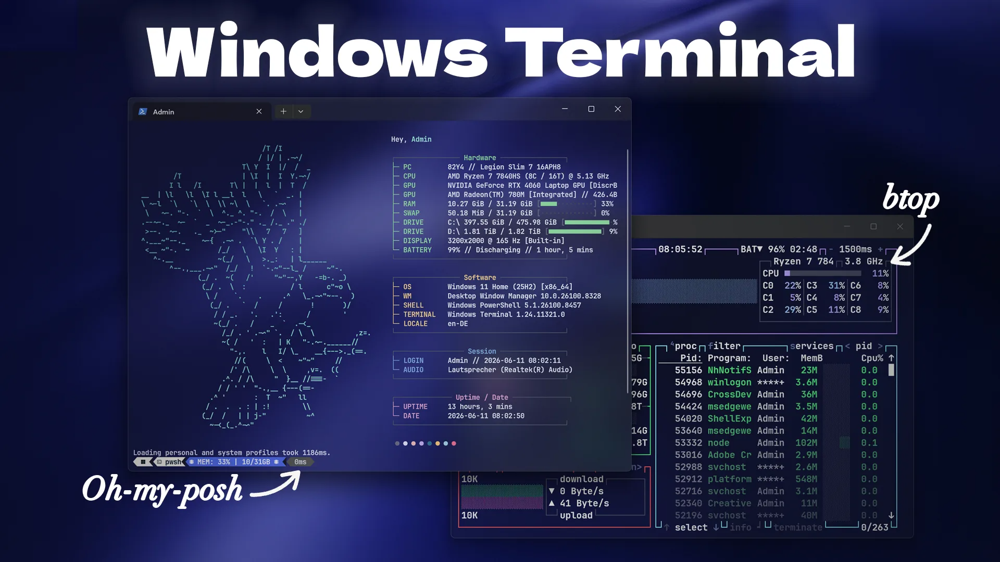
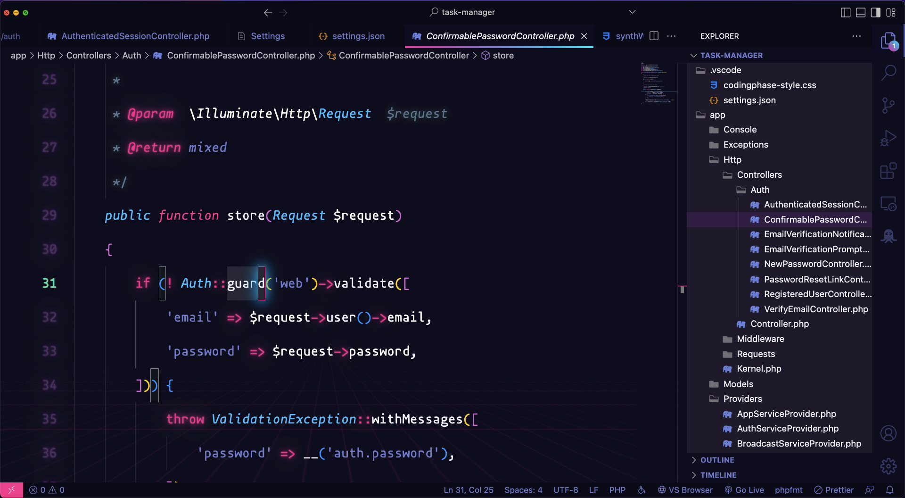
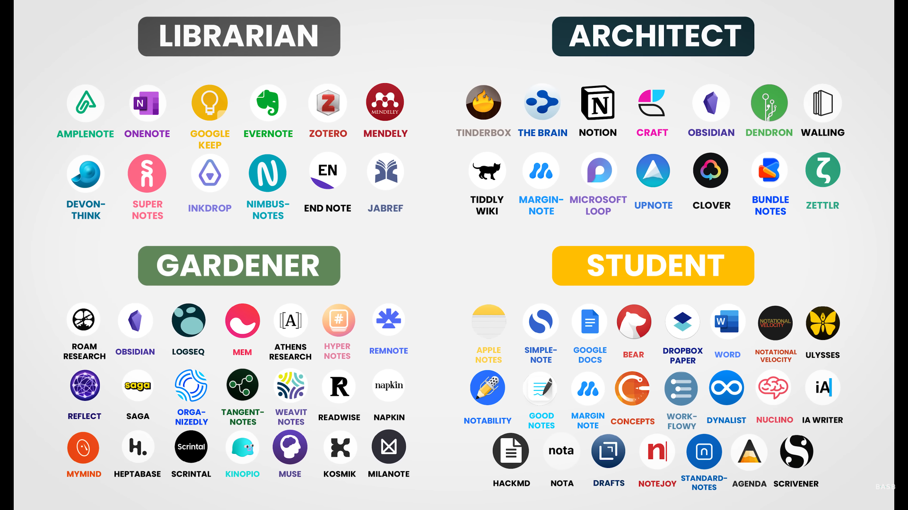

# <p align="center">Other Tool Links</p>

- [Workspace tools](#workspace-tools)
- [Terminal](#terminal)
- [VS Code](#vs-code)
- [Neovim](#neovim)
- [Windows](#windows)
- [Programming Languages](#programming-languages)
- [Code Editors](#code-editors)
- [Note-taking Apps](#note-taking-apps)
- [Misc Apps](#misc-apps)
- [Game Emulation Tools](#game-emulation-tools)
- [Misc Repos](#misc-repos)

# Workspace tools

- [nvm win](https://github.com/coreybutler/nvm-windows) - [fnm](https://github.com/Schniz/fnm) - [nub](https://github.com/nubjs/nub) - [Bun](https://bun.sh/) - [Python](https://www.python.org/downloads/) - [Rust](https://www.rust-lang.org/tools/install) - [LLVM](https://github.com/llvm/llvm-project/releases) - [GCC](https://gcc.gnu.org/install/binaries.html) - [Zig](https://ziglang.org/download/)
- [Notepad++](https://notepad-plus-plus.org/downloads/) - [VS Code](https://code.visualstudio.com/) - [VS](https://visualstudio.microsoft.com/downloads/) - [MSSQL](https://www.microsoft.com/en-us/sql-server/sql-server-downloads) - [SSMS](https://learn.microsoft.com/en-us/sql/ssms/download-sql-server-management-studio-ssms) - [Docker](https://www.docker.com/)
- [Git](https://git-scm.com/downloads) - [GitHub Desktop](https://github.com/desktop/desktop) - [GitButler](https://github.com/gitbutlerapp/gitbutler) - [gitru](https://github.com/ruru-m07/gitru) - [PowerToys](https://github.com/microsoft/PowerToys) - [Vulkan](https://vulkan.lunarg.com/)
- [Zen](https://www.zen-browser.app/) - [Helium](https://helium.computer/) - [Brave](https://brave.com/) - [Floorp](https://floorp.app/) - [Ladybird](https://ladybird.org/) - [Cromite](https://github.com/uazo/cromite) - [Orion](https://orionbrowser.com/)
- [Vivaldi](https://vivaldi.com/) - [Yandex](https://browser.yandex.com/) - [Waterfox](https://www.waterfox.com/) - [LibreWolf](https://librewolf.net/) - [Flow](https://flow-browser.com/) - [Opera](https://www.opera.com/)
- [i2pd](https://i2pd.website/) - [Tor](https://www.torproject.org/) - [Mullvad](https://mullvad.net/en/browser) - [Servo](https://servo.org/) - [Firefox](https://www.mozilla.org/en-US/firefox/new/) - [Chrome](https://www.google.com/chrome/)

- ## MS 365
- [Office Deployment Tool](https://www.microsoft.com/en-US/download/details.aspx?id=49117) & [Install Office LTSC preview](https://learn.microsoft.com/en-gb/office/ltsc/preview/install-ltsc-preview)
- Download `Office Deployment Tool` extract to a folder by double clicking the exe.
- Remove all xml & create a `configuration.xml` file and paste the bellow:
  ```xml
  <Configuration>
    <Add OfficeClientEdition="64"  Channel="PerpetualVL2024">
      <Product ID="ProPlus2024Volume" PIDKEY="2TDPW-NDQ7G-FMG99-DXQ7M-TX3T2" >
          <Language ID="en-us" />
      <ExcludeApp ID="Access" />
      <ExcludeApp ID="Lync" />
      <ExcludeApp ID="OneDrive" />
      <ExcludeApp ID="OneNote" />
      <ExcludeApp ID="Outlook" />
      <ExcludeApp ID="Publisher" />
      </Product>
    </Add>
    <RemoveMSI />
    <Property Name="AUTOACTIVATE" Value="1" />
  </Configuration>
  ```
- Then run the terminal as admin and run the below command:

  ```properties
  ./setup /configure ./configuration.xml
  ```

- [LibreOffice](https://www.libreoffice.org/) - [FreeOffice](https://www.freeoffice.com/) - [OnlyOffice](https://www.onlyoffice.com/) - [WPS](https://www.wps.com/) - [OfficeSuite](https://officesuite.com/)
- [Bento](https://github.com/nyblnet/bento)

# Terminal

- [Monaspace](https://monaspace.githubnext.com/) - [JetBrains Mono Fonts](https://www.jetbrains.com/lp/mono/) - [Nerd Fonts](https://www.nerdfonts.com/font-downloads)
- [Terminal](https://github.com/microsoft/terminal) - [Intelligent Terminal](https://github.com/microsoft/intelligent-terminal) - [PowerShell](https://github.com/powershell/powershell)
- [btop4win](https://github.com/aristocratos/btop4win) -[btop](https://github.com/aristocratos/btop) - [fzf](https://github.com/junegunn/fzf) - [fd](https://github.com/sharkdp/fd) - [eza](https://github.com/eza-community/eza) - [tmux](https://github.com/tmux/tmux) - [zellij](https://github.com/zellij-org/zellij) - [herdr](https://github.com/ogulcancelik/herdr)
- [yazi](https://github.com/sxyazi/yazi) - [Superfile](https://github.com/yorukot/superfile) - [Midnight Commander](https://github.com/MidnightCommander/mc)
- [Ghostty](https://github.com/ghostty-org/ghostty) - [alacritty](https://github.com/alacritty/alacritty) - [kitty](https://github.com/kovidgoyal/kitty) - [wezterm](https://github.com/wezterm/wezterm)
- [warp](https://github.com/warpdotdev/warp) - [waveterm](https://github.com/wavetermdev/waveterm) - [Terax](https://github.com/crynta/terax-ai) - [tabby](https://github.com/Eugeny/tabby) - [hyper](https://github.com/vercel/hyper)
- [Windows Terminal Themes](https://windowsterminalthemes.dev/) - [Terminal Splash](https://terminalsplash.com/) - [Dracula Theme](https://draculatheme.com/windows-terminal)
- [Oh My Posh](https://ohmyposh.dev/) - [Oh My ZSH](https://ohmyz.sh/) - [Starship](https://starship.rs/)
- [starship.toml](./assets/tools/terminal/starship.toml) -> `C:\Users\{Name}\.config`
  - For Powershell
    - In the Document folder create a Folder name `PowerShell`.
    - Inside the folder Create a file name `Microsoft.PowerShell_profile.ps1` with `ps1` extension
    - And paste `Invoke-Expression (&starship init powershell)` in the `Microsoft.PowerShell_profile.ps1`
    - PowerShell log data `%APPDATA%\Microsoft\Windows\PowerShell\PSReadline\`
- [fastfetch](https://github.com/fastfetch-cli/fastfetch)
  - 
  - Download folder or content of theme in [fastfetch-configs](./assets/tools/terminal/fastfetch-configs/) and put it in your `C:\Users\<Username>` Folder.
  - In the Document folder check if theres `PowerShell` normal or hidden if not create the Folder.
  - In `Microsoft.PowerShell_profile.ps1` update the 'Your Path' with `C:\Users\<Username>\fastfetch-configs` or the place you put the downloaded folder/content.
  - Copy `Microsoft.PowerShell_profile.ps1` from the downloaded config and paste it inside the folder.
  - or just paste the content to the already existing file as you might have existing config for starship or oh my posh.
- [swpui](https://github.com/beeb/swpui) - [whosthere](https://github.com/ramonvermeulen/whosthere)
- [yt-dlp](https://github.com/yt-dlp/yt-dlp)
- [Awesome TUIs (List of projects that provide terminal user interfaces)](https://github.com/rothgar/awesome-tuis)

# VS Code

## VS Code Profiles

- [Code Profile](./assets/tools/vs-code/Code.code-profile)
- [Main Profile](./assets/tools/vs-code/Main.code-profile)

- [Islands Dark Theme](https://github.com/bwya77/vscode-dark-islands)

## VS Code Style



## Instructions

1.  Install vs code extension [Outrun Meets Synthwave](https://marketplace.visualstudio.com/items?itemName=codevars.outrun-meets-synthwave)
2.  Install vs code extension [Bearded Icons](https://marketplace.visualstudio.com/items?itemName=BeardedBear.beardedicons)
3.  Install vs code extension [Custom CSS and JS Loader](https://marketplace.visualstudio.com/items?itemName=be5invis.vscode-custom-css)
4.  Download Mononoki and Fira Code from [Nerd Fonts](https://www.nerdfonts.com/font-downloads) (mononki is super clean but if you want ligatures arrows then use Fira Code)
5.  on vs code `ctrl+shift+ p` then search for `User Settings (JSON)` and copy the settings on the [settings.json](./assets/tools/vs-code/settings.json) file and paste it at the bottom
6.  Replace the `vscode_custom_css.imports` depending your operative system, and add your user or file location in your VS Code `settings.json`

```js
On Mac:

{
  "vscode_custom_css.imports": [
    "file:///Users/{your username}/.vscode/extensions/codevars.outrun-meets-synthwave-0.0.1/synthWaveStyles.css"
    ]
}

Windows:

{
  "vscode_custom_css.imports": [
    "file:///C:/Users/{your username}/.vscode/extensions/codevars.outrun-meets-synthwave-0.0.1/synthWaveStyles.css"
    ]
}

Linux:
{
    "vscode_custom_css.imports": [
        "file:///home/{your username}/.vscode/extensions/codevars.outrun-meets-synthwave-0.0.1/synthWaveStyles.css"
    ]
}
```

8. Copy and paste the css inside of the [codingphase-style.css](./assets/workspace/vs-code/codingphase-style.css) file and replace the styles inside the `synthWaveStyles.css` file

# Creating VS Code Snippets

1. Create a snippet then goto [snippet-generator](https://snippet-generator.app/) and convert your snippet for VS Code.
2. From Setting Icon select `Snippets` and select whether you want it to be a global or language specific then give a trigger and save it.

# Neovim

## Editor

- [NeoVim](https://neovim.io/)
- [Helix](https://helix-editor.com/)

## Configs

- [NvChad](https://nvchad.com/docs/quickstart/install)
- [AstroNvim](https://astronvim.com/)
- [LunarVim](https://www.lunarvim.org/)
- [SpaceVim](https://spacevim.org/quick-start-guide/)
- [LazyVim](https://www.lazyvim.org/)

### [Vim Tutor (vimschool)](https://vimschool.netlify.app/introduction/)

# Windows

## Registry setting to enable long paths using Powershell command

```ps
New-ItemProperty -Path "HKLM:\SYSTEM\CurrentControlSet\Control\FileSystem" -Name "LongPathsEnabled" -Value 1 -PropertyType DWORD -Force
```

## Change `Device setup region`

1. Open `Settings` Goto `Time & language > Language & Region`.
2. Change `Country or region` to country you want your `Device setup region` to be and close the settings app.
3. Open `Registry Editor` and on the url put `HKEY_LOCAL_MACHINE\SOFTWARE\Microsoft\Windows\CurrentVersion\Control Panel\DeviceRegion`.
4. It will open the DeviceRegion key on the right side. Delete the Device region.
5. Open settings app again and it will set the `Device setup region` to the selected `Country or region`.

## Check and Toggle Recall

- Open up the Terminal (as Admin) and type in this command
- Check If Recall Is ON : `Dism /Online /Get-Featureinfo /Featurename:Recall`

- Depending on your preference these commands can either ENABLE or DISABLE the software.
- Disable RECALL: `Dism /Online /Disable-Feature /Featurename:Recall`
- Enable RECALL: `Dism /Online /Enable-Feature /Featurename:Recall`

## Old Context Menu In Windows 11

- Manually
  - Open Registry Editor
  - Navigate to `HKEY_CURRENT_USER\Software\Classes\CLSID`
  - Right-click the folder and select `New > Key`
  - Assign the name `{86ca1aa0-34aa-4e8b-a509-50c905bae2a2}`
  - Right-click the new key, and select `New > Key`
  - Name it `InprocServer32`
  - Edit the `default` string inside the `InprocServer32` key, and set the data to `empty/null`.
  - Reboot, and the context-menu should be available.

- Auto
  - Create a file with {name}.reg any where then open it with notepad and paste teh bellow code inside it save it and then double click on the file and click yes on all the popup and after that reboot.

  - ```re
    Windows Registry Editor Version 5.00
    [HKEY_CURRENT_USER\Software\Classes\CLSID\{86ca1aa0-34aa-4e8b-a509-50c905bae2a2}]

    [HKEY_CURRENT_USER\Software\Classes\CLSID\{86ca1aa0-34aa-4e8b-a509-50c905bae2a2}\InprocServer32]
    @="empty/null"
    ```

## Remove Open With Visual Studio from Context Menu

- Open Registry Editor (Search it in the windows search)
- In the Registry Editor put the bellow link in the nav it will take you to folder name AnyCode just delete the folder
- `HKEY_CLASSES_ROOT\Directory\Background\shell\AnyCode`
- `HKEY_CLASSES_ROOT\Directory\shell\AnyCode`

## Hide Web Search in Start Search

- Open Registry Editor (Search it in the windows search)
- In the Registry Editor put the bellow link in the nav it will take you to folder name System
- `HKEY_CURRENT_USER\Software\Policies\Microsoft\Windows\Explorer`
- If doesn't exist then go to the below path
- `HKEY_CURRENT_USER\Software\Policies\Microsoft\Windows\`
- In Windows add New Key Name `Explorer`
- Then while the System selected on the right add new DWORD(32-bit) named `DisableSearchBoxSuggestions` value `1`

## Get Startup/Shutdown Time Info About Services

- Open Registry Editor (Search it in the windows search)
- In the Registry Editor put the bellow link in the nav it will take you to folder name System
- `HKEY_LOCAL_MACHINE\SOFTWARE\Microsoft\Windows\CurrentVersion\Policies\System`
- Then while the System selected on the right add new DWORD(32-bit) named `VerboseStatus` value `1`

## Clean Run recent lists

- HKEY_CURRENT_USER\Software\Microsoft\Windows\CurrentVersion\Explorer\RunMRU

## Add to open with in context menu (right click) for any app

- For Adding

  ### Create a add.bat file and pase these code inside and run as Admin

  ```bat
  @echo off

  @REM Change the file location based on your app location
  SET stPath=C:\Program Files\Sublime Text\sublime_text.exe

  @REM Change the open with Sublime Text with the name you want to see for all 12 Places
  @REM for example @reg add "HKEY_CLASSES_ROOT\*\shell\Open with VS Code"         /t REG_SZ /v "" /d "Open with VS Code"   /f

  rem add it for right-clicking all file types
  @reg add "HKEY_CLASSES_ROOT\*\shell\Open with Sublime Text"         /t REG_SZ /v "" /d "Open with Sublime Text"   /f
  @reg add "HKEY_CLASSES_ROOT\*\shell\Open with Sublime Text"         /t REG_EXPAND_SZ /v "Icon" /d "%stPath%,0" /f
  @reg add "HKEY_CLASSES_ROOT\*\shell\Open with Sublime Text\command" /t REG_SZ /v "" /d "%stPath% \"%%1\"" /f

  rem add it for right-clicking a folders
  @reg add "HKEY_CLASSES_ROOT\Folder\shell\Open with Sublime Text"         /t REG_SZ /v "" /d "Open with Sublime Text"   /f
  @reg add "HKEY_CLASSES_ROOT\Folder\shell\Open with Sublime Text"         /t REG_EXPAND_SZ /v "Icon" /d "%stPath%,0" /f
  @reg add "HKEY_CLASSES_ROOT\Folder\shell\Open with Sublime Text\command" /t REG_SZ /v "" /d "%stPath% \"%%1\"" /f

  rem add it for right-clicking inside folders
  @reg add "HKEY_CLASSES_ROOT\Directory\Background\shell\Open with Sublime Text"         /t REG_SZ /v "" /d "Open with Sublime Text"   /f
  @reg add "HKEY_CLASSES_ROOT\Directory\Background\shell\Open with Sublime Text"         /t REG_EXPAND_SZ /v "Icon" /d "%stPath%,0" /f
  @reg add "HKEY_CLASSES_ROOT\Directory\Background\shell\Open with Sublime Text\command" /t REG_SZ /v "" /d "%stPath% \"%%W\"" /f
  pause
  ```

- For Deleting

  ### Create a delete.bat file and put these code inside and run as Admin

  ```bat
  @REM Change the open with Sublime Text as you added for your app for all 3 places
  @REM for example @reg delete "HKEY_CLASSES_ROOT\*\shell\Open with VS Code"

  @echo off
  rem for deleting right-clicking all file types
  @reg delete "HKEY_CLASSES_ROOT\*\shell\Open with Sublime Text"

  rem for deleting right-clicking a folders
  @reg delete "HKEY_CLASSES_ROOT\Folder\shell\Open with Sublime Text"

  rem for deleting right-clicking inside folders
  @reg delete "HKEY_CLASSES_ROOT\Directory\Background\shell\Open with Sublime Text
  pause
  ```

- Or you get get the file from [here](./assets/tools/windows/) open with notepad and modify them

## To rename all jpg in a folder to png

- Create a rename.bat file in that folder
- Then open it with notepad and paste the bellow
- `ren *.jpg *.png` and save the file
- Then double click

## Add prefix to all the file name in a folder

- Create a rename.bat file in that folder
- Then open it with notepad and paste the bellow code and save the file
- Then double click

  ```bat
  @echo off
  setlocal enabledelayedexpansion

  set "prefix=prefix_"

  for %%F in (*.*) do (
      set "oldName=%%~nF"
      set "extension=%%~xF"
      set "newName=!prefix!!oldName!!extension!"
      ren "%%F" "!newName!"
  )
  endlocal
  ```

## Make Folder Invisible

- Right click and select rename then `alt + 0160`
- Right click and select properties select customize then change icon and pick a blank icon

## GodMode

Create a new folder on your Windows Desktop (or in any other folder that you might want to have this God Mode icon) and change the name to:
`GodMode.{ED7BA470-8E54-465E-825C-99712043E01C}`

## Run Commnads

- `cleanmgr`
- `%temp%`
- `temp`
- `recent`
- `prefetch`
- `%AppData%`
- `%LocalAppData%`
- `shell:startup`
- `shell:appsfolder`
- `shell:common startup`
- `services.msc`
- `netplwiz`
- `resmon` more info than task manager
- `perfmon /rel` show windows error, warning, crash timeline with info
- `ncpa.cpl` network adapter
- `shell:history` last 3 weeks history
- `inetcpl.cpl` internet security settings
- `shrpubw` create shared folder on local network
- `mdsched` run memory diagnostic on rebot
- `SystemPropertiesAdvanced` to see windows users list
- `chrome.exe --user-data-dir="c:/ChromeDevSession"`

# Programming Languages

1. [TypeScript](https://github.com/microsoft/TypeScript) - [Bun](https://github.com/oven-sh/bun) - [Deno](https://github.com/denoland/deno) - [Node](https://github.com/nodejs/node) - [AssemblyScript](https://github.com/AssemblyScript/assemblyscript) - [Solidity](https://github.com/ethereum/solidity) - [Wing](https://github.com/winglang/wing) - [Flyde](https://github.com/flydelabs/flyde)
2. [LLVM](https://github.com/llvm/llvm-project) - [GCC](https://github.com/gcc-mirror/gcc) - [Zig](https://codeberg.org/ziglang/zig) - [Jai]() - [Odin](https://github.com/odin-lang/Odin) - [cppfront](https://github.com/hsutter/cppfront) - [C3](https://github.com/c3lang/c3c) - [carbon-lang](https://github.com/carbon-language/carbon-lang) - [.NET](https://github.com/dotnet/runtime) - [Lua](https://github.com/lua/lua) - [moonscript](https://github.com/leafo/moonscript) - [V](https://github.com/vlang/v) - [Beef](https://github.com/beefytech/Beef) - [Lobster](https://github.com/aardappel/lobster) - [haxe](https://github.com/HaxeFoundation/haxe)
3. [Mojo](https://github.com/modularml/mojo) - [Python](https://github.com/python/cpython) - [Julia](https://github.com/JuliaLang/julia) - [R](https://github.com/wch/r-source) - [Triton](https://github.com/triton-lang/triton) - [Cython](https://github.com/cython/cython) - [Codon](https://github.com/exaloop/codon) - [RustPython](https://github.com/RustPython/RustPython) - [ironpython3](https://github.com/IronLanguages/ironpython3) - [PyScript](https://github.com/pyscript/pyscript) - [MicroPython](https://github.com/micropython/micropython) - [OCaml](https://github.com/ocaml/ocaml) - [Rust](https://github.com/rust-lang/rust) - [Go](https://github.com/golang/go) - [Go+](https://github.com/goplus/gop) - [Nim](https://github.com/nim-lang/Nim)
4. [Java](https://github.com/openjdk/jdk) - [kotlin](https://github.com/JetBrains/kotlin) - [swift](https://github.com/apple/swift) - [dart-lang](https://github.com/dart-lang/language) - [sdk](https://github.com/dart-lang/sdk) - [php](https://github.com/php/php-src) - [Ruby](https://github.com/ruby/ruby) - [perl5](https://github.com/Perl/perl5) - [scala](https://github.com/scala/scala) - [Scala 3](https://github.com/lampepfl/dotty) - [groovy](https://github.com/apache/groovy) - [clojure](https://github.com/clojure/clojure) - [crystal](https://github.com/crystal-lang/crystal) - [Haskell](https://github.com/ghc/ghc) - [elixir](https://github.com/elixir-lang/elixir) - [erlang](https://github.com/erlang/otp) - [gleam](https://github.com/gleam-lang/gleam) - [roc](https://github.com/roc-lang/roc)
5. [vala](https://gitlab.gnome.org/GNOME/vala) - [red](https://github.com/red/red) - [D](https://github.com/dlang/dmd) - [Draco-lang](https://github.com/Draco-lang/Compiler) - [terra](https://github.com/terralang/terra) - [pharo](https://github.com/pharo-project/pharo) - [eo](https://github.com/objectionary/eo) - [rakudo](https://github.com/rakudo/rakudo) - [flix](https://github.com/flix/flix) - [effekt](https://github.com/effekt-lang/effekt) - [Idris2](https://github.com/idris-lang/Idris2) - [starlark](https://github.com/bazelbuild/starlark) - [starlark-go](https://github.com/google/starlark-go) - [starlark-rust](https://github.com/facebookexperimental/starlark-rust) - [koka](https://github.com/koka-lang/koka) - [ring](https://github.com/ring-lang/ring) - [ponyc](https://github.com/ponylang/ponyc) - [futhark](https://github.com/diku-dk/futhark) - [coq](https://github.com/coq/coq) - [cue](https://github.com/cue-lang/cue) - [chapel](https://github.com/chapel-lang/chapel) - [lux](https://github.com/LuxLang/lux) - [leo](https://github.com/AleoHQ/leo) - [ballerina-lang](https://github.com/ballerina-platform/ballerina-lang) - [BosqueLanguage](https://github.com/BosqueLanguage/BosqueCore) - [racket](https://github.com/racket/racket)
6. [Framework Mono](https://gitlab.winehq.org/mono/mono) - [Senegal](https://github.com/SenegalLang/Senegal) - [purescript](https://github.com/purescript/purescript) - [LiveScript](https://github.com/gkz/LiveScript) - [coffeescript](https://github.com/jashkenas/coffeescript) - [elm](https://github.com/elm/compiler) - [kit](https://github.com/kitlang/kit) - [gravity](https://github.com/marcobambini/gravity) - [Vale](https://github.com/ValeLang/Vale) - [io](https://github.com/IoLanguage/io) - [eta](https://github.com/typelead/eta) - [goby](https://github.com/goby-lang/goby) - [gosu-lang](https://github.com/gosu-lang/gosu-lang) - [frege](https://github.com/Frege/frege) - [nu](https://github.com/programming-nu/nu) - [wren](https://github.com/wren-lang/wren) - [muon](https://github.com/nickmqb/muon) - [wenyan](https://github.com/wenyan-lang/wenyan) - [skip](https://github.com/skiplang/skip) - [livecode](https://github.com/livecode/livecode) - [golo-lang](https://github.com/eclipse-archived/golo-lang)

# Code Editors

1. [VS Code](https://github.com/microsoft/vscode) - [VS Codium](https://github.com/VSCodium/vscodium) - [Zed](https://github.com/zed-industries/zed) - [Lapce](https://github.com/lapce/lapce) - [Pulsar](https://github.com/pulsar-edit/pulsar) - [Sublime Text](https://www.sublimetext.com/)
2. [Notepad++](https://github.com/notepad-plus-plus/notepad-plus-plus) - [Notepad3](https://github.com/rizonesoft/Notepad3) - [Notepad Next](https://github.com/dail8859/NotepadNext) - [Notepads](https://github.com/0x7c13/Notepads)
3. [Pragtical](https://github.com/pragtical/pragtical) - [Lite XL](https://github.com/lite-xl/lite-xl) - [Phoenix](https://github.com/phcode-dev/phoenix) - [Eclipse Theia](https://github.com/eclipse-theia/theia)
4. [Vim](https://github.com/vim/vim) - [Neovim](https://github.com/neovim/neovim) - [NvChad](https://github.com/NvChad/NvChad) - [Astro](https://github.com/AstroNvim/AstroNvim) - [Lazy](https://github.com/LazyVim/LazyVim) - [Emacs](https://github.com/emacs-mirror/emacs) - [Space](https://github.com/syl20bnr/spacemacs) - [Doom](https://github.com/doomemacs/doomemacs) - [Centaur](https://github.com/seagle0128/.emacs.d) - [Evil](https://github.com/emacs-evil/evil)
5. [terminal-code](https://github.com/zenbu-labs/terminal-code) - [Edit](https://github.com/microsoft/edit) - [Helix](https://github.com/helix-editor/helix) - [Ox](https://github.com/curlpipe/ox) - [micro](https://github.com/zyedidia/micro) - [Nano](https://github.com/madnight/nano) - [Fresh](https://github.com/sinelaw/fresh) - [Moe](https://github.com/fox0430/moe) - [kakoune](https://github.com/mawww/kakoune)
6. [SharpIDE](https://github.com/MattParkerDev/SharpIDE) - [DotNetLab](https://github.com/jjonescz/DotNetLab) - [Apollo](https://github.com/Mythetech/Apollo)
7. [VS](https://visualstudio.microsoft.com/) - [IntelliJ IDEA](https://github.com/JetBrains/intellij-community) - [Eclipse CDT™](https://github.com/eclipse-cdt/cdt) - [Apache NetBeans](https://github.com/apache/netbeans) - [neoeedit](https://github.com/neoedmund/neoeedit)
8. [athas](https://github.com/athasdev/athas) - [gram](https://codeberg.org/GramEditor/gram) - [sidex](https://github.com/Sidenai/sidex) - [loom](https://github.com/dexter-xD/loom) - [focus](https://github.com/focus-editor/focus)
9. [textadept](https://github.com/orbitalquark/textadept) - [Kate](https://github.com/KDE/kate) - [CudaText](https://github.com/Alexey-T/CudaText) - [CodeLite](https://github.com/eranif/codelite) - [leo-editor](https://github.com/leo-editor/leo-editor) - [CodeEdit](https://github.com/CodeEditApp/CodeEdit) - [CotEditor](https://github.com/coteditor/CotEditor)

# Note-taking Apps

<div align="center">
    
</div>

1. [Obsidian](https://obsidian.md/) - [Notion](https://www.notion.so/) - [Evernote](https://evernote.com/download) - [Milanote](https://milanote.com/) - [Squidnotes](https://www.squidnotes.com/) - [Capacities](https://capacities.io/) - [Scrintal](https://scrintal.com/) - [HackMD](https://hackmd.io/) - [Tana](https://tana.inc/)
2. [Logseq](https://github.com/logseq/logseq) - [Docmost](https://github.com/docmost/docmost) - [Siyuan](https://github.com/siyuan-note/siyuan) - [Joplin](https://github.com/laurent22/joplin/) - [Anytype](https://github.com/anyproto/anytype-ts) - [AFFiNE](https://github.com/toeverything/AFFiNE) - [AppFlowy](https://github.com/AppFlowy-IO/AppFlowy) - [Notesnook](https://github.com/streetwriters/notesnook) - [Outline](https://github.com/outline/outline) - [atomic](https://github.com/kenforthewin/atomic)
3. [zennotes](https://github.com/ZenNotes/zennotes) - [MarkFlowy](https://github.com/drl990114/MarkFlowy) - [Colanode](https://github.com/colanode/colanode) - [NoteGen](https://github.com/codexu/note-gen) - [Trilium](https://github.com/zadam/trilium) - [MarkText](https://github.com/marktext/marktext) - [HelixNotes](https://codeberg.org/ArkHost/HelixNotes) - [Zettlr](https://github.com/Zettlr/Zettlr)
4. [clin](https://github.com/reekta92/clin-rs) - [Basalt](https://github.com/erikjuhani/basalt) - [ignis](https://github.com/Nystik-gh/ignis) - [shiki (私記)](https://github.com/sazardev/shiki)
5. [Ferrite](https://github.com/OlaProeis/Ferrite) - [Typethings](https://github.com/pheralb/typethings) - [Typability](https://github.com/SimonShiki/Typability) - [Foam](https://github.com/foambubble/foam)
6. [Planify](https://github.com/alainm23/planify) - [Super Productivity](https://github.com/super-productivity/super-productivity) - [Focalboard](https://github.com/mattermost/focalboard) - [Freeter](https://github.com/FreeterApp/Freeter)

# Misc Apps

1. Win11 Debloater: [Winhance](https://github.com/memstechtips/Winhance) - [winutil](https://github.com/ChrisTitusTech/winutil) - [Sparkle](https://github.com/Parcoil/Sparkle) - [Crapfixer](https://github.com/builtbybel/Crapfixer) - [Microsoft PC Manager](https://pcmanager.microsoft.com/en-us) - [BC Uninstaller](https://github.com/BCUninstaller/Bulk-Crap-Uninstaller)
2. Win11 Debloater: [Wintoys](https://apps.microsoft.com/detail/9p8ltpgcbzxd) - [Win11Debloat](https://github.com/Raphire/Win11Debloat) - [Revo](https://www.revouninstaller.com/) - [UnattendedWinstall](https://github.com/memstechtips/UnattendedWinstall) - [ExplorerPatcher](https://github.com/valinet/ExplorerPatcher)
3. Win11 Customization: [Windhawk](https://windhawk.net/) - [BongoCat](https://github.com/ayangweb/BongoCat) - [YASB Reborn](https://github.com/amnweb/yasb) - [Seelen UI](https://apps.microsoft.com/detail/9p67c2d4t9fb) - [DWMBlurGlass](https://github.com/Maplespe/DWMBlurGlass) - [ExplorerBlurMica](https://github.com/Maplespe/ExplorerBlurMica)
4. Win11 Customization: [Rectify11](https://github.com/Rectify11/Installer) - [Rainmeter](https://github.com/rainmeter/rainmeter) - [Skins](https://visualskins.com/) - [Monterey](https://github.com/creewick/MontereyRainmeter) - [Droptop Four](https://www.droptopfour.com/) - [JaxCore](https://github.com/Jax-Core/JaxCore) - [TranslucentTB](https://apps.microsoft.com/detail/9pf4kz2vn4w9) - [Loaf](https://github.com/DinoChan/Loaf)
5. Win11 Theme: [Rainmeter Themes](https://rainmeterthemes.com/) - [MD3-Windows](https://github.com/Runixe786/MD3-Windows) - [NThing-UI](https://github.com/Runixe786/NThing-UI) - [Expressive-Windows](https://github.com/Runixe786/Expressive-Windows) - [Macified-Windows](https://github.com/Runixe786/Macified-Windows)
6. Wallpaper: [Raycast Wallpapers](https://www.raycast.com/wallpapers) - [Lively Wallpaper](https://github.com/rocksdanister/lively) - [moewalls](https://moewalls.com/landscape/aurora-over-the-lake-live-wallpaper/) - [wallpapercave](https://wallpapercave.com/)
7. File Explorer: [Files](https://github.com/files-community/files) - [File Pilot](https://filepilot.tech/) - [CopyParty](https://github.com/9001/copyparty) - [FileBrowser](https://github.com/gtsteffaniak/filebrowser) - [Spacedrive](https://github.com/spacedriveapp/spacedrive) - [Poly](https://poly.app/) - [BoxBox](https://github.com/jR4dh3y/BoxBox)
8. App Launcher: [Vicinae](https://github.com/vicinaehq/vicinae) - [Flow.Launcher](https://github.com/Flow-Launcher/Flow.Launcher) - [asyar](https://github.com/Xoshbin/asyar) - [Raycast](https://www.raycast.com/) - Search: [Everything](https://www.voidtools.com/)
9. Duplicate Finder: [dskDitto](https://github.com/jdefrancesco/dskDitto) - [Duplicate Finder](https://www.duplicate-finder.com/photo.html) - [Czkawka](https://github.com/qarmin/czkawka) - [digikam](https://invent.kde.org/graphics/digikam)
10. Disk Usage Statistics [windirstat](https://windirstat.net/) - [BleachBit](https://github.com/bleachbit/bleachbit) - System Metrics: [TMOG](https://tmog.org/)
11. Torrent Client: [Transmission](https://github.com/transmission/transmission) - [qBittorrent](https://www.qbittorrent.org/)
12. File: [Partition Wizard](https://www.partitionwizard.com/download.html) - [File Shredder](https://www.fileshredder.org/) - [WinfrGUI](https://www.winfr.org/) - [Recuva](https://www.ccleaner.com/recuva) - Clone Windows: [DiskGenius](https://www.diskgenius.com/)
13. Screenshot: [Flameshot](https://github.com/flameshot-org/flameshot) - Record & Repeat Actions: [TinyTask](https://tinytask.net/)
14. Video Player: [Potplayer](https://potplayer.daum.net/) - [VLC](https://www.videolan.org/) - Screen Recoder: [OBS Studio](https://obsproject.com/)
15. [NanaZip](https://github.com/M2Team/NanaZip) - GUI for CLI Package Manager: [UniGetUI](https://github.com/marticliment/WingetUI)
16. WordPad: [UltraPad](https://github.com/lixkote/ultrapad) - Take files and convert them to a safe PDF: [Dangerzone](https://github.com/freedomofpress/dangerzone)
17. Protect Privacy: [Portmaster](https://safing.io/) - [Ghostery](https://www.ghostery.com/) - [LuLu](https://objective-see.org/products/lulu.html)
18. [KeePass](https://keepass.info/) - [HWiNFO](https://www.hwinfo.com/)
19. [TuxMate](https://github.com/abusoww/tuxmate) is a cross-distro install command generator built for real Linux workflows
20. Upscaler: [video2x](https://github.com/k4yt3x/video2x) - [Waifu2x-Extension-GUI](https://github.com/AaronFeng753/Waifu2x-Extension-GUI)
21. Anime Downloader: [animepahe-cli](https://github.com/Danushka-Madushan/animepahe-cli)
22. Thio Utils: [Thio-Background-App-Notifier](https://github.com/ThioJoe/Thio-Background-App-Notifier) - [Edit-Clipboard-Contents](https://github.com/ThioJoe/Edit-Clipboard-Contents) - [Windows-Super-God-Mode](https://github.com/ThioJoe/Windows-Super-God-Mode)

# Game Emulation Tools

1. [Obtainium](https://github.com/ImranR98/Obtainium)
2. [Obtainium Emulation Pack](https://github.com/RJNY/Obtainium-Emulation-Pack)
3. [GameNative](https://github.com/utkarshdalal/GameNative)
4. [SimpleLauncher](https://github.com/drpetersonfernandes/SimpleLauncher)
5. [RetroArch](https://github.com/libretro/RetroArch)
6. [RPCS3](https://github.com/RPCS3/rpcs3)
7. [FunKey-OS](https://github.com/FunKey-Project/FunKey-OS)
8. [SideStore](https://github.com/SideStore/SideStore/) - [ManicEMU](https://github.com/Manic-EMU/ManicEMU) - [dolphin-ios](https://github.com/OatmealDome/dolphin-ios) - [MeloNX](https://git.ryujinx.app/projects/MeloNX) - [XeniOS](https://github.com/xenios-jp/XeniOS) - [iPSX2](https://github.com/otti83/iPSX2)
9. [lutris](https://github.com/lutris/lutris)
10. [Romspedia](https://www.romspedia.com/)
11. [shadPS4](https://github.com/shadps4-emu/shadPS4) - [shadps4-qtlauncher](https://github.com/shadps4-emu/shadps4-qtlauncher)
12. [ChonkyStation4](https://github.com/liuk7071/ChonkyStation4) - [ChonkyStation3](https://github.com/liuk7071/ChonkyStation3)
13. [GammaOSNext](https://github.com/TheGammaSqueeze/GammaOSNext)
14. [azahar](https://github.com/azahar-emu/azahar)
15. [WatermelonDS](https://github.com/SapphireRhodonite/WatermelonDS) - [melonDS-android](https://github.com/rafaelvcaetano/melonDS-android) - [SeedlessDS](https://github.com/SapphireRhodonite/SeedlessDS)
16. [XenDroid](https://github.com/rfandango/XenDroid)
17. [flycast](https://github.com/flyinghead/flycast)
18. [NetherSX2](https://thenethersx2.com/)
19. [NetherSX2-Slushii-Turnip-Fix](https://github.com/slushiimusic/NetherSX2-Slushii-Turnip-Fix)
20. [NetherSX2-Turnip](https://github.com/nckstwrt/NetherSX2-Turnip)
21. [ARMSX3](https://github.com/ARMSX2/ARMSX3)
22. [Vita3K-Plus](https://github.com/nckstwrt/Vita3K-Plus) - [Vita3K](https://github.com/Vita3K/Vita3K)
23. []()
24. [nostlan](https://quinton-ashley.itch.io/nostlan)
25. [Fit Launcher](https://github.com/CarrotRub/Fit-Launcher)

# Cyberspace Tools

0. [OSINT Framework](https://osintframework.com/)
1. [awesome-privacy](https://github.com/pluja/awesome-privacy)
2. [sherlock](https://github.com/sherlock-project/sherlock) Hunt down social media accounts by username across social networks
3. [Holehe](https://github.com/megadose/holehe) allows you to check if the mail is used on different sites
4. [spiderfoot](https://github.com/smicallef/spiderfoot) automates OSINT for threat intelligence and mapping your attack surface
5. [MetaDetective](https://github.com/franckferman/MetaDetective)
6. [DNSExfiltrator](https://github.com/Arno0x/DNSExfiltrator)
7. [CVE-Matcher](https://github.com/theghostshinobi/CVE-Matcher)
8. [IntelTechniques](https://inteltechniques.com/)
9. [Have I Been Pwned](https://haveibeenpwned.com/)
10. [epieos](https://epieos.com/)
11. [hunchly](https://hunch.ly/)
12. [wireguard](https://www.wireguard.com/)
13. [Pi-hole](https://pi-hole.net/) Network-wide Ad Blocking
14. [Bjorn](https://github.com/infinition/Bjorn)
15. [sqlmap](https://github.com/sqlmapproject/sqlmap)
16. [gobuster](https://salsa.debian.org/pkg-security-team/gobuster)
17. [nmap](https://nmap.org/)
18. [genymotion](https://www.genymotion.com/)
19. [objection](https://github.com/sensepost/objection)
20. [frida](https://github.com/frida/frida)
21. [apktool](https://github.com/iBotPeaches/Apktool)
22. [MobSF](https://github.com/MobSF/Mobile-Security-Framework-MobSF)
23. [drozer](https://github.com/ReversecLabs/drozer)
24. [qark](https://github.com/linkedin/qark)
25. [DVWA](https://github.com/digininja/DVWA)
26. [burp suite](https://portswigger.net/burp)
27. [payloadsallthethings](https://github.com/swisskyrepo/payloadsallthethings)
28. [httpx](https://github.com/projectdiscovery/httpx)
29. [nuclei](https://github.com/projectdiscovery/nuclei) - [nuclei-templates](https://github.com/projectdiscovery/nuclei-templates)
30. [katana](https://github.com/projectdiscovery/katana)
31. [cheat-engine](https://github.com/cheat-engine/cheat-engine)
32. [crackmes](https://crackmes.one/)
33. [x64dbg](https://github.com/x64dbg/x64dbg)
34. [ghidra](https://github.com/nationalsecurityagency/ghidra)
35. [radare2](https://github.com/radareorg/radare2)
36. [MalwareBazaar](https://bazaar.abuse.ch/)
37. [thezoo](https://github.com/ytisf/thezoo)
38. [systeminformer](https://github.com/winsiderss/systeminformer)
39. [wireshark](https://github.com/wireshark/wireshark)
40. [detect-it-easy](https://github.com/horsicq/detect-it-easy)
41. [hackingtool](https://github.com/Z4nzu/hackingtool)
42. [nikto](https://github.com/sullo/nikto)
43. [hashcat](https://github.com/hashcat/hashcat)
44. [metasploit](https://github.com/rapid7/metasploit-framework)
45. [amass](https://github.com/owasp-amass/amass)
46. [ffuf](https://github.com/ffuf/ffuf)
47. [bloodhound](https://github.com/specterops/bloodhound)
48. [SharpHound](https://github.com/SpecterOps/SharpHound)
49. [responder](https://gitlab.com/kalilinux/packages/responder)
50. [aquatone](https://github.com/michenriksen/aquatone)
51. [Cloudflare warp](https://one.one.one.one/) The free app that makes your Internet safer.
52. [TCPView](https://learn.microsoft.com/en-us/sysinternals/downloads/tcpview)
53. [Process Explorer](https://learn.microsoft.com/en-us/sysinternals/downloads/process-explorer)
54. [Autoruns](https://learn.microsoft.com/en-us/sysinternals/downloads/autoruns)
55. [Process Monitor](https://learn.microsoft.com/en-us/sysinternals/downloads/procmon) - [Procmon-for-Linux](https://github.com/microsoft/Procmon-for-Linux)
56. [ZAP](https://www.zaproxy.org/)
57. [john](https://github.com/openwall/john)
58. [aircrack-ng](https://github.com/aircrack-ng/aircrack-ng)

# Embedded

1. [EEZ Studio](https://github.com/eez-open/studio)
2. [LVGL](https://github.com/lvgl/lvgl)

# Misc Repos

1. [Git](https://github.com/git/git) - [lore](https://github.com/EpicGames/lore) - [Jujutsu](https://github.com/jj-vcs/jj) - [Grace](https://github.com/ScottArbeit/Grace) - [SQLite](https://github.com/sqlite/sqlite) - [fossil-mirror](https://github.com/drhsqlite/fossil-mirror)
2. [Linux](https://github.com/torvalds/linux) - [NetBSD](https://github.com/NetBSD/src) - [FreeBSD](https://github.com/freebsd/freebsd-src) - [OpenBSD](https://github.com/openbsd/src) - [Android](https://android.googlesource.com/) - [ReactOS](https://github.com/reactos/reactos) - [SerenityOS](https://github.com/SerenityOS/serenity) - [XenevaOS](https://github.com/manaskamal/XenevaOS)
3. [MS-DOS](https://github.com/microsoft/MS-DOS) - [ravynOS](https://github.com/ravynsoft/ravynos) - [DragonFlyBSD](https://gitweb.dragonflybsd.org/dragonfly.git) - [skiftOS](https://github.com/skift-org/skift) - [RedoxOS](https://gitlab.redox-os.org/redox-os/redox) - [XNU](https://github.com/apple-oss-distributions/xnu) - [Tilck](https://github.com/vvaltchev/tilck)
4. [windows95](https://github.com/felixrieseberg/windows95)
5. [QEMU](https://gitlab.com/qemu-project/qemu)
6. [Wine](https://github.com/wine-mirror/wine) - [Wine](https://gitlab.winehq.org/wine/wine) - [Proton](https://github.com/ValveSoftware/Proton) - [FEX](https://github.com/FEX-Emu/FEX) - [winapps](https://github.com/winapps-org/winapps) - [waydroid](https://github.com/waydroid/waydroid) - [winboat](https://github.com/TibixDev/winboat)
7. [OSX-KVM](https://github.com/kholia/OSX-KVM) - [Docker-Android](https://github.com/budtmo/docker-android)
8. [Managarm](https://github.com/managarm/managarm) - [Asterinas](https://github.com/asterinas/asterinas) - [Xous](https://github.com/betrusted-io/xous-core) - [OpenHarmony](https://gitee.com/openharmony) - [HarmonyOS](https://github.com/1021256354/harmonyOS)
9. [aniyomi](https://github.com/aniyomiorg/aniyomi) - [mihon](https://github.com/mihonapp/mihon)
10. [Dependencies](https://github.com/lucasg/Dependencies) - An open-source modern Dependency Walker
11. [ImHex](https://github.com/WerWolv/ImHex)
12. [Modern Windows Message Box Generator](https://github.com/ThioJoe/Modern-Windows-Message-Box-Generator)
13. [SVG Thumbnail Extension](https://github.com/ThioJoe/win-svg-thumbs-rust)
14. [yggdrasil-go](https://github.com/yggdrasil-network/yggdrasil-go)
15. [pear](https://github.com/holepunchto/pear)
