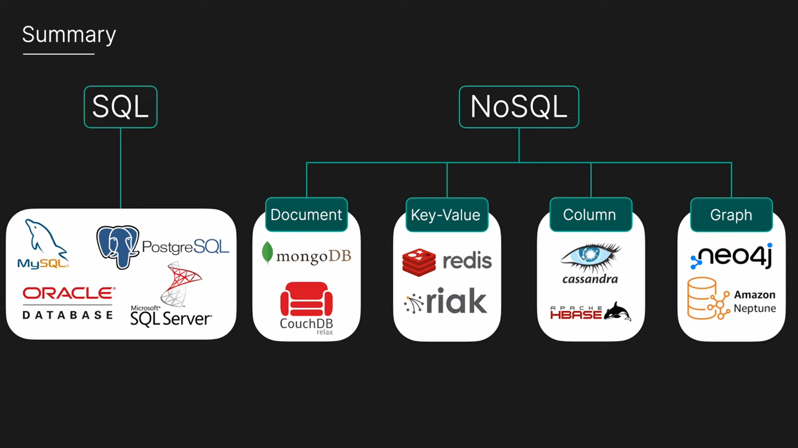

# <p align="center"></>React Angular .NET MongoDB SQL snippets</></p>

- [React](#react)
  - [React Best Practices](#react-best-practices)
  - [Common React Mistakes to Avoid ](#common-react-mistakes-to-avoid)
- [Angular](#angular)
- [ASP.NET](#aspnet)
  - [C#](#csharp)
  - [Entity Framework](#entity-framework)
  - [Configuration](#configuration)
- [DB](#db)
  - [MongoDb](#mongodb)
  - [SQL](#sql)

# React

# React Best Practices

### Fundamental building blocks of React, known as primitives:

**1. Components:**

- Reusable pieces of UI that encapsulate their own logic and rendering.
- Can be classified as:
  - **Functional Components:** Simple JavaScript functions that return JSX.
  - **Class Components:** Extend React.Component and manage state and lifecycle methods using `this`.

**2. JSX:**

- A syntax extension for JavaScript that allows writing HTML-like structures within code.
- Elements in JSX can represent both React components and DOM elements.

**3. Props:**

- Data passed from parent components to child components.
- Used to customize the behavior and appearance of child components.

**4. State:**

- Data that can change over time within a component.
- Managed using the `useState` hook in functional components or `this.state` in class components.
- Changes to state trigger re-renders of the component and its children.

**5. Rendering:**

- The process of generating the UI based on the component's state and props.
- React uses a virtual DOM to efficiently update only the necessary parts of the actual DOM.

**6. Lifecycle Methods:**

- Methods that are called at different stages of a component's lifecycle (mounting, updating, unmounting).
- Used for tasks like data fetching, subscriptions, or cleanup.
- Available in class components, but functional components can use hooks for similar effects.

**7. Hooks:**

- Functions that allow you to "hook into" React features like state and lifecycle methods from functional components.
- Examples include `useState`, `useEffect`, `useContext`, `useMemo`, and more.

**8. Virtual DOM:**

- An in-memory representation of the actual DOM.
- React uses it to compare changes and apply only the necessary updates to the real DOM, improving performance.

**9. Reconciliation:**

- The process of comparing the virtual DOM with the actual DOM to determine the minimal changes needed.
- React's efficient reconciliation algorithm is a key factor in its performance.

### useMemo

```js
// The useMemo hook is used to memoize the result of a computation. Memoization is a technique where the result of a function is cached and returned when the same inputs occur again, instead of recomputing the result. This can be useful for optimizing performance in certain scenarios, especially when dealing with expensive calculations or rendering.

import React, { useState, useMemo } from "react";

function App() {
  const [count, setCount] = useState(0);
  const [toDos, setToDos] = useState([{ id: 1, text: "Learn React" }]);

  const filteredToDos = useMemo(() => {
    // Expensive filtering operation
    return toDos.filter((todo) => todo.id !== count);
  }, [toDos, count]);

  return (
    <div>
      <p>Count: {count}</p>
      <button onClick={() => setCount(count + 1)}>Increment</button>
      <ul>
        {filteredToDos.map((todo) => (
          <li key={todo.id}>{todo.text}</li>
        ))}
      </ul>
    </div>
  );
}
```

### The best way to filter using useSearchParam

```js
export default function App() {
  const [searchParam, setSearchParam] = useSearchParam({ q: "", isActive: false });

  const q = searchParam.get("q");
  const isActive = searchParam.get("isActive") === "true";

  return (
    <>
      <input
        type="text"
        id="q"
        value={q}
        onChange={(e) =>
          setSearchParam(
            (prev) => {
              prev.set("q", e.target.value);
              return prev;
            },
            { replace: true },
          )
        }
      />
      <input
        type="checkbox"
        id="isActive"
        value={isActive}
        onChange={(e) =>
          setSearchParam((prev) => {
            prev.set("isActive", e.target.checked);
            return prev;
          })
        }
      />
    </>
  );
}
```

### The best way to change state in react and get the updated value instantly

```js
export default function App() {
  const [array, setArray] = useState([1, 2, 3]);

  const addToStart = (num) => {
    setArray((prev) => {
      return [num, ...prev];
    });
  };
  const addToEnd = (num) => {
    setArray((prev) => {
      return [...prev, num];
    });
  };

  return (
    <>
      {array}
      <button
        onClick={() => {
          addToStart(0);
          addToEnd(0);
        }}
      >
        Add
      </button>
    </>
  );
}
```

### To change tab title or html page title in React

```js
// Add this to the page components and change the title based on the page
document.title = "A new title";
```

### Functions

```js
// ES5
function getSum(a, b) {
  return a + b;
}

// ES6
const getSum = (a, b) => a + b;
```

### Template Literal String

```js
// ES5
var name = "Name";
console.log("My name is " + name);

// ES6
const name = "Name";
console.log(`My name is ${name}`);
```

### Use const & let instead of var

```js
// ES5
var fruits = ["apple", "banana"];

// ES6
let fruits = ["apple", "banana"];
fruits.push("mango");

const workingHours = 8;
```

### Object Destructuring

```js
var person = {
  name: "John",
  age: 32,
};

// ES5
var name = person.name;
var age = person.age;

// ES6
const { name, age } = person;
```

### Defining Objects

```js
var name = "John";
var age = 32;
var designations = "Game Developer";
var workingHours = 8;

// ES5
var person = {
  name: name,
  age: age,
  designation: designation,
  workingHours: workingHours,
};

// ES6
const person = { name, age, designation, workingHours };
```

### Component Name Should be in PascalCase

```js
const helloText = () => <div>Hello</div>; // wrong

const HelloText = () => <div>Hello</div>; // correct
```

### Variable & Function Names Should be in camelCase

```js
const working_hours = 10; // bad approach

const workingHours = 10; // good approach

const get_sum = (a, b) => a + b; // bad approach

const getSum = (a, b) => a + b; // good approach
```

### ID & Class Names Should be in kebab-case

```html
<!--bad approach-->
<div className="hello_word" id="hello_world">Hello World</div>

<!--good approach -->
<div className="hello-word" id="hello-world">Hello World</div>
```

### Always Check null & undefined for Objects & Arrays

```js
const person = {
  name: "John",
  state: "LA",
};
console.log("Age", person.age); // error
console.log("Age", person.age ? person.age : "Not available"); // correct
console.log("Age", person.age ?? "Not available"); //correct

const oddNumbers = undefined;
console.log(oddNumbers.length); // error
console.log(oddNumbers.length ? oddNumbers.length : "Array is undefined"); // correct
console.log(oddNumbers.length ?? "Array is undefined"); // correct
```

### Avoid Inline Styling

```js
const text = <div style={{ fontWeight: "bold" }}>Happy Learning!</div>; // bad approach

const text = <div className="learning-text">Happy Learning!</div>; // good approach
```

#### In .css file

```css
.learning-text {
  font-weight: bold;
}
```

### Avoid DOM Manipulation

#### Bad approach

```html
<div id="error-msg">Please enter a valid value</div>
```

```js
document.getElementById("error-msg").visibility = visible;
```

#### Good approach

```js
const [isValid, setIsValid] = useState(false);

<div hidden={isValid}>Please enter a valid value</div>;
```

### Always Remove Every Event Listener in useEffect

```js
const printHello = () => console.log("HELLO");
useEffect(() => {
  document.addEventListener("click", printHello);
  return () => document.removeEventListener("click", printHello);
});
```

### Avoid Repetition, Use Generic Components

```jsx
const Input=(props)=>{
  const [inputValue, setInputValue]=useState('');
  return(
    <label>{props.thing}</label>
    <input type='text' value={inputValue} onChange={(e)=>setInputValue(e.target.value)} />
  )
}

// Import Input and use instead of JSX
<div>
    <Input thing="First Name" />
    <Input thing="Second Name" />
</div>
```

### Use Ternary Operator Instead of if/else if Statements

```js
// Bad approach
if (name === "Ali") {
  return 1;
} else if (name === "Bilal") {
  return 2;
} else {
  return 3;
}

// Good approach
name === "Ali" ? 1 : name === "Bilal" ? 2 : 3;
```

### Make index.js File Name to Minimize Importing Complexity

```js
// If you have a file named index.js in a directory named actions and you want to import action from it in your component, your import would be like this

import { pageName } from "src/components/pages/index"; // Bad
import { pageName } from "src/components/pages"; // Good
```

### Destructuring of Props

```js
// Bad approach
const Details = (props) => {
  return (
    <div>
      <p>{props.name}</p>
      <p>{props.age}</p>
      <p>{props.designation}</p>
    </div>
  );
};

// Good approach
const Details = ({ name, age, designation }) => {
  return (
    <div>
      <p>{name}</p>
      <p>{age}</p>
      <p>{designation}</p>
    </div>
  );
};
```

### Don't Try to Access Modified State Variable in the Same Function

```js
// In a function, if you are assigning a value to a state variable then you won't be able to access that assigned value even after it has been assigned in that function

const Message = () => {
  const [message, setMessage] = useState("Hello World");
  const changeMessage = (messageText) => {
    setMessage("Happy Learning");
    console.log(message); // It will print Hello World on console
  };

  return <div>{message}</div>;
};
```

### Use === Operator instead of ==

```js
// While comparing two values, strictly checking both values and their data types is a good practice.

"2" == 2 ? true : false; // true
"2" === 2 ? true : false; // false
```

### Find 2nd largest number in array

```js
function nextBiggest(arr) {
  let max = 0,
    result = 0;

  for (const value of arr) {
    const val = Number(value);
    if (val > max) {
      [result, max] = [max, val]; // save previous max
    } else if (val < max && val > result) {
      result = val; // new second biggest
    }
  }
  return result;
}

const arr = ["20", "120", "111", "215", "215", "215", "54", "78"];
console.log(nextBiggest(arr));
```

### IIFE

```js
(async () => {
  await asyncCodeHere();
})();
```

### Suspense

```js
async function TodoList() {
  const todos = await getTodos();

  return (
    <div className="mt-8 flex flex-col gap-4">
      todos.map((todo) => (
      <Card key="{todo.id}">
        <CardHeader>
          <CardTitle className="text-2xl font-bold">{todo.title}</CardTitle>
        </CardHeader>
        <CardContent>{todo.description}</CardContent>
      </Card>
      ))}
    </div>
  );
}

<Suspense fallback={<div>Loading...</div>}>
  <TodoList />
</Suspense>;
```

# Common React Mistakes to Avoid

### 1. Missing or Incorrect `key` Prop in Lists

- **Description**: Without unique keys, React can't efficiently reconcile list items during updates, leading to bugs like incorrect state preservation or unnecessary re-renders.
- **Wrong Example**:
  ```jsx
  function TodoList({ todos }) {
    return (
      <ul>
        {todos.map((todo) => (
          <li>{todo.text}</li>
        ))}{" "}
        // No key!
      </ul>
    );
  }
  ```
- **Correct Fix**:
  ```jsx
  function TodoList({ todos }) {
    return (
      <ul>
        {todos.map((todo) => (
          <li key={todo.id}>{todo.text}</li>
        ))}{" "}
        // Use stable, unique ID.
      </ul>
    );
  }
  ```

### 2. Using Index as Key in Dynamic Lists

- **Description**: Indices change when items are added/removed, causing React to misidentify components and leading to bugs like lost focus or incorrect animations.
- **Wrong Example**:
  ```jsx
  {
    items.map((item, index) => <div key={index}>{item}</div>);
  }
  ```
- **Correct Fix**: Always use a unique identifier from the data, like an ID.

### 3. Not Cleaning Up in `useEffect`

- **Description**: For side effects like timers or subscriptions, forgetting cleanup leads to memory leaks or duplicate executions.
- **Wrong Example**:
  ```jsx
  useEffect(() => {
    const timer = setInterval(() => console.log("Tick"), 1000);
  }, []);
  ```
- **Correct Fix**:
  ```jsx
  useEffect(() => {
    const timer = setInterval(() => console.log("Tick"), 1000);
    return () => clearInterval(timer); // Cleanup on unmount.
  }, []);
  ```

### 4. Overusing `useEffect` for Computations

- **Description**: `useEffect` is for side effects; using it for derived state or sync logic bloats the code and can cause unnecessary delays.
- **Wrong Example**:
  ```jsx
  const [count, setCount] = useState(0);
  const [double, setDouble] = useState(0);
  useEffect(() => {
    setDouble(count * 2); // Unnecessary effect.
  }, [count]);
  ```
- **Correct Fix**:
  ```jsx
  const double = count * 2; // Compute in render.
  ```
  _(Or use `useMemo` for expensive computations.)_

### 5. Incorrectly Adding Refs or `.current` to Hook Dependencies

- **Description**: Refs are mutable but stable across renders; adding the ref object as a dep is usually unnecessary and can cause unexpected re-runs. Adding `.current` directly skips ESLint warnings but breaks if the value changes without triggering a render.
- **Wrong Example**:
  ```jsx
  function MyComponent() {
    const ref = useRef(null);
    useEffect(() => {
      console.log(ref.current); // Access .current.
    }, [ref]); // Unnecessary dep on ref object.
    // Or worse: [ref.current] – this warns and can cause stale values.
  }
  ```
- **Correct Fix**:
  ```jsx
  useEffect(() => {
    console.log(ref.current);
  }, []); // No dep needed; ref is stable.
  ```
  _(Reason: Refs don't cause re-renders when `.current` changes, so deps aren't triggered by them. Understand: Dependencies are for values that, if changed, should re-run the effect.)_

### 6. Stale Closures in Hooks or Callbacks

- **Description**: Functions capturing outdated state/props due to closures, especially in async code or callbacks. Experienced devs miss this in complex flows.
- **Wrong Example**:
  ```jsx
  function Counter() {
    const [count, setCount] = useState(0);
    const logCount = () => {
      setTimeout(() => console.log(count), 1000); // Logs stale count.
    };
    return <button onClick={logCount}>Log</button>;
  }
  ```
- **Correct Fix**:
  ```jsx
  const logCount = useCallback(() => {
    setTimeout(() => console.log(count), 1000);
  }, [count]); // Include count in deps.
  ```
  _(Or use a ref for the latest value: `const countRef = useRef(count);` and update in effect.)_

### 7. Unnecessary Re-renders from Bad Memoization

- **Description**: Forgetting to memoize objects/functions passed as props, causing child components to re-render unnecessarily. Pros do this when optimizing prematurely.
- **Wrong Example**:
  ```jsx
  function Parent() {
    const onClick = () => {}; // New function every render.
    return <Child onClick={onClick} />;
  }
  const Child = React.memo(({ onClick }) => <button onClick={onClick}>Click</button>);
  ```
- **Correct Fix**:
  ```jsx
  const onClick = useCallback(() => {}, []); // Memoize.
  ```

# Angular

1. **Component Life Cycles**

   **ngOnInit**
   Called once, after the first ngOnChanges()

   **ngOnChanges**
   Called before ngOnInit() and whenever one of the input properties changes.

   **ngOnDestroy**
   Called just before Angular destroys the directive/component.

   **ngDoCheck**
   Called during every change detection run.

   **ngAfterContentChecked**
   Called after the ngAfterContentInit() and every subsequent ngDoCheck()

   **ngAfterViewChecked**
   Called after the ngAfterViewInit() and every subsequent ngAfterContentChecked().

   **ngAfterContentInit**
   Called once after the first ngDoCheck().

   **ngAfterViewInit**
   Called once after the first ngAfterContentChecked().

2. **Template Syntax**

   Interpolation - generates user name.

   ```html
   {{user.name}}
   ```

   property binding - bind image url for user to src attribute

   ```html
   
   ```

   Event - assign function to click event

   ```html
   <button (click)="do()" ... />
   ```

   Show button when user.showSth is true

   ```html
   <button \*ngIf="user.showSth" ... />
   ```

   Iterate through the items list

   ```html
   *ngFor="let item of items"
   ```

   Angular ngClass attribute

   ```html
   <div [ngClass]="{green: isTrue(), bold: itTrue()}" />
   ```

   Angular ngStyle attribute

   ```html
   <div [ngStyle]="{'color': isTrue() ? '#bbb' : '#ccc'}" />
   ```

3. **Input and Output**

   Input() To pass value into child component

   Sample child component implementation:

   ```ts
   export class SampleComponent {
       @Input() value: any/string/object/…;
       ...
   }
   ```

   Sample parent component usage:

   ```ts
   <app-sample-component [value]="myValue"></app-sampe-component>
   Output() Emitting event to parent component
   Sample child component:
   @Output() myEvent: EventEmitter = new EventEmitter();
   onRemoved(item: MyModel) {
   this.myEvent.emit(item);
   }
   ```

   Sample parent component:

   ```html
   <app-my-component (myEvent)="someFunction()"></app-my-component>
   ```

   onRemoved in the child component is calling the someFunction() method in the parent component, as we can see in the above two child and parent components.

4. **Content Projection**

   Content projection in Angular is a pattern in which you inject the desired content into a specific component.

   Here’s an example of a parent component template:

   ```html
   <component>
     <div>(some html here)</div>
   </component>
   ```

   Child component template:

   ```html
   <ng-content></ng-content>
   ```

   Let us now inject the following HTML code in the parent component template:

   ```html
   <div well-body>(some html here)</div>
   ```

   It will look like:

   ```html
   <component>
     <div well-title>(some html here)</div>
     <div well-body>(some html here)</div>
   </component>
   ```

   When we combine both the above parent and child template, you get the following result:

   ```html
   <component>
     <div well-title>(some html here)</div>
     <div well-body>(some html here)</div>
   </component>
   <ng-content select="title"></ng-content>
   <ng-content select="body"></ng-content>
   ```

5. **ViewChild Decorator**

   Offers access to child component/directive/element:

   ```ts
   @ViewChild(NumberComponent) private numberComponent: NumberComponent; increase() {
   this.numberComponent.increaseByOne(); //method from child component } decrease() {
   this.numberComponent.decreaseByOne(); //method from child component }
   ```

   Sample for element: html:

   ```html
   <div #myElement></div>
   ```

   component:

   ```ts
   @ViewChild('myElement') myElement: ElementRef
   ```

   Instead ElementRef can be used for specific elements like FormControl for forms.

   Reference to element in html:

   ```html
   <button (click)="doSth(myElement)"></button>
   ```

6. **Routing**

   The Angular Router enables navigation from one view to the next as users perform application tasks.

   Sample routing ts file:

   ```ts
   const appRoutes: Routes = [
     { path: "crisis-center", component: CrisisListComponent },
     { path: "prod/:id", component: HeroDetailComponent },
     {
       path: "products",
       component: ProductListComponent,
       data: { title: "Products List" },
     },
     {
       path: "",
       redirectTo: "/products",
       pathMatch: "full",
     },
     { path: "**", component: PageNotFoundComponent },
   ];
   ```

   Then, this should be added inside Angular.module imports:

   ```ts
   RouterModule.forRoot(appRoutes);
   ```

   You can also turn on console tracking for your routing by adding enableTracing:

   ```ts
   imports: [RouterModule.forRoot(routes,{enableTracing: true})],
   ```

   Usage

   ```html
   <a routerLink="/crisis-center" routerLinkActive="active"> Crisis Center </a>
   ```

   routerLinkActive="active" will add active class to element when the link's route becomes active

   ```ts
   //Navigate from code
   this.router.navigate(["/heroes"]);
   // with parameters
   this.router.navigate(["/heroes", { id: heroId, foo: "foo" }]);
   // Receive parameters without Observable
   let id = this.route.snapshot.paramMap.get("id");
   ```

   CanActivate and CanDeactivate
   In Angular routing, two route guards are CanActivate and CanDeactivate. The former decides whether the route can be activated by the current user, while the latter decides whether the router can be deactivated by the current user.

   CanActivate:

   ```ts
   class UserToken {}
   class Permissions {
     canActivate(user: UserToken, id: string): boolean {
       return true;
     }
   }
   ```

   CanDeactivate:

   ```ts
   class UserToken {}
   class Permissions {
     canDeactivate(user: UserToken, id: string): boolean {
       return true;
     }
   }
   ```

7. **Modules**

   Angular apps are modular and Angular has its own modularity system called NgModules. NgModules are containers for a cohesive block of code dedicated to an application domain, a workflow, or a closely related set of capabilities.

   **Sample Module with Comments**

   ```ts
   import { BrowserModule } from "@angular/platform-browser";
   import { NgModule } from "@angular/core";
   import { AppRoutingModule } from "./app-routing.module";
   import { AppComponent } from "./app.component";
   @NgModule({
     declarations: [AppComponent], // components, pipes, directives
     imports: [BrowserModule, AppRoutingModule], // other modules
     providers: [], // services
     bootstrap: [AppComponent], // top component
   })
   export class AppModule {}
   ```

8. **Services**

   Components shouldn't fetch or save data directly and they certainly shouldn't knowingly present fake data. Instead, they should focus on presenting data and delegate data access to a service.

   Sample service with one function:

   ```ts
   @Injectable()
   export class MyService {
     public items: Item[];
     constructor() {}
     getSth() {
       // some implementation
     }
   }
   ```

   When you create any new instance of the component class, Angular determines the services and other dependencies required by that component by looking at the parameters defines in the constructor as follows:

   ```ts
   constructor(private dogListService: MyService){ }
   ```

   The above constructor requires the service: MyService

   Register MyService in the providers module:

   ```ts
   providers: [MyService];
   ```

9. **HttpClient**

   This command handles and consumes http requests.

   Add import to module:

   ```ts
   import { HttpClientModule } from "@angular/common/http";
   ```

   You can use the above statement in the following way:

   ```ts
   import {HttpClient} from '@angular/common/http';
   ...

   // GET
   public getData(): Observable {
       return this.http.get('api/users/2');
   }

   // POST
   public send(val1: any, val2: any): Observable {
       const object = new SendModel(val1, val2);
       const options = {headers: new HttpHeaders({'Content-type': 'application/json'})};
       return this.http.post(environment.apiUrl + 'api/login', object, options);
   }
   ```

10. **Dependency Injection**

    This injects a class into another class:

    ```ts
    @Injectable({
      providedIn: "root",
    })
    export class SomeService {}
    ```

    It accepts 'root' as a value or any module of your application.

11. **Declare Global Values**

    Class:

    ```ts
    import { InjectionToken } from "@angular/core";
    export const CONTROLS_GLOBAL_CONFIG = new InjectionToken("global-values");
    export interface ControlsConfig {
      firstGlobalValue: string;
    }
    ```

    Module:

    ```ts
    providers: [{provide: CONTROLS_GLOBAL_CONFIG, useValue: {firstGlobalValue : 'Some value' }},
    ```

    Usage (for example in component):

    ```ts
    constructor(@Optional() @Inject(CONTROLS_GLOBAL_CONFIG) globalValues: ControlsConfig) {}
    ```

12. **Pipes**

    Pipes transform data and values to a specific format. For example:

    Show date in shortDate format:

    ```ts
    {{model.birthsDay | date:'shortDate'}}
    ```

    Pipe implementation:

    ```ts
    @Pipe({ name: "uselessPipe" })
    export class uselessPipe implements PipeTransform {
      transform(value: string, before: string, after: string): string {
        let newStr = `${before} ${value} ${after}`;
        return newStr;
      }
    }
    ```

    usage:

    ```ts
    {{ user.name | uselessPipe:"Mr.":"the great" }}
    ```

13. **Directives**

    An Attribute directive changes A DOM element’s appearance or behavior. For example, [ngStyle] is a directive.

    Custom directive:

    ```ts
    import { Directive, ElementRef, HostListener, Input } from "@angular/core";
    @Directive({
      selector: "[appHighlight]",
    })
    export class HighlightDirective {
      constructor(private el: ElementRef) {}
      @Input("appHighlight") highlightColor: string;
      @Input("otherPar") otherPar: any; //it will be taken from other attribute named [otherPar]
      @HostListener("mouseenter") onMouseEnter() {
        this.highlight(this.highlightColor || "red");
      }
      private highlight(color: string) {
        this.el.nativeElement.style.backgroundColor = color;
      }
    }
    ```

    Usage:

    ```html
    <p [appHighlight]="color" [otherPar]="someValue">Highlight me!</p>
    ```

14. **Animations**

    Animations allow you to move from one style state to another before adding BrowserModule and BrowserAnimationsModule to the module.

    Implementation:

    ```ts
    animations: [
      trigger("openClose", [
        state(
          "open",
          style({
            height: "400px",
            opacity: 1.5,
          }),
        ),
        state(
          "closed",
          style({
            height: "100px",
            opacity: 0.5,
          }),
        ),
        transition("open => closed", [animate("1s")]),
        transition("closed => open", [animate("1s")]),
      ]),
    ];
    ```

    Usage:

    ```html
    <div [@openClose]="isShowed ? 'open' : 'closed'"></div>
    ```

15. **Angular Forms**

    In this section of our Angular 4 cheat sheet, we’ll discuss different types of Angular forms.

    **Template Driven Forms**

    Form logic (validation, properties) are kept in the template.

    sample html:

    ```html
    <form name="form" (ngSubmit)="f.form.valid && onSubmit()" #f="ngForm" novalidate>
      <div class="form-group">
        <label for="firstName">First Name</label>

        <input
          type="text"
          class="form-control"
          name="firstName"
          [(ngModel)]="model.firstName"
          #firstName="ngModel"
          [ngClass]="{ 'is-invalid': f.submitted && firstName.invalid }"
          required
        />
        <div *ngIf="f.submitted && firstName.invalid" class="invalid-feedback">
          <div *ngIf="firstName.errors.required">First Name is required</div>
        </div>
      </div>
      <div class="form-group">
        <button class="btn btn-primary">Register</button>
      </div>
    </form>
    ```

    Sample component:

    ```ts
    @ViewChild("f") form: any;

    firstName: string = "";
    langs: string[] = ["English", "French", "German"];
    onSubmit() {
        if (this.form.valid) {
            console.log("Form Submitted!");
            this.form.reset();
        }
    }
    ```

    **Reactive Forms**

    Form logic (validation, properties) are kept in the component.

    Sample HTML:

    ```html
    <form [formGroup]="registerForm" (ngSubmit)="onSubmit()">
      <div class="form-group">
        <label>Email</label>
        <input
          type="text"
          formControlName="email"
          class="form-control"
          [ngClass]="{ 'is-invalid': submitted && f.email.errors }"
        />
        <div *ngIf="submitted && f.email.errors" class="invalid-feedback">
          <div *ngIf="f.email.errors.required">Email is required</div>
          <div *ngIf="f.email.errors.email">Email must be a valid email address</div>
        </div>
      </div>
      <div class="form-group">
        <button [disabled]="loading" class="btn btn-primary">Register</button>
      </div>
    </form>
    ```

    Sample component:

    ```ts
    registerForm: FormGroup;
    submitted = false;
    constructor(private formBuilder: FormBuilder) { }
    ngOnInit() {
        this.registerForm = this.formBuilder.group({
        firstName: [{{here default value}}, Validators.required],
        lastName: ['', Validators.required],
        email: ['', [Validators.required, Validators.email]],
        password: ['', [Validators.required, Validators.minLength(6)]]
        });
    }

    // convenience getter for easy access to form fields
    get f() { return this.registerForm.controls; }
    onSubmit() {
        this.submitted = true;
        // stop here if form is invalid
        if (this.registerForm.invalid) {
            return;
        }
        alert('SUCCESS!! :-)')
    }
    ```

    **Custom Validator for Reactive Forms**

    Function:

    ```ts
    validateUrl(control: AbstractControl) {
        if (!control.value || control.value.includes('.png') || control.value.includes('.jpg')) {
            return null;
        }
        return { validUrl: true };
    }
    ```

    Usage:

    ```ts
    this.secondFormGroup = this._formBuilder.group({
      imageCtrl: ["", [Validators.required, this.validateUrl]],
    });
    ```

    Multi-field validation:

    ```ts
    validateNameShire(group: FormGroup) {
        if (group) {
            if (group.get('isShireCtrl').value && !group.get('nameCtrl').value.toString().toLowerCase().includes('shire')) {
                return { nameShire : true };
            }
        }
        return null;
    }
    ```

    Multi-field validation usage:\*

    ```ts
    this.firstFormGroup.setValidators(this.validateNameShire);
    ```

    Error handling:

    ```html
    <div *ngIf="firstFormGroup.controls.nameCtrl.errors.maxlength">Name is too long</div>

    <div *ngIf="firstFormGroup.errors.nameShire">
      Shire dogs should have "shire" in name
    </div>
    ```

    **Custom Validator Directive for Template-Driven Forms**

    Shortly, we’ll cover how to register our custom validation directive to the NG_VALIDATORS service. Thanks to multi-parameter we won't override NG_VALIDATORS but just add CustomValidator to NG_VALIDATORS).

    Here’s what you use:

    ```ts
    @Directive({
        selector: '[CustomValidator]',
        providers: [{provide: NG_VALIDATORS, useExisting: CustomValidator, multi:true}]
    })
    ```

    Example:

    ```ts
    @Directive({
        selector: '[customValidation]',
        providers: [{provide: NG_VALIDATORS, useExisting: EmailValidationDirective, multi: true}]
    })

    export class CustomValidation implements Validator {
        constructor() { }
        validate(control: AbstractControl): ValidationErrors {
            return (control.value && control.value.length <= 300) ?
            {myValue : true } : null;
        }
    }
    For multiple fields:
    validate(formGroup: FormGroup): ValidationErrors {
        const passwordControl = formGroup.controls["password"];
        const emailControl = formGroup.controls["login"];
        if (!passwordControl || !emailControl || !passwordControl.value || !emailControl.value) {
            return null;
        }
        if (passwordControl.value.length > emailControl.value.length) {
            passwordControl.setErrors({ tooLong: true });
        } else {
            passwordControl.setErrors(null);
        }
        return formGroup;
    }
    ```

    **ngModel in Custom Component**

    Add to module:

    ```ts
    providers: [{
        provide: NG_VALUE_ACCESSOR,
        useExisting: forwardRef(() => TextAreaComponent),
        multi: true
        }]

    Implement ControlValueAccessor interface
    interface ControlValueAccessor {
        writeValue(obj: any): void
        registerOnChange(fn: any): void
        registerOnTouched(fn: any): void
        setDisabledState(isDisabled: boolean)?: void
    }
    ```

    **registerOnChange**

    Register a function to tell Angular when the value of the input changes.

    **registerOnTouched**

    Register a function to tell Angular when the value was touched.

    **writeValue**

    Tell Angular how to write a value to the input.

    Sample implementation:

    ```ts
    @Component({
      selector: "app-text-area",
      templateUrl: "./text-area.component.html",
      styleUrls: ["./text-area.component.less"],
      providers: [
        {
          provide: NG_VALUE_ACCESSOR,
          useExisting: forwardRef(() => TextAreaComponent),
          multi: true,
        },
      ],
    })
    export class TextAreaComponent implements ControlValueAccessor, OnInit {
      @Input() value: string;
      private _onChange = (data: any) => {
        console.log("changed: " + data);
      };
      private _onTouched = (data?: any) => {
        console.log("touched: " + data);
      };
      ngOnInit(): void {
        const self = this;
      }
      constructor() {}
      writeValue(obj: any): void {
        this.value = obj;
      }
      registerOnChange(fn) {
        this._onChange = fn;
      }
      registerOnTouched(fn: any): void {
        this._onTouched = fn;
      }
    }
    ```

16. **Tests**

    Every software application under development needs to be tested to verify its correctness, and so do the Angular applications. Testing implies executing various tests or test cases on an application to validate it functionality and correctness.

    **Unit tests**

    Unit testing, in general, is a type of software testing level that checks various components of an application separately. In Angular, the default unit testing framework is Jasmine. It is widely utilized while developing an Angular project using CLI.

    Service:

    ```ts
    describe('MyService', () => {
        let service: MyService;
        beforeEach(() => service = new MyService();
        it('#fetch should update data', () => {
        service.fetchData();
        expect(service.data.length).toBe(4);
        expect(service.data[0].id).toBe(1);
        });
    });
    ```

    For async functions:

    ```ts
    it("#fetch should update data", (done: DoneFn) => {
      // some code
      done(); // we need 'done' to avoid test finishing before date was received
      // some code
    });
    ```

    example async test:

    ```ts
    it("http client works", (done: DoneFn) => {
      service.getUser().subscribe((data) => {
        expect(data).toBe("test");
        done();
      });
    });
    ```

17. **Spy and stub**

    When you make calls during the testing process, a stub provides canned answers to all those calls. It does not respond to anything outside the program under test.

    A spy is a stub that records the information based on the calls you make during the test.

    **Spy:**

    ```ts
    // create spied object by copy getDataAsync from HttpService
    const valueServiceSpy = jasmine.createSpyObj("HttpService", ["getDataAsync"]);
    ```

    **Stub:**

    ```ts
    const stubValue = of("StubValue");
    valueServiceSpy.getDataAsync.and.returnValue(stubValue);
    ```

    **TestBed Mock whole module/environment for unit tests:**

    ```ts
    beforeEach(() => {
      let httpClientMock = TestBed.configureTestingModule({
        providers: [{ provide: MyService, useValue: new MyService(httpClientMock) }],
      });
    });
    ```

    Then use tested object (for example service) like this:

    ```ts
    service = TestBed.get(MyService);
    ```

    We can add schemas: [NO_ERRORS_SCHEMA]. This means that we don’t have to mock child component dependencies of this component because Angular won’t yell if we don’t include them!

18. **Miscellaneous**

    **Http Interceptor**
    An HTTP interceptor can handle any given HTTP request.

    Class:

    ```ts
    @Injectable()
    export class MyInterceptor implements HttpInterceptor {
        constructor() { }
        intercept(request: HttpRequest, next: HttpHandler): Observable> {
            // do sth (like check and throw error)
            return next.handle(request); //if want continue
        }
    }
    ```

    Parameters:

    - req: HttpRequest\<any> - It is the object that handles outgoing requests.
      next: HttpHandler
    - next: HttpHandler - It indicates the next interceptor in the line or the backend in case there are no interceptors.

    Returns:

    An HTTP interceptor returns the observable of the event stream.

    Observable<HttpEvent\<any>>

# ASP.NET

## CSharp

### Polymorphism

- **Method Overriding:**
  Method overriding allows a derived class with `override` to provide a specific implementation of a method that is already defined in its base class with `virtual`. This enables you to invoke the method on objects of the derived class through a reference to the base class, and the overridden method will be executed based on the actual type of the object at runtime.

  **Preventing Derived class from overriding virtual members**
  For example, if class X has the virtual method "A," class Y is derived from X, and class Z "s "is derived from Y, class Z inherits the virtual method "A" and overrides it with `sealed`.

- **Method Overloading:**
  Method overloading allows you to define multiple methods with the same name but with different parameter lists. This enables you to provide different implementations of a method based on the number or types of parameters passed to it.

### Encapsulation

- **Access Modifiers:**

  - `public:` The member is accessible from any code in the same assembly or referencing assembly.
  - `private:` The member is accessible only within the same class or struct.
  - `protected:` The member is accessible within the same class or subclass (derived class).
  - `internal:` The member is accessible within the same assembly.
  - `protected internal:` The member is accessible within the same assembly or from within a derived class located in any assembly.

### Class types

- **Abstract Class:** An abstract class is designed to be a base class for other classes. It cannot be instantiated on its own (i.e. that cannot create an object). It allows you to define common functionality in the base class that can be shared by its derived classes. Can have none abstract in the body.
- **Static Class:** Can not create object of static class. In this type of class all methods, variables etc should be static. Static class can be access globally. Use for any Math operations, file manipulation, string manipulation, Configuration etc.
- **Interface:** An interface in C# is a contract that defines a set of method and property signatures. It outlines a common set of behaviors that classes must implement, promoting code consistency, polymorphism, and flexibility in software design.

### Abstract Class vs Interface

Abstract classes can contain abstract methods, which are methods without implementation also contain non-abstract methods. Abstract methods must be implemented in any non-abstract derived class. Non-abstract methods can have implementations and will be inherited by derived classes.

An interface in is a contract that defines a set of methods, properties, and events that a class must implement. Interfaces are similar to abstract classes in that they cannot be directly instantiated. They are used to define a behavior that can be implemented by multiple unrelated classes.

- Abstract classes can contain implemented methods, while interfaces only contain method signatures.
- Classes can implement multiple interfaces, but they can inherit from only one abstract class.
- Abstract classes can have constructors, while interfaces cannot.
- Abstract classes can have fields and properties, while interfaces can only have properties.
- Abstract classes are typically used for creating a base class for other classes to inherit from, while interfaces are used for defining a contract that classes must implement.

## Entity Framework

### EF Core ALL Relationships

- 1:1

  Lets say we have two Model Character and Weapon. A Character can only equip one weapon and one weapon can only be equipped by a Character. So, it's a one-to-one relationship.

  Both Model will have references to each other but the one that can't exist without the other Model will have Id references of the other Model.

  Here a Character can exist without a Weapon but the Weapon only exist because theres a Character to equip it so, weapon have one more variable CharacterId.

  If it was other way then there would be one more variable in Character Model as WeaponId and CharacterId from weapons Model will be removed.

  ```cs
  // Character can exist without a weapon
  public class Character
  {
      public Guid Id { get; set; }
      public Weapon Weapon { get; set; }
  }

  // weapon cant exist without a character
  public class Weapon
  {
      public Guid Id { get; set; }
      public Character Character { get; set; }
      public Guid CharacterId { get; set; }
  }
  ```

- 1:n

  Lets say we have two Model User and Character. A User can have many Characters but a Character can only have one User. So, it's a one-to-many relationship.

  Since it's a one-to-many relationship then User will have list reference of Character
  and Character will have only one User reference and UserId.

  ```cs
  // 1 user can have many characters
  public class User
  {
      public Guid Id { get; set; }
      List<Character> Characters { get; set; }
  }

  // character has only one user
  public class Character
  {
      public Guid Id { get; set; }
      public User User { get; set; }
      public Guid UserId { get; set; }
  }
  ```

- n:n

  Lets say we have two Model Character and Skill. A Character can have many Skills and a Skill can have be used by many Characters. So, it's a many-to-many relationship. So both Model will have list references of each other.

  ```cs
  public class Character
  {
      public Guid Id { get; set; }
      public List<Skill> Skills { get; set; }
  }

  public class Skill
  {
      public Guid Id { get; set; }
      public List<Character> Characters { get; set; }
  }
  ```

## Configuration

### Rate Limiter

```cs
// program.cs
builder.Services
    .AddRateLimiter(o =>
    o.AddFixedWindowLimiter(policyName: "fixed",
    options =>
    {
        options.PermitLimit = 10;
        options.Window = TimeSpan.FromSeconds(5);
        options.QueueLimit = 2;
    }));

app.UseRateLimiter();

// WeatherController.cs
[EnableRateLimiting("fixed")]
public class WeatherController: Controller
{
    // HTTP Methods
}
```

# DB



# MongoDb

#### Install

    $ npm i mongoose

#### Connect

```js
import mongoose from "mongoose";

const connectionString = "string from mongodb atlas";

mongoose.connect(connectionString, {
  useNewUrlParser: true,
  useCreateIndex: true,
  useFindAndModify: false,
  useUnifiedTopology: true,
});
```

#### Defining a schema

```js
const userSchema = new mongoose.Schema({
  fullName: {
    type: String,
    maxlength: 20,
    required: [true, "Name cant be Empty"],
  },
  phone: Number,
  verified: { type: Boolean, default: false },
});
```

##### SchemaTypes

- String
- Number
- Date
- Buffer
- Boolean
- Mixed
- ObjectId
- Array

For more
[SchemaTypes](http://mongoosejs.com/docs/schematypes.html)

#### Query

[all query](https://mongoosejs.com/docs/api/query.html)

A model is a constructor compiled from a schema. Model instances represent a collection of documents.

##### Create a model

```js
const User = mongoose.model("User", userSchema);

const u = User.create({ fullName: "Name", phone: 0123456789, verified: true });

const u = User.insert({ fullName: "Name", phone: 0123456789, verified: true });
```

##### $find all

```js
User.find({});
```

##### $find by name

```js
User.find({ fullName: "Name" });
```

##### $find by multiple values

```js
User.find({ fullName: "Name", id: "123" });
```

##### $find one by id

```js
User.findOne({ _id: id });
```

##### $update one by id

```js
User.findOneAndUpdate({ _id: id }, updateData, {
  new: true,
  runValidators: true,
  overwrite: true, // it will remove all the old data without default values and add the new data under the id
});
```

##### $delete one by id

```js
User.findOneAndDelete({ _id: id });
```

##### $delete one by id

```js
User.findByIdAndRemove(id);
```

# SQL


