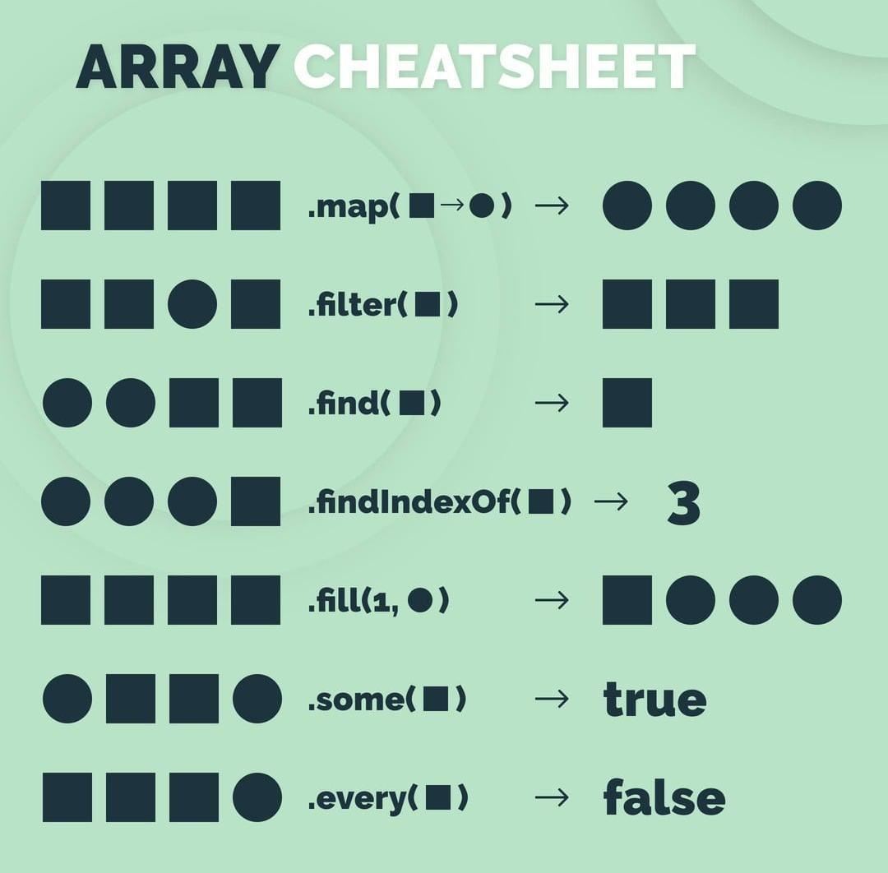
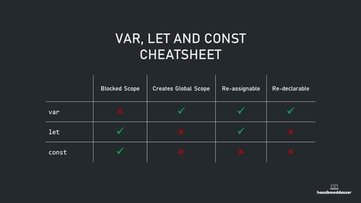

# <p align="center">🔖Web Dev Tools</></p>

- [Frontend](#frontend)
  - [Useful Links](#useful-links)
    - [Frontend Frameworks](#frontend-frameworks)
    - [Mock Up Tools](#mock-up-tools)
    - [Code Screenshots](#code-screenshots)
    - [Games to learn JavaScript](#games-to-learn-javascript)
    - [Top 3 Regex Tools](#top-3-regex-tools)
    - [Js Links](#js-links)
    - [CSS Links](#css-links)
    - [SVG Tools](#svg)
    - [Colors](#colors)
    - [Typography](#typography)
    - [Loader](#loader)
    - [Layouts](#layouts)
    - [Avatar](#avatar)
    - [Icons](#icons)
    - [3d icons](#3d-icons)
    - [Illustrations](#illustrations)
    - [Videos & Images](#videos-&-images)
    - [Info](#info)
    - [Free API](#free-api)
    - [Next Open Source Projects](#next-open-source-projects)
    - [Other Tools](#other-tools)
  - [React](#react)
    - [React Ecosystem](#react-ecosystem)
      - [Getting Started](#getting-started)
      - [Auth](#auth)
      - [Routing](#routing)
      - [State Management](#state-management)
      - [Form](#form)
      - [Schema Validator](#schema-validator)
      - [Styling](#styling)
      - [UI Component](#ui-component)
      - [Other UI libs](#other-ui-libs)
      - [Drag and Drop](#drag-and-drop)
      - [Animation](#animation)
      - [Data Visualization/Chart/Table](#data-visualization-chart-table)
      - [PDF Doc](#pdf-doc)
      - [Payment Methods](#payment-methods)
      - [Markdown/Rich Text Editor](#markdown-rich-text-editor)
      - [Tour Guide](#tour-guide)
      - [HTTP](#http)
      - [Date Time](#date-time)
      - [Internationalization](#internationalization)
      - [Rendering Performance](#rendering-performance)
      - [Testing](#testing)
      - [Documentation](#documentation)
      - [Type Checking](#type-checking)
      - [Visual Editors](#visual-editors)
      - [Other Libraries](#other-libraries)
      - [DevTools](#devtools)
    - [Folder Structure](#folder-structure)
    - [React Best Practices](#react-best-practices)
    - [Interview Questions](#interview-questions)
  - [Angular](#angular)
    - [Component Libraries](#angular-component-libraries)
    - [Angular Cli](#angular-cli)
  - [Vue](#vue)
    - [Component Libraries](#vue-component-libraries)
  - [HTML Snippet](#html-snippet)
  - [CSS Snippet](#css-snippet)
  - [Tailwind CSS](#tailwind-css)
  - [JS/TS Snippet](#js-snippet)
- [Backend](#backend)
  - [Backend Framework](#backend-framework)
  - [Backend as a Service and Database](#backend-as-a-service-and-database)
  - [ASP.NET](#aspnet)
    - [C#](#csharp)
    - [Entity Framework](#entity-framework)
    - [Configuration](#configuration)
    - [Library List](#library-list)
    - [Links](#links)
  - [MongoDb](#mongodb)
  - [SQL](#sql)

# Frontend

# Useful Links

- ## Frontend Frameworks

  1. [React](https://github.com/facebook/react) - [Next](https://github.com/vercel/next.js) - [Astro](https://github.com/withastro/astro) - [Remix](https://github.com/remix-run/remix) - [React Admin](https://github.com/marmelab/react-admin) - [Refine](https://github.com/refinedev/refine) - [umi](https://github.com/umijs/umi)
  2. [Angular](https://github.com/angular/angular)
  3. [Solid](https://github.com/solidjs/solid) - [Solid Start](https://github.com/solidjs/solid-start)
  4. [Qwik](https://github.com/BuilderIO/qwik) - [Lit](https://github.com/lit/lit) - [Van](https://github.com/vanjs-org/van)
  5. [Preact](https://github.com/preactjs/preact)
  6. [htmx](https://github.com/bigskysoftware/htmx)
  7. [Vue](https://github.com/vuejs/core) - [Nuxt](https://github.com/nuxt/nuxt)
  8. [Svelte](https://github.com/sveltejs/svelte) - [Kit](https://github.com/sveltejs/kit)
  9. [rio - WebApps in pure Python](https://github.com/rio-labs/rio)
  10. [riot](https://github.com/riot/riot)
  11. [Alpine.js](https://github.com/alpinejs/alpine)
  12. [Nuejs](https://github.com/nuejs/nuejs)
  13. [Yew](https://github.com/yewstack/yew)
  14. [neo.mjs](https://github.com/neomjs/neo)
  15. [Stimulus](https://github.com/hotwired/stimulus)
  16. [Hibiki HTML](https://github.com/dashborg/hibiki)

- ## Mock Up Tools

  1. [shots](https://shots.so/)
  2. [brandbird](https://www.brandbird.app/)
  3. [huemint](https://huemint.com/)

- ## Code Screenshots

  1. [codeimage](https://app.codeimage.dev/)
  2. [ray.so](https://ray.so/)
  3. [carbon](https://carbon.now.sh/)
  4. [chalk](https://chalk.ist/)
  5. [poet](https://poet.so/)
  6. [tweetlet](https://tweetlet.net/)

- ## Games to learn JavaScript

  1. [codecombat](https://codecombat.com/play)
  2. [jsrobot](https://lab.reaal.me/jsrobot/)
  3. [code-maven](https://www.crunchzilla.com/code-)
  4. [elevatorsaga](https://play.elevatorsaga.com/)
  5. [jsdares](https://jsdares.com/)
  6. [untrusted](https://alexnisnevich.github.io/untrusted/)
  7. [checkio](https://js.checkio.org/)

- ## Top 3 Regex Tools

  1. [Regex 101](https://regex101.com/)
  2. [YouCode AI: Regex](https://you.com/search?q=regex)
  3. [Regexr](https://regexr.com/)

- ## Js Links

  1. [JavaScript Visualizer 9000](https://www.jsv9000.app/)
  2. [swiperjs](https://swiperjs.com/)
  3. [kute](https://thednp.github.io/kute.js/)
  4. [emailjs](https://www.emailjs.com/)
  5. [turnjs](http://turnjs.com/)
  6. [leafletjs](https://leafletjs.com/)
  7. [particles](https://vincentgarreau.com/particles.js/)
  8. [desandro](https://masonry.desandro.com/)
  9. [konvajs](https://konvajs.org/)
  10. [popper](https://popper.js.org/)
  11. [tweenjs](https://github.com/tweenjs/tween.js/)

- ## CSS Links

  1. [analyze-css](https://www.projectwallace.com/analyze-css)
  2. [sass](https://sass-lang.com/guide)
  3. [3D Book Image CSS Generator](https://scastiel.dev/3dbook)
  4. [css-grid-cheat-sheet](https://alialaa.github.io/css-grid-cheat-sheet/)
  5. [cssgridgenerator](https://cssgridgenerator.io/)
  6. [grid.malven](https://grid.malven.co/) - [flexbox.malven](https://flexbox.malven.co/)
  7. [(easings) Easing functions](https://easings.net/)
  8. [(easingwizard) Easing functions](https://easingwizard.com/)
  9. [code-magic](https://code-magic.vercel.app/)
  10. [motion-ui](https://zurb.com/playground/motion-ui)
  11. [themeselection](https://bootstrap-cheatsheet.themeselection.com/)
  12. [hint](https://kushagra.dev/lab/hint)
  13. [webgradients](https://webgradients.com/)
  14. [enjoycss](https://enjoycss.com/)
  15. [fancy-border-radius](https://9elements.github.io/fancy-border-radius/)
  16. [neumorphism](https://neumorphism.io/#e0e0e0)
  17. [clippy](https://bennettfeely.com/clippy/)
  18. [easing-gradients](https://larsenwork.com/easing-gradients/)
  19. [shadows](https://shadows.brumm.af/)
  20. [cubic-bezier](https://cubic-bezier.com/#.17,.67,.83,.67)
  21. [cssgradient](https://cssgradient.io/)
  22. [css-separator-generator](https://wweb.dev/resources/css-separator-generator/)
  23. [haikei](https://haikei.app/)
  24. [shapedivider](https://www.shapedivider.app/)
  25. [gradient](https://angrytools.com/gradient/)
  26. [scale-up](https://animista.net/play/basic/scale-up)
  27. [magic](https://www.minimamente.com/project/magic/)
  28. [animate](https://animate.style/)
  29. [box-shadow](https://box-shadow.dev/)
  30. [generate-css](https://generate-css.com/)
  31. [box-shadow](https://html-css-js.com/css/generator/box-shadow/)
  32. [buttons-generator](https://markodenic.com/tools/buttons-generator/)
  33. [10-online-button-generators](https://www.sitepoint.com/10-online-button-generators/)
  34. [css-glow-generator](https://cssbud.com/css-generator/css-glow-generator/)
  35. [uiverse](https://uiverse.io/)
  36. [cssfx](https://cssfx.netlify.app/)
  37. [clothoid](https://onotakehiko.dev/clothoid/)
  38. [glassmorphism-generator](https://hype4.academy/tools/glassmorphism-generator)
  39. [cssfilters](https://www.cssfilters.co/)
  40. [base64-image](https://www.base64-image.de/)
  41. [quantityqueries](https://quantityqueries.com/)
  42. [animate](https://keyframes.app/animate)
  43. [waitanimate](https://waitanimate.wstone.uk/)
  44. [transition](https://www.transition.style/)
  45. [heropatterns](https://heropatterns.com/)
  46. [haikei](https://app.haikei.app/)
  47. [pattern-generator](https://doodad.dev/pattern-generator/)
  48. [css-pattern](https://css-pattern.com/)
  49. [patternizer](https://patternizer.com/4rjn)
  50. [patternify](http://www.patternify.com/)
  51. [animated-css-background-generator](https://wweb.dev/resources/animated-css-background-generator/)
  52. [trianglify](https://trianglify.io/)
  53. [animatedbackgrounds](https://animatedbackgrounds.me/)
  54. [css-backgrounds](https://www.magicpattern.design/tools/css-backgrounds)
  55. [stylifycss](https://stylifycss.com/)
  56. [emojicursor](https://www.emojicursor.app/)
  57. [css-generators](https://css-generators.com/)
  58. [cssportal](https://www.cssportal.com/)
  59. [squircley](https://squircley.app/)
  60. [all-animation](https://all-animation.github.io/)
  61. [csshake](https://elrumordelaluz.github.io/csshake/)
  62. [Hover](https://ianlunn.github.io/Hover/)
  63. [infinite](https://tilomitra.github.io/infinite/)
  64. [Woah.css](https://www.joerezendes.com/projects/Woah.css/)
  65. [finisher](https://www.finisher.co/lab/header/)
  66. [css-tools](https://10015.io/css-tools)
  67. [hamburgers](https://jonsuh.com/hamburgers/)
  68. [cssbuttons](https://cssbuttons.app/)

- ## SVG

  1. [fffuel](https://fffuel.co/) collection of color tools and free SVG generators for gradients, patterns, textures, shapes & backgrounds
  2. [getwaves](https://getwaves.io/)
  3. [blobmaker](https://www.blobmaker.app/)
  4. [svgwave](https://svgwave.in/)
  5. [svg-wave-generator](https://www.softr.io/tools/svg-wave-generator)
  6. [svgbackgrounds](https://www.svgbackgrounds.com/)
  7. [svg-shape-generator](https://www.softr.io/tools/svg-shape-generator)

- ## Colors

  1. [color-palette](https://www.degraeve.com/color-palette/)
  2. [palettte](https://palettte.app/)
  3. [coolors](https://coolors.co/)
  4. [paletton](https://paletton.com/)
  5. [color-wheel](https://color.adobe.com/create/color-wheel)
  6. [khroma](http://khroma.co/)
  7. [culrs](https://www.culrs.com/#/)
  8. [colorhunt](https://colorhunt.co/)
  9. [colorsinspo](https://colorsinspo.com/)
  10. [grabient](https://www.grabient.com/)
  11. [easing-gradients](https://larsenwork.com/easing-gradients/#editor)
  12. [meshgradient](https://meshgradient.in/)
  13. [flatuicolors](https://flatuicolors.com/)
  14. [colordesigner](https://colordesigner.io/tools)
  15. [colorpalettes](https://colorpalettes.earth/)
  16. [colormixer](https://colormixer.web.app/)
  17. [uigradients](https://uigradients.com/)
  18. [omatsuri](https://omatsuri.app/)
  19. [gradient](https://gradient.style/)
  20. [realtimecolors](https://realtimecolors.com/)

- ## Typography

  1. [glitter](https://wh0.github.io/glitter/)
  2. [fontjoy](https://fontjoy.com/)
  3. [typesetwith](https://typesetwith.me/)
  4. [type-scale](https://type-scale.com/)
  5. [glyphter](https://glyphter.com/)
  6. [font-library](https://katydecorah.com/font-library/#!/)

- ## Loader

  1. [spinkit](https://tobiasahlin.com/spinkit/)
  2. [whirl](https://whirl.netlify.app/)
  3. [css-loaders](https://projects.lukehaas.me/css-loaders/)
  4. [cssloaders](https://cssloaders.github.io/)
  5. [loading](https://loading.io/css/)

- ## Layouts

  1. [cssgridgarden](https://cssgridgarden.com/)
  2. [flexboxfroggy](https://flexboxfroggy.com/)
  3. [flexplorer](https://bennettfeely.com/flexplorer/)
  4. [flexulator](https://www.flexulator.com/)
  5. [cssgrid-generator](https://cssgrid-generator.netlify.app/)
  6. [bradwoods](https://layout.bradwoods.io/)
  7. [carolineartz](https://codepen.io/carolineartz/full/ogVXZj)

- ## Avatar

  1. [avatars](https://avatars.dicebear.com/)
  2. [avamake](https://avamake.com/)
  3. [avvvatars](https://avvvatars.com/)

- ## Icons

  1. [techicons](https://techicons.dev/) - [macosicongallery](https://www.macosicongallery.com/) - [macosicons](https://macosicons.com/)
  2. [svgl](https://svgl.app/)
  3. [vscode-codicons](https://github.com/microsoft/vscode-codicons)
  4. [feathericons](https://feathericons.com/)
  5. [iconify](https://icon-sets.iconify.design/)
  6. [lordicon](https://lordicon.com/)
  7. [flaticon](https://www.flaticon.com/)
  8. [fontawesome](https://fontawesome.com/icons)
  9. [iconmonstr](https://iconmonstr.com/)
  10. [thenounproject](https://thenounproject.com/)
  11. [icons8](https://icons8.com/)
  12. [tablericons](https://tablericons.com)
  13. [heroicons](https://heroicons.com/)
  14. [boxicons](https://boxicons.com/)
  15. [getbootstrap](https://icons.getbootstrap.com)
  16. [svgrepo](https://www.svgrepo.com/)
  17. [copyicon](https://copyicon.com/)
  18. [uilogos](https://uilogos.co/)

- ## 3d icons

  1. [valentine-illustrations](https://10clouds.com/valentine-illustrations)
  2. [handz](https://www.handz.design/)
  3. [isometriclove](https://www.isometriclove.com/)

- ## Illustrations

  1. [iradesign](https://iradesign.io/illustrations)
  2. [manypixels](https://www.manypixels.co/gallery)
  3. [undraw](https://undraw.co/illustrations)
  4. [storyset](https://storyset.com/)
  5. [opendoodles](https://www.opendoodles.com/)
  6. [humaaans](https://www.humaaans.com/)
  7. [openpeeps](https://www.openpeeps.com/)
  8. [blush](https://blush.design/)
  9. [drawkit](https://www.drawkit.io/)

- ## Videos & Images

  1. [unsplash](https://unsplash.com/)
  2. [mixkit](https://mixkit.co/)
  3. [pexels](https://www.pexels.com/)
  4. [coverr](https://coverr.co/)
  5. [pixabay](https://pixabay.com/)
  6. [stocksnap](https://stocksnap.io/)
  7. [shopify](https://burst.shopify.com/)
  8. [loremfaces](https://loremfaces.com/)

- ## Info

  1. [cdnjs](https://cdnjs.com/)
  2. [SRI Hash Generator](https://www.srihash.org/)
  3. [css-timeline](https://css-timeline.vercel.app/)
  4. [screensizemap](https://screensizemap.com/)
  5. [css-ruler](https://katydecorah.com/css-ruler/)
  6. [bada55](http://bada55.io/)
  7. [whocanuse](https://www.whocanuse.com/)
  8. [caniemail](https://www.caniemail.com/)
  9. [unused-css](https://unused-css.com/)
  10. [gallery](https://component.gallery/)
  11. [design-systems-recent](https://designsystemsrepo.com/design-systems-recent/)
  12. [checklist](https://www.checklist.design/)
  13. [glyphs](https://css-tricks.com/snippets/html/glyphs/)
  14. [css-tricks](https://css-tricks.com/)
  15. [htmlwasher](https://www.htmlwasher.com/)
  16. [caniuse](https://caniuse.com/)
  17. [validator](https://validator.w3.org/)
  18. [imagecompressor](https://imagecompressor.com/)
  19. [websitedownloader](https://websitedownloader.io/)
  20. [builtwith](https://builtwith.com/)
  21. [measure](https://web.dev/measure/)
  22. [gitignore](https://www.toptal.com/developers/gitignore)
  23. [devhints](https://devhints.io/)
  24. [metatags](https://metatags.io/)
  25. [frontendchecklist](https://frontendchecklist.io/)
  26. [overapi](https://overapi.com/)
  27. [devdocs](https://devdocs.io/)
  28. [codebeautify](https://codebeautify.org/)
  29. [tinypng](https://tinypng.com/)
  30. [it-tools](https://it-tools.tech/)
  31. [favicon](https://www.favicon.cc/)
  32. [jsoncrack](https://jsoncrack.com/)
  33. [gtmetrix](https://gtmetrix.com/)
  34. [pingdom](https://tools.pingdom.com/)
  35. [tinyjpg](https://tinyjpg.com/)

- ## Free API

  1. [rapidapi](https://rapidapi.com/hub)
  2. [Generate massive amounts of fake Data](https://fakerjs.dev/)
  3. [API for placeholder images](https://lorem.space/)
  4. [pokeapi](https://pokeapi.co/)
  5. [developers](https://developers.giphy.com/)
  6. [swapi](https://swapi.dev/)
  7. [nasa](https://api.nasa.gov/)
  8. [unsplash](https://unsplash.com/developers)
  9. [breakingbadapi](https://breakingbadapi.com/documentation)
  10. [random-data-api](https://random-data-api.com/documentation)

- ## Next Open Source Projects

  1. [plane](https://github.com/makeplane/plane)
  2. [twenty](https://github.com/twentyhq/twenty)
  3. [rallly](https://github.com/lukevella/rallly)
  4. [infisical](https://github.com/Infisical/infisical)
  5. [dailydotdev](https://github.com/dailydotdev/apps)
  6. [formbricks](https://github.com/formbricks/formbricks)
  7. [dub](https://github.com/dubinc/dub)
  8. [inbox-zero](https://github.com/elie222/inbox-zero)
  9. [civitai](https://github.com/civitai/civitai)
  10. [cal.com](https://github.com/calcom/cal.com)

- ## Other Tools

  1. [hoppscotch](https://github.com/hoppscotch/hoppscotch) - [insomnia](https://github.com/Kong/insomnia) - [Yaak](https://github.com/yaakapp/app)
  2. [meilisearch](https://github.com/meilisearch/meilisearch) - [zincsearch](https://github.com/zincsearch/zincsearch)
  3. [chartdb](https://github.com/chartdb/chartdb)
  4. [Partytown](https://github.com/BuilderIO/partytown)
  5. [mockoon](https://github.com/mockoon/mockoon)
  6. [trpc](https://github.com/trpc/trpc)
  7. [responsively-app](https://github.com/responsively-org/responsively-app)
  8. [atrilabs-engine](https://github.com/Atri-Labs/atrilabs-engine)
  9. [e2b](https://github.com/e2b-dev/e2b)
  10. [arrow-js](https://github.com/justin-schroeder/arrow-js)
  11. [uvicorn](https://github.com/encode/uvicorn)
  12. [motionity](https://github.com/alyssaxuu/motionity)
  13. [Danfo.js](https://github.com/javascriptdata/danfojs)

# React

# React Ecosystem

1. #### Getting Started
   - [Vite (For react projects)](https://vitejs.dev/guide/)
   - [bun init (For react projects)](https://bun.sh/docs/cli/init)
   - [Next JS (Full-stack React Framework)](https://nextjs.org/)
   - [bhvr (Full-stack React-Hono Framework)](https://bhvr.dev/)
   - [Waku (React Framework)](https://waku.gg/)
   - [Astro (Content-based Website)](https://astro.build/)
   - [React Admin (B2B React Framework)](https://marmelab.com/react-admin/)
   - [Refine (B2B React Framework)](https://refine.dev/)
   - [Better T Stack (Modern CLI for scaffolding end-to-end type-safe TypeScript projects)](https://better-t-stack.dev/)
   - [CodeSandbox (For trying online)](https://codesandbox.io/)
   - [StackBlitz (For trying online)](https://stackblitz.com/)
2. #### Auth
   - [Clerk](https://clerk.com/)
   - [Better-Auth](https://www.better-auth.com/)
   - [Kinde](https://kinde.com/)
   - [AuthKit](https://workos.com/)
   - [next-auth](https://next-auth.js.org/)
3. #### Routing
   - [React Router (Remix)](https://reactrouter.com/en/main)
   - [TanStack Router](https://tanstack.com/router/v1)
4. #### State Management
   - [Redux Toolkit](https://redux-toolkit.js.org/)
   - [Zustand](https://zustand-demo.pmnd.rs/)
   - [Jotai](https://jotai.org/)
   - [mobx](https://mobx.js.org/)
   - [TanStack Query](https://tanstack.com/query/latest)
   - [RTK Query](https://redux-toolkit.js.org/rtk-query/overview)
   - [Apollo Client](https://www.apollographql.com/docs/react/)
   - [swr](https://swr.vercel.app/)
5. #### Form
   - [React Hook Form](https://react-hook-form.com/)
   - [TanStack Form](https://tanstack.com/form/latest)
   - [Formik](https://formik.org/docs/overview)
6. #### Schema Validator
   - [Standard Schema](https://standardschema.dev/)
   - [Valibot](https://valibot.dev/)
   - [ArkType](https://arktype.io/)
   - [Zod](https://zod.dev/)
7. #### Styling
   - [Tailwind CSS](https://tailwindcss.com/)
     - [patterncraft](https://patterncraft.fun/)
     - [flowbite](https://flowbite.com/)
     - [Keep React](https://react.keepdesign.io/)
     - [tailblocks](https://tailblocks.cc/)
     - [tailwindtoolbox](https://tailwindtoolbox.com/)
     - [tailkit](https://tailkit.com/)
     - [tailwindwidgets](https://tailwindwidgets.com/)
     - [merakiui](https://merakiui.com/)
   - [Bootstrap](https://getbootstrap.com/)
   - [styled-components](https://styled-components.com/)
   - [Emotion](https://emotion.sh/docs/introduction)
   - [matcha](https://matcha.mizu.sh/) Make naked websites look great
   - [98.css](https://jdan.github.io/98.css/)
   - [XP.css](https://botoxparty.github.io/XP.css/)
   - [7.css](https://khang-nd.github.io/7.css/)
   - [Simple.css](https://github.com/kevquirk/simple.css)
   - [twin.macro](https://github.com/ben-rogerson/twin.macro)
   - [Emotion](https://github.com/emotion-js/emotion)
8. #### UI Component
   - [shadcn/ui](https://ui.shadcn.com/) - [tweakcn](https://tweakcn.com/) - [radix](https://www.radix-ui.com/) - [awesome-shadcn/ui](https://github.com/birobirobiro/awesome-shadcn-ui)
   - [React Bits](https://reactbits.dev/) - [Aceternity](https://ui.aceternity.com/)
   - [Animate UI](https://animate-ui.com/) - [originui](https://originui.com/)
   - [skiper-ui](https://skiper-ui.com/) - [magicui](https://magicui.design/docs/installation)
   - [MUI](https://mui.com/) - [Chakra UI](https://chakra-ui.com/)
   - [Ant Design](https://ant.design/) - [Mantine](https://mantine.dev/)
   - [Fluent UI](https://github.com/microsoft/fluentui) - [daisyUI](https://daisyui.com/)
   - [HeroUI](https://www.heroui.com/)
   - [headlessui](https://headlessui.com/)
   - [react-aria](https://react-spectrum.adobe.com/react-aria/)
   - [eldoraui](https://www.eldoraui.site/)
   - [ark-ui](https://ark-ui.com/)
   - [ariakit](https://ariakit.org/)
   - [park-ui](https://park-ui.com/)
   - [evergreen](https://evergreen.segment.com/)
   - [PrimeReact](https://github.com/primefaces/primereact)
   - [React Bootstrap](https://react-bootstrap.github.io/)
   - [blueprintjs](https://blueprintjs.com/docs/)
   - [React Suite](https://rsuitejs.com/)
   - [Gestalt](https://github.com/pinterest/gestalt)
   - [grommet](https://github.com/grommet/grommet)
   - [21st.dev](https://21st.dev/)
9. #### Other UI libs
   - [player](https://player.style/) Video and audio player themes built with Media Chrome
   - [Wavesurfer.js](https://wavesurfer.xyz/) Audio visualizer
   - [react-player](https://cookpete.github.io/react-player/)
   - [xyflow](https://www.xyflow.com/) node-based UIs - [Drawflow](https://github.com/jerosoler/Drawflow)
   - [uiverse](https://uiverse.io/buttons) Button designs
   - [visx](https://github.com/airbnb/visx)
   - [floating-ui](https://floating-ui.com/)
   - [fullcalendar](https://fullcalendar.io/)
   - [react-hot-toast](https://react-hot-toast.com/)
   - [react-toastify](https://fkhadra.github.io/react-toastify/introduction)
   - [sweetalert2](https://sweetalert2.github.io/) - [Sweetalert](https://sweetalert.js.org/)
   - [maska (input masking)](https://beholdr.github.io/maska/v3/#/)
   - [react-jsonschema-form](https://rjsf-team.github.io/react-jsonschema-form/)
   - [skeletonreact](https://skeletonreact.com/)
   - [react-svgr](https://react-svgr.com/)
   - [React Slick Carousel](https://react-slick.neostack.com/)
   - [coolshapes-react](https://github.com/realvjy/coolshapes-react)
   - [Semantic-UI-React](https://github.com/Semantic-Org/Semantic-UI-React)
10. #### Drag and Drop
    - [dnd kit](https://dndkit.com/)
    - [react-mosaic](https://nomcopter.github.io/react-mosaic//)
    - [swapy](https://swapy.tahazsh.com/)
    - [pragmatic-drag-and-drop](https://atlassian.design/components/pragmatic-drag-and-drop/about)
    - [react-dnd](https://react-dnd.github.io/react-dnd/about)
    - [react-dropzone](https://react-dropzone.js.org/)
    - [react-grid-layout](https://github.com/react-grid-layout/react-grid-layout)
    - [react-sortable-tree](https://github.com/frontend-collective/react-sortable-tree)
    - [Sortable](https://sortablejs.github.io/Sortable/)
11. #### Animation
    - [GSAP](https://gsap.com/resources/React/)
    - [Framer Motion](https://www.framer.com/motion/)
    - [react-spring](https://www.react-spring.dev/)
    - [remotion](https://www.remotion.dev/)
    - [theatrejs](https://www.theatrejs.com/)
    - [threejs](https://threejs.org/)
    - [typed-js](https://mattboldt.com/demos/typed-js/)
    - [scrollmagic](https://scrollmagic.io/)
    - [scrollrevealjs](https://scrollrevealjs.org/)
    - [animejs](https://animejs.com/)
    - [mojs](https://mojs.github.io/)
    - [Animate.css](https://animate.style/)
    - [vivus](https://maxwellito.github.io/vivus/)
    - [lottie](https://airbnb.io/lottie/#/)
    - [popmotion](https://popmotion.io/)
12. #### Data Visualization Chart Table
    - [VictoryChart](https://formidable.com/open-source/victory/docs/victory-chart/)
    - [react-chartjs-2](https://react-chartjs-2.js.org/)
    - [Recharts](https://recharts.org/en-US/)
    - [RacingBars](https://racing-bars.hatemhosny.dev/)
    - [d3js](https://d3js.org/)
    - [tremor](https://www.tremor.so/)
    - [TanStack Table](https://tanstack.com/table/v8)
    - [ag-grid](https://www.ag-grid.com/)
    - [tabulator](https://tabulator.info/)
    - [React Virtualized](https://github.com/bvaughn/react-virtualized)
13. #### PDF Doc
    - [react-pdf](https://react-pdf.org/)
    - [react-pdf](https://projects.wojtekmaj.pl/react-pdf/)
    - [pdfme](https://github.com/pdfme/pdfme)
    - [pdfkit](https://github.com/foliojs/pdfkit)
    - [react-pdf-viewer](https://github.com/react-pdf-viewer/react-pdf-viewer)
    - [react-doc-viewer](https://github.com/cyntler/react-doc-viewer)
14. #### Payment Methods
    - [Stripe](https://stripe.com/)
    - [Clerk](https://clerk.com/billing)
    - [SSLCOMMERZ](https://sslcommerz.com/payment-gateway/)
    - [bKash](https://developer.bka.sh/)
15. #### Markdown Rich Text Editor
    - [MDXEditor](https://mdxeditor.dev/)
    - [quill](https://quilljs.com/)
    - [platejs](https://platejs.org/)
    - [editorjs](https://editorjs.io/)
    - [blocknotejs](https://www.blocknotejs.org/)
    - [blocksuite](https://blocksuite.io/)
    - [yoopta](https://yoopta.dev/)
    - [tiptap](https://tiptap.dev/)
    - [ckeditor5](https://ckeditor.com/ckeditor-5/)
    - [Muyu](https://github.com/marktext/muya)
    - [shiki](https://github.com/shikijs/shiki)
16. #### Tour Guide
    - [react-joyride](https://react-joyride.com/)
    - [driver.js](https://driverjs.com/)
    - [introjs](https://introjs.com/)
    - [onborda](https://www.onborda.dev/)
    - [tourguidejs](https://tourguidejs.com/)
    - [flows](https://flows.sh/)
    - [shepherdjs](https://shepherdjs.dev/)
    - [bootstraptour](https://bootstraptour.com/)
17. #### HTTP
    - [Axios](https://axios-http.com/docs/intro)
    - [Ky](https://github.com/sindresorhus/ky)
    - [Better Fetch](https://github.com/bekacru/better-fetch)
    - [Wretch](https://github.com/elbywan/wretch)
    - [Ofetch](https://github.com/unjs/ofetch)
    - [Alova](https://github.com/alovajs/alova)
18. #### Date Time
    - [luxon](https://moment.github.io/luxon/#/)
    - [dayjs](https://github.com/iamkun/dayjs)
    - [date-fns](https://github.com/date-fns/date-fns)
    - [spacetime](https://github.com/spencermountain/spacetime)
    - [moment](https://github.com/moment/moment/)
19. #### Internationalization
    - [react-i18next](https://react.i18next.com/)
    - [FormatJS](https://formatjs.io/docs/react-intl/)
20. #### Rendering Performance
    - [million](https://million.dev/) Speed up your website by 70%.
    - [React Scan](https://github.com/aidenybai/react-scan) - automatically detects performance issues in your React app.
    - [Why Did You Render](https://github.com/welldone-software/why-did-you-render)
    - [ForesightJS](https://foresightjs.com/)
21. #### Testing
    - [Vitest](https://vitest.dev/)
    - [Cypress](https://cypress.io/)
    - [Playwright](https://playwright.dev/)
    - [Jest](https://jestjs.io/)
    - [React Testing Library](https://testing-library.com/docs/react-testing-library/intro/)
22. #### Documentation
    - [Docusaurus](https://docusaurus.io/)
    - [Nextra](https://nextra.site/)
23. #### Type Checking
    - [TypeScript](https://www.typescriptlang.org/)
    - [JSDoc](https://jsdoc.app/)
24. #### Visual Editors
    - [Onlook](https://github.com/onlook-dev/onlook)
    - [Codux](https://www.codux.com/)
    - [Framer](https://www.framer.com/)
    - [Framely](https://github.com/belastrittmatter/Framely)
    - [craft.js](https://github.com/prevwong/craft.js)
25. #### Other Libraries
    - [Haiku](https://www.reacthaiku.dev/) is a simple & lightweight React library with the goal of saving you time by offering a large collection of hooks & utilities that will help you get the job done faster & more efficiently!
    - [Xterm.js](https://github.com/xtermjs/xterm.js) Build terminals in the browser.
    - [Socket.io](https://github.com/socketio/socket.io) is a library that enables real-time, bidirectional communication between web clients and servers.
    - [mitosis](https://mitosis.builder.io/) Write components once, run everywhere.
    - [Storybook](https://storybook.js.org/) Build UIs without the grunt work.
    - [copilotkit](https://www.copilotkit.ai/) CopilotKit is the simplest way to integrate production-ready Copilots into any product.
    - [react-tweet](https://react-tweet.vercel.app/) Allows you to embed tweets in your React application.
    - [react-advanced-cropper](https://advanced-cropper.github.io/react-advanced-cropper/) This react cropper library gives you the possibility to create croppers that exactly suited for your website design.
    - [json-editor](https://github.com/json-editor/json-editor) JSON Editor takes a JSON Schema and uses it to generate an HTML form.
26. #### DevTools
    - [React Developer Tools (chrome link)](https://chrome.google.com/webstore/detail/react-developer-tools/fmkadmapgofadopljbjfkapdkoienihi)
    - [Redux DevTools (chrome link)](https://chrome.google.com/webstore/detail/redux-devtools/lmhkpmbekcpmknklioeibfkpmmfibljd)
    - [Testing Playground (chrome link)](https://chrome.google.com/webstore/detail/testing-playground/hejbmebodbijjdhflfknehhcgaklhano)
    - [React Hook Form DevTools](https://react-hook-form.com/dev-tools)
    - [TanStack Query DevTools](https://tanstack.com/query/v4/docs/react/devtools)
    - [Fake Filler (chrome link)](https://chrome.google.com/webstore/detail/fake-filler/bnjjngeaknajbdcgpfkgnonkmififhfo)
    - [Responsive Viewer (chrome link)](https://chrome.google.com/webstore/detail/responsive-viewer/inmopeiepgfljkpkidclfgbgbmfcennb)
    - [Web Developer (chrome link)](https://chrome.google.com/webstore/detail/web-developer/bfbameneiokkgbdmiekhjnmfkcnldhhm)
    - [CSS Peeper (chrome link)](https://chrome.google.com/webstore/detail/css-peeper/mbnbehikldjhnfehhnaidhjhoofhpehk)
    - [CSS Viewer for Google Chrome (chrome link)](https://chrome.google.com/webstore/detail/css-viewer-for-google-chr/eedfldkdghfkhdcanjnfiklpeehbfoag)
    - [Project Naptha (chrome link)](https://chrome.google.com/webstore/detail/project-naptha/molncoemjfmpgdkbdlbjmhlcgniigdnf)

# Folder Structure

### 1:

```
└── src/
    ├── assets/
    ├── components/
    │   ├── SignUpForm.tsx
    │   ├── Employees.tsx
    │   ├── PaymentForm.tsx
    │   └── Button.tsx
    ├── hooks/
    │   ├── usePayment.ts
    │   ├── useUpdateEmployee.ts
    │   ├── useEmployees.ts
    │   └── useAuth.tsx
    ├── lib/
    │   ├── constants/
    │   ├── helpers/
    │   └── types/
    ├── pages/
    │   ├── Admin/
    │   │   └── ...
    │   ├── Auth/
    │   │   └── ...
    │   └── ...
    ├── services/
    │   ├── authService.ts
    │   └── axios.ts
    ├── main.tsx
    └── App.tsx
```

### 2:

```
└── src/
    ├── assets/
    ├── app/
    │   ├── components/
    │   │   ├── AppLayout/
    │   │   ├── ContextProvider/
    │   │   ├── Utils/
    │   │   ├── UI/
    │   │   │   ├── Buttons/
    │   │   │   └── Inputs/
    │   │   ├── Layout/
    │   │   ├── Loader.tsx
    │   │   └── ...
    │   ├── features/
    │   │   ├── Admin/
    │   │   │   └── ...
    │   │   ├── Auth/
    │   │   │   └── ...
    │   │   └── ...
    │   ├── pages/
    │   │   ├── Admin/
    │   │   │   └── ...
    │   │   ├── Auth/
    │   │   │   └── ...
    │   │    └── ...
    │   ├── routes/
    │   │   ├── AppRoutes.tsx
    │   │   └── ...
    ├── hooks/
    │   ├── auth/
    │   │   └── useAuth.ts
    │   ├── payment/
    │   │   └── usePayment.ts
    │   └── employees/
    │       ├── useEmployees.ts
    │       └── useUpdateEmployee.ts
    ├── lib/
    │   ├── configs/
    │   │   ├── store.ts
    │   │   ├── theme.ts
    │   │   ├── i18n.ts
    │   │   └── ...
    │   ├── constants/
    │   ├── helpers/
    │   └── types/
    ├── services/
    │   ├── authService.ts
    │   └── axios.ts
    └── main.tsx
```

### 3:

```
└── src/
    ├── assets/
    ├── core/
    │   ├── services/
    │   ├── store/
    │   ├── configs/
    │   └── ...
    ├── modules/
    │   ├── payment/
    │   │   ├── components/
    │   │   │   └── PaymentForm.tsx
    │   │   ├── hooks/
    │   │   │   └── usePayment.ts
    │   │   ├── index.tsx
    │   │   └── ...
    │   ├── auth/
    │   │   ├── components/
    │   │   │   └── SignUpForm.tsx
    │   │   ├── index.tsx
    │   │   └── ...
    │   ├── employees/
    │   │   ├── components/
    │   │   │   ├── EmployeeList.tsx
    │   │   │   └── EmployeeSummary.tsx
    │   │   ├── hooks/
    │   │   │   ├── useEmployees.ts
    │   │   │   └── useUpdateEmployee.ts
    │   │   ├── index.tsx
    │   │   └── ...
    │   └── ...
    ├── shared/
    │   ├── components/
    │   │   └── Button.tsx
    │   ├── constants/
    │   ├── enums/
    │   ├── hooks/
    │   │   └── useAuth.ts
    │   ├── models/
    │   ├── types/
    │   ├── utils/
    │   └── ...
    ├── App.tsx (with routes)
    ├── main.tsx
    └── ...
```

> [!Note]
> These are just to give you an idea about how to structure you project and not the absolute you should always follow.

# React Best Practices

### Fundamental building blocks of React, known as primitives:

**1. Components:**

- Reusable pieces of UI that encapsulate their own logic and rendering.
- Can be classified as:
  - **Functional Components:** Simple JavaScript functions that return JSX.
  - **Class Components:** Extend React.Component and manage state and lifecycle methods using `this`.

**2. JSX:**

- A syntax extension for JavaScript that allows writing HTML-like structures within code.
- Elements in JSX can represent both React components and DOM elements.

**3. Props:**

- Data passed from parent components to child components.
- Used to customize the behavior and appearance of child components.

**4. State:**

- Data that can change over time within a component.
- Managed using the `useState` hook in functional components or `this.state` in class components.
- Changes to state trigger re-renders of the component and its children.

**5. Rendering:**

- The process of generating the UI based on the component's state and props.
- React uses a virtual DOM to efficiently update only the necessary parts of the actual DOM.

**6. Lifecycle Methods:**

- Methods that are called at different stages of a component's lifecycle (mounting, updating, unmounting).
- Used for tasks like data fetching, subscriptions, or cleanup.
- Available in class components, but functional components can use hooks for similar effects.

**7. Hooks:**

- Functions that allow you to "hook into" React features like state and lifecycle methods from functional components.
- Examples include `useState`, `useEffect`, `useContext`, `useMemo`, and more.

**8. Virtual DOM:**

- An in-memory representation of the actual DOM.
- React uses it to compare changes and apply only the necessary updates to the real DOM, improving performance.

**9. Reconciliation:**

- The process of comparing the virtual DOM with the actual DOM to determine the minimal changes needed.
- React's efficient reconciliation algorithm is a key factor in its performance.

### useMemo

```js
// The useMemo hook is used to memoize the result of a computation. Memoization is a technique where the result of a function is cached and returned when the same inputs occur again, instead of recomputing the result. This can be useful for optimizing performance in certain scenarios, especially when dealing with expensive calculations or rendering.

import React, { useState, useMemo } from "react";

function App() {
  const [count, setCount] = useState(0);
  const [toDos, setToDos] = useState([{ id: 1, text: "Learn React" }]);

  const filteredToDos = useMemo(() => {
    // Expensive filtering operation
    return toDos.filter((todo) => todo.id !== count);
  }, [toDos, count]);

  return (
    <div>
      <p>Count: {count}</p>
      <button onClick={() => setCount(count + 1)}>Increment</button>
      <ul>
        {filteredToDos.map((todo) => (
          <li key={todo.id}>{todo.text}</li>
        ))}
      </ul>
    </div>
  );
}
```

### The best way to filter using useSearchParam

```js
export default function App() {
  const [searchParam, setSearchParam] = useSearchParam({ q: "", isActive: false });

  const q = searchParam.get("q");
  const isActive = searchParam.get("isActive") === "true";

  return (
    <>
      <input
        type="text"
        id="q"
        value={q}
        onChange={(e) =>
          setSearchParam(
            (prev) => {
              prev.set("q", e.target.value);
              return prev;
            },
            { replace: true },
          )
        }
      />
      <input
        type="checkbox"
        id="isActive"
        value={isActive}
        onChange={(e) =>
          setSearchParam((prev) => {
            prev.set("isActive", e.target.checked);
            return prev;
          })
        }
      />
    </>
  );
}
```

### The best way to change state in react and get the updated value instantly

```js
export default function App() {
  const [array, setArray] = useState([1, 2, 3]);

  const addToStart = (num) => {
    setArray((prev) => {
      return [num, ...prev];
    });
  };
  const addToEnd = (num) => {
    setArray((prev) => {
      return [...prev, num];
    });
  };

  return (
    <>
      {array}
      <button
        onClick={() => {
          addToStart(0);
          addToEnd(0);
        }}
      >
        Add
      </button>
    </>
  );
}
```

### To change tab title or html page title in React

```js
// Add this to the page components and change the title based on the page
document.title = "A new title";
```

### Functions

```js
// ES5
function getSum(a, b) {
  return a + b;
}

// ES6
const getSum = (a, b) => a + b;
```

### Template Literal String

```js
// ES5
var name = "Name";
console.log("My name is " + name);

// ES6
const name = "Name";
console.log(`My name is ${name}`);
```

### Use const & let instead of var

```js
// ES5
var fruits = ["apple", "banana"];

// ES6
let fruits = ["apple", "banana"];
fruits.push("mango");

const workingHours = 8;
```

### Object Destructuring

```js
var person = {
  name: "John",
  age: 32,
};

// ES5
var name = person.name;
var age = person.age;

// ES6
const { name, age } = person;
```

### Defining Objects

```js
var name = "John";
var age = 32;
var designations = "Game Developer";
var workingHours = 8;

// ES5
var person = {
  name: name,
  age: age,
  designation: designation,
  workingHours: workingHours,
};

// ES6
const person = { name, age, designation, workingHours };
```

### Component Name Should be in PascalCase

```js
const helloText = () => <div>Hello</div>; // wrong

const HelloText = () => <div>Hello</div>; // correct
```

### Variable & Function Names Should be in camelCase

```js
const working_hours = 10; // bad approach

const workingHours = 10; // good approach

const get_sum = (a, b) => a + b; // bad approach

const getSum = (a, b) => a + b; // good approach
```

### ID & Class Names Should be in kebab-case

```html
<!--bad approach-->
<div className="hello_word" id="hello_world">Hello World</div>

<!--good approach -->
<div className="hello-word" id="hello-world">Hello World</div>
```

### Always Check null & undefined for Objects & Arrays

```js
const person = {
  name: "John",
  state: "LA",
};
console.log("Age", person.age); // error
console.log("Age", person.age ? person.age : "Not available"); // correct
console.log("Age", person.age ?? "Not available"); //correct

const oddNumbers = undefined;
console.log(oddNumbers.length); // error
console.log(oddNumbers.length ? oddNumbers.length : "Array is undefined"); // correct
console.log(oddNumbers.length ?? "Array is undefined"); // correct
```

### Avoid Inline Styling

```js
const text = <div style={{ fontWeight: "bold" }}>Happy Learning!</div>; // bad approach

const text = <div className="learning-text">Happy Learning!</div>; // good approach
```

#### In .css file

```css
.learning-text {
  font-weight: bold;
}
```

### Avoid DOM Manipulation

#### Bad approach

```html
<div id="error-msg">Please enter a valid value</div>
```

```js
document.getElementById("error-msg").visibility = visible;
```

#### Good approach

```js
const [isValid, setIsValid] = useState(false);

<div hidden={isValid}>Please enter a valid value</div>;
```

### Always Remove Every Event Listener in useEffect

```js
const printHello = () => console.log("HELLO");
useEffect(() => {
  document.addEventListener("click", printHello);
  return () => document.removeEventListener("click", printHello);
});
```

### Avoid Repetition, Use Generic Components

```jsx
const Input=(props)=>{
  const [inputValue, setInputValue]=useState('');
  return(
    <label>{props.thing}</label>
    <input type='text' value={inputValue} onChange={(e)=>setInputValue(e.target.value)} />
  )
}

// Import Input and use instead of JSX
<div>
    <Input thing="First Name" />
    <Input thing="Second Name" />
</div>
```

### Use Ternary Operator Instead of if/else if Statements

```js
// Bad approach
if (name === "Ali") {
  return 1;
} else if (name === "Bilal") {
  return 2;
} else {
  return 3;
}

// Good approach
name === "Ali" ? 1 : name === "Bilal" ? 2 : 3;
```

### Make index.js File Name to Minimize Importing Complexity

```js
// If you have a file named index.js in a directory named actions and you want to import action from it in your component, your import would be like this

import { pageName } from "src/components/pages/index"; // Bad
import { pageName } from "src/components/pages"; // Good
```

### Destructuring of Props

```js
// Bad approach
const Details = (props) => {
  return (
    <div>
      <p>{props.name}</p>
      <p>{props.age}</p>
      <p>{props.designation}</p>
    </div>
  );
};

// Good approach
const Details = ({ name, age, designation }) => {
  return (
    <div>
      <p>{name}</p>
      <p>{age}</p>
      <p>{designation}</p>
    </div>
  );
};
```

### Don't Try to Access Modified State Variable in the Same Function

```js
// In a function, if you are assigning a value to a state variable then you won't be able to access that assigned value even after it has been assigned in that function

const Message = () => {
  const [message, setMessage] = useState("Hello World");
  const changeMessage = (messageText) => {
    setMessage("Happy Learning");
    console.log(message); // It will print Hello World on console
  };

  return <div>{message}</div>;
};
```

### Use === Operator instead of ==

```js
// While comparing two values, strictly checking both values and their data types is a good practice.

"2" == 2 ? true : false; // true
"2" === 2 ? true : false; // false
```

# Interview Questions

### Find 2nd largest number in array

```js
function nextBiggest(arr) {
  let max = 0,
    result = 0;

  for (const value of arr) {
    const nr = Number(value);
    if (nr > max) {
      [result, max] = [max, nr]; // save previous max
    } else if (nr < max && nr > result) {
      result = nr; // new second biggest
    }
  }
  return result;
}

const arr = ["20", "120", "111", "215", "215", "215", "54", "78"];
console.log(nextBiggest(arr));
```

### IIFE

```js
(async () => {
  await asyncCodeHere();
})();
```

### Suspense

```js
<Suspense fallback={<Loading />}>
  <SomeComponent />
</Suspense>
```

# Angular

## Angular Component Libraries

1. [Kendo UI](https://www.telerik.com/kendo-angular-ui)
2. [Angular Material](https://material.angular.io/)
3. [NG Bootstrap](https://ng-bootstrap.github.io/#/home)
4. [NGX-Bootstrap](https://valor-software.com/ngx-bootstrap/#/)
5. [PrimeNG](https://primeng.org/)
6. [ApexCharts](https://apexcharts.com/angular-chart-demos/)
7. [Nebular](https://akveo.github.io/nebular/)
8. [Clarity](https://clarity.design/)
9. [Core UI](https://coreui.io/angular/)
10. [Ignite UI for Angular](https://www.infragistics.com/products/ignite-ui-angular/angular/components/general/getting-started)

## Angular CLI

1. **Setup**

   ```properties
   npm install -g @angular/cli
   ```

2. **New Application**

   ```properties
   ng new <app-name>
   ```

3. **Lint for Formatting**

   The Lint command fixes code smells and corrects improper formatting.

   ```properties
   ng lint my-app --fix
   ```

   This command shows warnings:

   ```properties
   ng lint my-app
   ```

   If you want to format the code, you can use the following command.

   ```properties
   ng lint my-app --format stylish
   ```

4. **Blueprints**

   Generate spec:

   ```properties
   --spec
   ```

   Check whether the template will be a.ts file or not:

   ```properties
   --inline-template (-t)
   ```

   Check whether the style will be in the.ts file or not:

   ```properties
   --inline-style (-s)
   ```

   Create a directive:

   ```properties
   ng g d directive-name
   ```

   Create a pipeline:

   ```properties
   ng g p init-caps
   ```

   Create customer class in the models folder:

   ```properties
   ng g cl models/customer
   ```

   Creates a component without the need for the creation of a new folder.

   ```properties
   ng g c my-component --flat true
   ```

   Assign a prefix:

   ```properties
   --prefix
   ```

   Create an interface in the models folder:

   ```properties
   ng g i models/person
   ```

   Create an ENUM gender in the models folder:

   ```properties
   ng g e models/gender
   ```

   Create a service:

   ```properties
   ng g s <service-name>
   ```

5. **Building Serving**

   Build an app to /dist folder:

   ```properties
   ng build
   ```

   Optimize and build an app without using unnecessary code:

   ```properties
   ng build --aot
   ```

   Create a build for production:

   ```properties
   ng build --prod
   ```

   Specify serve with opening a browser:

   ```properties
   ng serve -o
   ```

   Reload when changes occur:

   ```properties
   ng serve --live-reload
   ```

   Serve using SSL:

   ```properties
   ng serve -ssl
   ```

6. **Add New Capabilities**

   Add angular material to project:

   ```properties
   ng add @angular/material
   ```

   Create a material navigation component:

   ```properties
   ng g @angular/material:material-nav --name nav
   ```

7. **Component Life Cycles**

   **ngOnInit**
   Called once, after the first ngOnChanges()

   **ngOnChanges**
   Called before ngOnInit() and whenever one of the input properties changes.

   **ngOnDestroy**
   Called just before Angular destroys the directive/component.

   **ngDoCheck**
   Called during every change detection run.

   **ngAfterContentChecked**
   Called after the ngAfterContentInit() and every subsequent ngDoCheck()

   **ngAfterViewChecked**
   Called after the ngAfterViewInit() and every subsequent ngAfterContentChecked().

   **ngAfterContentInit**
   Called once after the first ngDoCheck().

   **ngAfterViewInit**
   Called once after the first ngAfterContentChecked().

8. **Template Syntax**

   Interpolation - generates user name.

   ```html
   {{user.name}}
   ```

   property binding - bind image url for user to src attribute

   ```html
   
   ```

   Event - assign function to click event

   ```html
   <button (click)="do()" ... />
   ```

   Show button when user.showSth is true

   ```html
   <button \*ngIf="user.showSth" ... />
   ```

   Iterate through the items list

   ```html
   *ngFor="let item of items"
   ```

   Angular ngClass attribute

   ```html
   <div [ngClass]="{green: isTrue(), bold: itTrue()}" />
   ```

   Angular ngStyle attribute

   ```html
   <div [ngStyle]="{'color': isTrue() ? '#bbb' : '#ccc'}" />
   ```

9. **Input and Output**

   Input() To pass value into child component

   Sample child component implementation:

   ```ts
   export class SampleComponent {
       @Input() value: any/string/object/…;
       ...
   }
   ```

   Sample parent component usage:

   ```ts
   <app-sample-component [value]="myValue"></app-sampe-component>
   Output() Emitting event to parent component
   Sample child component:
   @Output() myEvent: EventEmitter = new EventEmitter();
   onRemoved(item: MyModel) {
   this.myEvent.emit(item);
   }
   ```

   Sample parent component:

   ```html
   <app-my-component (myEvent)="someFunction()"></app-my-component>
   ```

   onRemoved in the child component is calling the someFunction() method in the parent component, as we can see in the above two child and parent components.

10. **Content Projection**

    Content projection in Angular is a pattern in which you inject the desired content into a specific component.

    Here’s an example of a parent component template:

    ```html
    <component>
      <div>(some html here)</div>
    </component>
    ```

    Child component template:

    ```html
    <ng-content></ng-content>
    ```

    Let us now inject the following HTML code in the parent component template:

    ```html
    <div well-body>(some html here)</div>
    ```

    It will look like:

    ```html
    <component>
      <div well-title>(some html here)</div>
      <div well-body>(some html here)</div>
    </component>
    ```

    When we combine both the above parent and child template, you get the following result:

    ```html
    <component>
      <div well-title>(some html here)</div>
      <div well-body>(some html here)</div>
    </component>
    <ng-content select="title"></ng-content>
    <ng-content select="body"></ng-content>
    ```

11. **ViewChild Decorator**

    Offers access to child component/directive/element:

    ```ts
    @ViewChild(NumberComponent) private numberComponent: NumberComponent; increase() {
    this.numberComponent.increaseByOne(); //method from child component } decrease() {
    this.numberComponent.decreaseByOne(); //method from child component }
    ```

    Sample for element: html:

    ```html
    <div #myElement></div>
    ```

    component:

    ```ts
    @ViewChild('myElement') myElement: ElementRef
    ```

    Instead ElementRef can be used for specific elements like FormControl for forms.

    Reference to element in html:

    ```html
    <button (click)="doSth(myElement)"></button>
    ```

12. **Routing**

    The Angular Router enables navigation from one view to the next as users perform application tasks.

    Sample routing ts file:

    ```ts
    const appRoutes: Routes = [
      { path: "crisis-center", component: CrisisListComponent },
      { path: "prod/:id", component: HeroDetailComponent },
      {
        path: "products",
        component: ProductListComponent,
        data: { title: "Products List" },
      },
      {
        path: "",
        redirectTo: "/products",
        pathMatch: "full",
      },
      { path: "**", component: PageNotFoundComponent },
    ];
    ```

    Then, this should be added inside Angular.module imports:

    ```ts
    RouterModule.forRoot(appRoutes);
    ```

    You can also turn on console tracking for your routing by adding enableTracing:

    ```ts
    imports: [RouterModule.forRoot(routes,{enableTracing: true})],
    ```

    Usage

    ```html
    <a routerLink="/crisis-center" routerLinkActive="active"> Crisis Center </a>
    ```

    routerLinkActive="active" will add active class to element when the link's route becomes active

    ```ts
    //Navigate from code
    this.router.navigate(["/heroes"]);
    // with parameters
    this.router.navigate(["/heroes", { id: heroId, foo: "foo" }]);
    // Receive parameters without Observable
    let id = this.route.snapshot.paramMap.get("id");
    ```

    CanActivate and CanDeactivate
    In Angular routing, two route guards are CanActivate and CanDeactivate. The former decides whether the route can be activated by the current user, while the latter decides whether the router can be deactivated by the current user.

    CanActivate:

    ```ts
    class UserToken {}
    class Permissions {
      canActivate(user: UserToken, id: string): boolean {
        return true;
      }
    }
    ```

    CanDeactivate:

    ```ts
    class UserToken {}
    class Permissions {
      canDeactivate(user: UserToken, id: string): boolean {
        return true;
      }
    }
    ```

13. **Modules**

    Angular apps are modular and Angular has its own modularity system called NgModules. NgModules are containers for a cohesive block of code dedicated to an application domain, a workflow, or a closely related set of capabilities.

    **Sample Module with Comments**

    ```ts
    import { BrowserModule } from "@angular/platform-browser";
    import { NgModule } from "@angular/core";
    import { AppRoutingModule } from "./app-routing.module";
    import { AppComponent } from "./app.component";
    @NgModule({
      declarations: [AppComponent], // components, pipes, directives
      imports: [BrowserModule, AppRoutingModule], // other modules
      providers: [], // services
      bootstrap: [AppComponent], // top component
    })
    export class AppModule {}
    ```

14. **Services**

    Components shouldn't fetch or save data directly and they certainly shouldn't knowingly present fake data. Instead, they should focus on presenting data and delegate data access to a service.

    Sample service with one function:

    ```ts
    @Injectable()
    export class MyService {
      public items: Item[];
      constructor() {}
      getSth() {
        // some implementation
      }
    }
    ```

    When you create any new instance of the component class, Angular determines the services and other dependencies required by that component by looking at the parameters defines in the constructor as follows:

    ```ts
    constructor(private dogListService: MyService){ }
    ```

    The above constructor requires the service: MyService

    Register MyService in the providers module:

    ```ts
    providers: [MyService];
    ```

15. **HttpClient**

    This command handles and consumes http requests.

    Add import to module:

    ```ts
    import { HttpClientModule } from "@angular/common/http";
    ```

    You can use the above statement in the following way:

    ```ts
    import {HttpClient} from '@angular/common/http';
    ...

    // GET
    public getData(): Observable {
        return this.http.get('api/users/2');
    }

    // POST
    public send(val1: any, val2: any): Observable {
        const object = new SendModel(val1, val2);
        const options = {headers: new HttpHeaders({'Content-type': 'application/json'})};
        return this.http.post(environment.apiUrl + 'api/login', object, options);
    }
    ```

16. **Dependency Injection**

    This injects a class into another class:

    ```ts
    @Injectable({
      providedIn: "root",
    })
    export class SomeService {}
    ```

    It accepts 'root' as a value or any module of your application.

17. **Declare Global Values**

    Class:

    ```ts
    import { InjectionToken } from "@angular/core";
    export const CONTROLS_GLOBAL_CONFIG = new InjectionToken("global-values");
    export interface ControlsConfig {
      firstGlobalValue: string;
    }
    ```

    Module:

    ```ts
    providers: [{provide: CONTROLS_GLOBAL_CONFIG, useValue: {firstGlobalValue : 'Some value' }},
    ```

    Usage (for example in component):

    ```ts
    constructor(@Optional() @Inject(CONTROLS_GLOBAL_CONFIG) globalValues: ControlsConfig) {}
    ```

18. **Pipes**

    Pipes transform data and values to a specific format. For example:

    Show date in shortDate format:

    ```ts
    {{model.birthsDay | date:'shortDate'}}
    ```

    Pipe implementation:

    ```ts
    @Pipe({ name: "uselessPipe" })
    export class uselessPipe implements PipeTransform {
      transform(value: string, before: string, after: string): string {
        let newStr = `${before} ${value} ${after}`;
        return newStr;
      }
    }
    ```

    usage:

    ```ts
    {{ user.name | uselessPipe:"Mr.":"the great" }}
    ```

19. **Directives**

    An Attribute directive changes A DOM element’s appearance or behavior. For example, [ngStyle] is a directive.

    Custom directive:

    ```ts
    import { Directive, ElementRef, HostListener, Input } from "@angular/core";
    @Directive({
      selector: "[appHighlight]",
    })
    export class HighlightDirective {
      constructor(private el: ElementRef) {}
      @Input("appHighlight") highlightColor: string;
      @Input("otherPar") otherPar: any; //it will be taken from other attribute named [otherPar]
      @HostListener("mouseenter") onMouseEnter() {
        this.highlight(this.highlightColor || "red");
      }
      private highlight(color: string) {
        this.el.nativeElement.style.backgroundColor = color;
      }
    }
    ```

    Usage:

    ```html
    <p [appHighlight]="color" [otherPar]="someValue">Highlight me!</p>
    ```

20. **Animations**

    Animations allow you to move from one style state to another before adding BrowserModule and BrowserAnimationsModule to the module.

    Implementation:

    ```ts
    animations: [
      trigger("openClose", [
        state(
          "open",
          style({
            height: "400px",
            opacity: 1.5,
          }),
        ),
        state(
          "closed",
          style({
            height: "100px",
            opacity: 0.5,
          }),
        ),
        transition("open => closed", [animate("1s")]),
        transition("closed => open", [animate("1s")]),
      ]),
    ];
    ```

    Usage:

    ```html
    <div [@openClose]="isShowed ? 'open' : 'closed'"></div>
    ```

21. **Angular Forms**

    In this section of our Angular 4 cheat sheet, we’ll discuss different types of Angular forms.

    **Template Driven Forms**

    Form logic (validation, properties) are kept in the template.

    sample html:

    ```html
    <form name="form" (ngSubmit)="f.form.valid && onSubmit()" #f="ngForm" novalidate>
      <div class="form-group">
        <label for="firstName">First Name</label>

        <input
          type="text"
          class="form-control"
          name="firstName"
          [(ngModel)]="model.firstName"
          #firstName="ngModel"
          [ngClass]="{ 'is-invalid': f.submitted && firstName.invalid }"
          required
        />
        <div *ngIf="f.submitted && firstName.invalid" class="invalid-feedback">
          <div *ngIf="firstName.errors.required">First Name is required</div>
        </div>
      </div>
      <div class="form-group">
        <button class="btn btn-primary">Register</button>
      </div>
    </form>
    ```

    Sample component:

    ```ts
    @ViewChild("f") form: any;

    firstName: string = "";
    langs: string[] = ["English", "French", "German"];
    onSubmit() {
        if (this.form.valid) {
            console.log("Form Submitted!");
            this.form.reset();
        }
    }
    ```

    **Reactive Forms**

    Form logic (validation, properties) are kept in the component.

    Sample HTML:

    ```html
    <form [formGroup]="registerForm" (ngSubmit)="onSubmit()">
      <div class="form-group">
        <label>Email</label>
        <input
          type="text"
          formControlName="email"
          class="form-control"
          [ngClass]="{ 'is-invalid': submitted && f.email.errors }"
        />
        <div *ngIf="submitted && f.email.errors" class="invalid-feedback">
          <div *ngIf="f.email.errors.required">Email is required</div>
          <div *ngIf="f.email.errors.email">Email must be a valid email address</div>
        </div>
      </div>
      <div class="form-group">
        <button [disabled]="loading" class="btn btn-primary">Register</button>
      </div>
    </form>
    ```

    Sample component:

    ```ts
    registerForm: FormGroup;
    submitted = false;
    constructor(private formBuilder: FormBuilder) { }
    ngOnInit() {
        this.registerForm = this.formBuilder.group({
        firstName: [{{here default value}}, Validators.required],
        lastName: ['', Validators.required],
        email: ['', [Validators.required, Validators.email]],
        password: ['', [Validators.required, Validators.minLength(6)]]
        });
    }

    // convenience getter for easy access to form fields
    get f() { return this.registerForm.controls; }
    onSubmit() {
        this.submitted = true;
        // stop here if form is invalid
        if (this.registerForm.invalid) {
            return;
        }
        alert('SUCCESS!! :-)')
    }
    ```

    **Custom Validator for Reactive Forms**

    Function:

    ```ts
    validateUrl(control: AbstractControl) {
        if (!control.value || control.value.includes('.png') || control.value.includes('.jpg')) {
            return null;
        }
        return { validUrl: true };
    }
    ```

    Usage:

    ```ts
    this.secondFormGroup = this._formBuilder.group({
      imageCtrl: ["", [Validators.required, this.validateUrl]],
    });
    ```

    Multi-field validation:

    ```ts
    validateNameShire(group: FormGroup) {
        if (group) {
            if (group.get('isShireCtrl').value && !group.get('nameCtrl').value.toString().toLowerCase().includes('shire')) {
                return { nameShire : true };
            }
        }
        return null;
    }
    ```

    Multi-field validation usage:\*

    ```ts
    this.firstFormGroup.setValidators(this.validateNameShire);
    ```

    Error handling:

    ```html
    <div *ngIf="firstFormGroup.controls.nameCtrl.errors.maxlength">Name is too long</div>

    <div *ngIf="firstFormGroup.errors.nameShire">
      Shire dogs should have "shire" in name
    </div>
    ```

    **Custom Validator Directive for Template-Driven Forms**

    Shortly, we’ll cover how to register our custom validation directive to the NG_VALIDATORS service. Thanks to multi-parameter we won't override NG_VALIDATORS but just add CustomValidator to NG_VALIDATORS).

    Here’s what you use:

    ```ts
    @Directive({
        selector: '[CustomValidator]',
        providers: [{provide: NG_VALIDATORS, useExisting: CustomValidator, multi:true}]
    })
    ```

    Example:

    ```ts
    @Directive({
        selector: '[customValidation]',
        providers: [{provide: NG_VALIDATORS, useExisting: EmailValidationDirective, multi: true}]
    })

    export class CustomValidation implements Validator {
        constructor() { }
        validate(control: AbstractControl): ValidationErrors {
            return (control.value && control.value.length <= 300) ?
            {myValue : true } : null;
        }
    }
    For multiple fields:
    validate(formGroup: FormGroup): ValidationErrors {
        const passwordControl = formGroup.controls["password"];
        const emailControl = formGroup.controls["login"];
        if (!passwordControl || !emailControl || !passwordControl.value || !emailControl.value) {
            return null;
        }
        if (passwordControl.value.length > emailControl.value.length) {
            passwordControl.setErrors({ tooLong: true });
        } else {
            passwordControl.setErrors(null);
        }
        return formGroup;
    }
    ```

    **ngModel in Custom Component**

    Add to module:

    ```ts
    providers: [{
        provide: NG_VALUE_ACCESSOR,
        useExisting: forwardRef(() => TextAreaComponent),
        multi: true
        }]

    Implement ControlValueAccessor interface
    interface ControlValueAccessor {
        writeValue(obj: any): void
        registerOnChange(fn: any): void
        registerOnTouched(fn: any): void
        setDisabledState(isDisabled: boolean)?: void
    }
    ```

    **registerOnChange**

    Register a function to tell Angular when the value of the input changes.

    **registerOnTouched**

    Register a function to tell Angular when the value was touched.

    **writeValue**

    Tell Angular how to write a value to the input.

    Sample implementation:

    ```ts
    @Component({
      selector: "app-text-area",
      templateUrl: "./text-area.component.html",
      styleUrls: ["./text-area.component.less"],
      providers: [
        {
          provide: NG_VALUE_ACCESSOR,
          useExisting: forwardRef(() => TextAreaComponent),
          multi: true,
        },
      ],
    })
    export class TextAreaComponent implements ControlValueAccessor, OnInit {
      @Input() value: string;
      private _onChange = (data: any) => {
        console.log("changed: " + data);
      };
      private _onTouched = (data?: any) => {
        console.log("touched: " + data);
      };
      ngOnInit(): void {
        const self = this;
      }
      constructor() {}
      writeValue(obj: any): void {
        this.value = obj;
      }
      registerOnChange(fn) {
        this._onChange = fn;
      }
      registerOnTouched(fn: any): void {
        this._onTouched = fn;
      }
    }
    ```

22. **Tests**

    Every software application under development needs to be tested to verify its correctness, and so do the Angular applications. Testing implies executing various tests or test cases on an application to validate it functionality and correctness.

    **Unit tests**

    Unit testing, in general, is a type of software testing level that checks various components of an application separately. In Angular, the default unit testing framework is Jasmine. It is widely utilized while developing an Angular project using CLI.

    Service:

    ```ts
    describe('MyService', () => {
        let service: MyService;
        beforeEach(() => service = new MyService();
        it('#fetch should update data', () => {
        service.fetchData();
        expect(service.data.length).toBe(4);
        expect(service.data[0].id).toBe(1);
        });
    });
    ```

    For async functions:

    ```ts
    it("#fetch should update data", (done: DoneFn) => {
      // some code
      done(); // we need 'done' to avoid test finishing before date was received
      // some code
    });
    ```

    example async test:

    ```ts
    it("http client works", (done: DoneFn) => {
      service.getUser().subscribe((data) => {
        expect(data).toBe("test");
        done();
      });
    });
    ```

23. **Spy and stub**

    When you make calls during the testing process, a stub provides canned answers to all those calls. It does not respond to anything outside the program under test.

    A spy is a stub that records the information based on the calls you make during the test.

    **Spy:**

    ```ts
    // create spied object by copy getDataAsync from HttpService
    const valueServiceSpy = jasmine.createSpyObj("HttpService", ["getDataAsync"]);
    ```

    **Stub:**

    ```ts
    const stubValue = of("StubValue");
    valueServiceSpy.getDataAsync.and.returnValue(stubValue);
    ```

    **TestBed Mock whole module/environment for unit tests:**

    ```ts
    beforeEach(() => {
      let httpClientMock = TestBed.configureTestingModule({
        providers: [{ provide: MyService, useValue: new MyService(httpClientMock) }],
      });
    });
    ```

    Then use tested object (for example service) like this:

    ```ts
    service = TestBed.get(MyService);
    ```

    We can add schemas: [NO_ERRORS_SCHEMA]. This means that we don’t have to mock child component dependencies of this component because Angular won’t yell if we don’t include them!

24. **Miscellaneous**

    **Http Interceptor**
    An HTTP interceptor can handle any given HTTP request.

    Class:

    ```ts
    @Injectable()
    export class MyInterceptor implements HttpInterceptor {
        constructor() { }
        intercept(request: HttpRequest, next: HttpHandler): Observable> {
            // do sth (like check and throw error)
            return next.handle(request); //if want continue
        }
    }
    ```

    Parameters:

    - req: HttpRequest\<any> - It is the object that handles outgoing requests.
      next: HttpHandler
    - next: HttpHandler - It indicates the next interceptor in the line or the backend in case there are no interceptors.

    Returns:

    An HTTP interceptor returns the observable of the event stream.

    Observable<HttpEvent\<any>>

# Vue

## Vue Component Libraries

- [Vuetify](https://vuetifyjs.com/en/)
- [PrimeVue](https://primevue.org/)

# HTML Snippet

<p align="center">
  
</p>

```js
/* Enabling design mode will make the entire web page editable, just by clicking and typing. To use it,
open up the console and run: */

document.designMode = "on";
```

```html
<input type="range" min="1" max="5" value="2" />
<input type="search" />
<input type="tel" />
<input type="time" />
<input type="color" />
<input type="datetime-local" />
<input type="week" />
<input type="month" />
<input type="url" />
```

## HTML Tricks

```html
<!-- Can give tooltip to any tag with title -->

<p title="Tooltip">Tooltip</p>
```

```html
<!-- different favicon for light and dark mode -->

<head>
  <link
    rel="icon"
    type="image/svg+xml"
    href="dark-icon.svg"
    media="(prefers-color-scheme:dark)"
  />
  <link
    rel="icon"
    type="image/svg+xml"
    href="light-icon.svg"
    media="(prefers-color-scheme:light)"
  />
</head>
```

```html
<!-- When you need to run some calculations on your inputs and get a result instantly, you can use the <output> element to display the results without writing any external JS -->

<form
  oninput="total.value=Number(amount.value) + (Number(amount.value) * Number(tip.value)/100)"
>
  <input type="number" id="amount" value="0" /> +
  <input type="number" id="tip" value="0" /> =
  <output name="total" for="amount tip"></output>
</form>
```

```html
<!-- You can add a special <meta> tag inside of your document head to refresh the page at a set interval or to redirect users to different websites after a set delay -->

<!-- refresh after 30s -->
<meta http-equiv="refresh" content="30" />

<!-- redirect after 30s -->
<meta http-equiv="refresh" content="30;https://www.youtube.com/" />
```

```html
<!-- For users who are on mobile devices, you can use the <input/> tag with a capture attribute to open the user's camera and allow them to take a photo or video to upload to your website. On desktop the default behavior of uploading files is kept -->

<!-- Opens back facing camera to take video -->
<input type="file" capture="environment" accept="video/*" />

<!-- Opens front facing camera to take photo -->
<input type="file" capture="user" accept="image/*" />
```

```html
<!-- When you have lots of images in your website but you don't wanna wait a longer time for the browser to load all the images then show the content of the site you can lazy load images it will show other content of the site then slowly load images  -->


```

```html
<!-- Disable right click for the entire website -->
<body oncontextmenu="return false"></body>

<!-- Disable right click for a specific element-->
<section oncontextmenu="return false"></section>
```

```html
<!-- input suggestion -->
<input list="lists" />
<datalist id="lists">
  <option value="1"></option>
  <option value="2"></option>
  <option value="3"></option>
</datalist>
```

```html
<!-- multiple image with different widths have a single scaling -->
<picture>
  <source media="{min-width:650px}" srcset="image.png" />
  <source media="{min-width:550px}" srcset="image.png" />
  
</picture>
```

```html
<!-- This lets the page be rendered first and then render the images slowly -->

```

```html
<!-- This is useful where you have many anchors tag but their base url is same -->
<head>
    <base href="http://twitter.com/" target="_blank"> />
</head>
<body>
    <a href="Elon musk">
</body>
```

```html
<!-- This will redirect the user to provided url in 4s and then set to 0 for an immediate redirect -->
<head>
  <meta http-equiv="refresh" content="4;URL=URL" />
</head>
```

```html
<!-- Group the options -->
<select>
  <optgroup label="Fruit">
    <option>Apple</option>
    <option>Mango</option>
    <option>Banana</option>
  </optgroup>
  <optgroup label="Car">
    <option>Bugatti</option>
    <option>Lamborgini</option>
    <option>Koenigseg</option>
  </optgroup>
</select>
```

## Useful HTML attributes you may not know

1. Dialog/Modal

   ```html
   <dialog>
     <form>
       <input type="text" />
       <button formmethod="dialog" type="submit">Cancel</button>
       <button type="submit">Submit</button>
     </form>
   </dialog>
   ```

   ```js
   const dialog = document.querySelector("dialog");
   dialog.show(); // Opens a non-modal dialog
   dialog.showModal(); // Opens a modal

   dialog.addEventListener("click", (e) => {
     const dialogDimensions = dialog.getBoundingClientRect();
     if (
       e.clientX < dialogDimensions.left ||
       e.clientX > dialogDimensions.right ||
       e.clientY < dialogDimensions.top ||
       e.clientY > dialogDimensions.bottom
     ) {
       dialog.close(); // Closes the dialog
     }
   });
   ```

2. Accordion

   ```html
   <details>
     <summary>Open</summary>
     <p>lorem ipsem</p>
   </details>
   ```

3. Progress bar

   ```html
   <label for="prog">Download</label> <progress id="prog" value="50" max="100"></progress>
   ```

4. Autocomplete

   ```html
   <input list="lists">
    <datalist id="lists">
      <option>op1</option>
      <option>op2</option>
      <option>op3</option>
    </datalist>
   </input>
   ```

5. Popover

   ```html
   <button popovertarget="pop">Open</button>
   <div id="pop" popover>
     <p>lorem ipsem</p>
   </div>
   ```

6. Multiple

   ```html
   <input type="file" multiple />
   ```

   The multiple attribute allows the user to enter multiple values on an input. It is a boolean attribute valid for file or email input types and the select element.
   For an email input, if and only if the multiple attribute is specified, the value can be a list of comma-separated email addresses. Any whitespace is removed from each address in the list.
   For a file input, the user can select multiple files in the as usual (holding down Shift or Crtl).

7. Accept

   ```html
   <input type="file" accept=".png, .jpg" />
   ```

   The input element has the accept attribute that allows you to specify the types of files the user can upload.
   You need to pass it a string containing a comma-separated list of unique file type specifiers.
   You can also use it to specify only audio, image, or video format.

8. Contenteditable

   ```html
   <div contenteditable="true">I'm a cool editable div ;)</div>
   ```

   contenteditable is a global attribute (common to all HTML elements) that makes the HTML content editable by the user or not. However, be careful with changes only made to visible content vs the DOM content.

9. Spellcheck

   ```html
   <p contenteditable="true" spellcheck="true">Thanks furr checkinng my speling :)</p>
   ```

   The spellcheck is another global attribute that you can use to check spelling and grammar on HTML elements such as input fields and other editable elements.
   Note: Typically non-editable elements are not checked for spelling errors, even if the spellcheck attribute is set to true and the browser supports spellchecking.

10. Translate

    ```html
    <footer><p translate="no">LearnPine</p></footer>
    ```

    translate tells the browser whether the content should be translated or not.
    For instance, you can use it to prevent Google Translate from automatically trying to translate your company's or brand's name.

11. Poster
    ```html
    <video controls src="https://bit.ly/3nWh78w" poster="posterImage.png"></video>
    ```
    Use the poster attribute to specify an image to be shown while the video is downloading, or until the user hits the play button.
    If the image isn't specified, nothing is displayed until the first frame is available, then the first frame is shown as the poster frame.
12. Download
    ```html
    <a href="index.html" download="fileName">Download me :)</a>
    ```
    Use the download attribute combined with an `a` element to instruct browsers to download a URL instead of navigating to it, so the user will be prompted to save it as a local file.
    You can also specify the file name.
13. Style
    ```html
    <body>
      <style contenteditable style="display:block; white-space:pre;">
        html {
          background: #bada55;
        }
      </style>
    </body>
    ```

## Semantic HTML tags

- `<header>` and `<footer>`: These elements represent the header and footer of a document or a section.
- `<nav>`: This element is used for the part of the website that contains navigation links.
- `<article>`: This element represents a self-contained composition in a document, like a blog post, a news story, or a forum post.
- `<section>`: This element represents a standalone section of a document, which doesn’t have a more specific semantic element to represent it.
- `<aside>`: This element is used for content that is indirectly related to the main content, like a sidebar or pull quotes.
- `<figure>` and `<figcaption>`: These elements are used for representing a piece of self-contained flow content, optionally with a caption.
- `<details>`: Defines additional details that the user can view or hide.
- `<summary>`: Defines a visible heading for a `<details>` element.
- `<main>`: Specifies the main content of a document.
- `<mark>`: Defines marked/highlighted text.
- `<time>`: Defines a date/time

## [Basic HTML tags](https://way2tutorial.com/html/example/html_cheat_sheet.php)

```html
<p hidden></p>
hide the content of the element
```

```html
<video poster="image.png"></video> Shown while the video isn't playing
```

```html
<optgroup></optgroup>
is a great way to add a little definition between groups of options inside a select box
```

```html
<acronym></acronym> is a way to define or further explain a group of words. When you hover
over text that has the acronym tag used, a box appears below with the text from the title
tag.
```

```html
<wbr></wbr> Defines a word break opportunity in a long string of text.
```

```html
<address></address>
Describes an address information
```

```html
<article></article>
Defines an article
```

```html
<aside></aside>
Describes contain set(or write) on aside place in page contain
```

```html
<audio></audio> Specific audio content
```

```html
<video></video> Used to embed video content.
```

```html
<base /> Define a base URL for all the links with in a web page
```

```html
<bb></bb> Define browser command, that command invoke as per client action
```

```html
<bdo></bdo> Specific direction of text display
```

```html
<blockquote></blockquote>
Specifies a long quotation
```

```html
<canvas></canvas> Specifies the display graphics on HTML web document
```

```html
<caption></caption>
Define a table caption
```

```html
<cite></cite> Specifies a text citation
```

```html
<code></code> Specifies computer code text
```

```html
<command></command> Define a command button, invoke as per user action
```

```html
<datalist></datalist> Define a list of pre-defined options surrounding input tag
```

```html
<details></details>
Define a additional details hide or show as per user action
```

```html
<embed /> Define a embedding external application using a relative plug-in
```

```html
<figcaption></figcaption>
Represents a caption text corresponding with a figure element
```

```html
<kbd></kbd>Used to identify text that are represents keyboard input.
```

```html
<legend></legend>
Used to add a caption (title) to a group of related form elements that are grouped
together into the fieldset tag.
```

```html
<map></map>Defines an clickable image map.
```

```html
<mark></mark>Used to highlighted (marked) specific text.
```

```html
<menu></menu> Used to display a unordered list of items/menu of commands.
```

```html
<meter></meter>Used to measure data within a given range.
```

```html
<param />
Provides parameters for embedded object element.
```

```html
<pre></pre>
Used to represents preformatted text.
```

```html
<progress></progress>Represents the progress of a task.
```

```html
<samp></samp> Represents text that should be interpreted as sample output from a computer
program.
```

```html
<sub></sub> Represents inline subscript text.
```

```html
<sup></sup>Represents inline superscript text.
```

```html
<time></time>Represents the date and/or time in an HTML document.
```

[HTML Table Generator](https://way2tutorial.com/html/table_generator.php)
<br>
[HTML Marquee Generator](https://way2tutorial.com/html/marquee_generator.php)
<br>
[HTML Marquee Falling Text Code Generator](https://way2tutorial.com/html/marquee_falling_text_generator.php)

## Reserved Characters in HTML

| Character | Decimal Entity | Name Entity | Description           |
| --------- | -------------- | ----------- | --------------------- |
|           | &#160;         |             | None Breaking Space   |
| "         | &#34;          | &quot;      | Double Quotation mark |
| '         | &#39;          | &apos;      | Single Quotation mark |
| &         | &#38;          | &amp;       | ampersand             |
| <         | &#60;          | &lt;        | less-than             |
| >         | &#62;          | &gt;        | greater-than          |
| #         | &#35;          |             | Hass Sign             |
| %         | &#37;          |             | Percentage Sign       |
| (         | &#40;          |             | Left Parenthesis      |
| )         | &#41;          |             | Right Parenthesis     |
| \*        | \*             |             | Left Parenthesis      |
| +         | &#43;          |             | Plus Sign             |
| -         | &#45;          |             | Hyphen                |
| /         | &#47;          |             | Slash                 |

## Copyright,Trademark and Registered Entities

| Character | Decimal Entity | Name Entity | Description       |
| --------- | -------------- | ----------- | ----------------- |
| ©         | &#169;         | &copy;      | Copyright Symbol  |
| ™         | &#8482;        | &trade;     | Trademark Symbol  |
| ®         | &#174;         | &reg;       | Registered Symbol |

## Currency Symbols

| Character | Decimal Entity | Name Entity | Description            |
| --------- | -------------- | ----------- | ---------------------- |
| ¢         | &#162;         | &cent;      | Cent Currency(�)       |
| £         | &#163;         | &pound;     | English Pound Currency |
| ¤         | &#164;         | &curren;    | General Currency       |
| ¥         | &#165;         | &yen;       | Japanese Yen           |
| €         | &#8364;        | &euro;      | European Euro          |
| $         | &#36;          | $           | Dollar Sign            |
| ₣         | &#8355;        | ₣           | Franc Sign             |

## Quotation Mark and Apostrophe Entities

| Character | Decimal Entity | Name Entity | Description                |
| --------- | -------------- | ----------- | -------------------------- |
| '         | &#8216;        | &lsquo;     | Left/Opening single quote  |
| '         | &#8217;        | &rsquo;     | Right/Closing single quote |
| "         | &#8220;        | &ldquo;     | Left/Opening double quote  |
| "         | &#8221;        | &rdquo;     | Right/Closing double quote |

## Arrow Entities

| Character | Decimal Entity | Name Entity | Description     |
| --------- | -------------- | ----------- | --------------- |
| ←         | &larr;         |             | Leftward Arrow  |
| ↑         | &uarr;         |             | Upward Arrow    |
| →         | &rarr;         |             | Rightward Arrow |
| ↓         | &darr;         |             | Downward Arrow  |

## Suit Entities

| Character | Decimal Entity | Name Entity | Description  |
| --------- | -------------- | ----------- | ------------ |
| ♠         | &spades;       |             | Spade Suit   |
| ♣         | &clubs;        |             | Club Suit    |
| ♥         | &hearts;       |             | Heart Suit   |
| ♦         | &diams;        |             | Diamond Suit |

# CSS Snippet

<p align="center">
  
  
  
  
</p>

## CSS Selectors

### Basic

| Name      | CSS          |
| --------- | ------------ |
| Universal | \*{}         |
| Type      | div{}        |
| Class     | .className{} |
| Id        | #idName{}    |

### Combination

| Name             | CSS        |
| ---------------- | ---------- |
| Descendent       | div a {}   |
| Direct Child     | div > a {} |
| General Sibling  | div ~ a {} |
| Adjacent sibling | div + a {} |
| Or               | div, a {}  |
| And              | div.c {}   |

### Attribute

| Name       | CSS      |
| ---------- | -------- |
| Has        | [a]      |
| Exact      | [a="1"]  |
| Begin With | [a^="1"] |
| Ends With  | [a$="1"] |
| Substring  | [a*="1"] |

### Pseudo Element

| Name   | CSS            |
| ------ | -------------- |
| Before | div::before {} |
| After  | div::after {}  |

### Pseudo Class

| Name             | CSS                         |
| ---------------- | --------------------------- |
| Hover            | button::hover {}            |
| Focus            | button::focus {}            |
| Required         | input::required {}          |
| Checked          | input::checked {}           |
| Disabled         | input::disabled {}          |
| First Child      | div::first-child {}         |
| Last Child       | div::last-child {}          |
| Nth Child        | div::nth-child(2n) {}       |
| Nth Last Child   | div::nth-last-child(3) {}   |
| Only Child       | div::only-child {}          |
| First of Type    | div::first-of-type {}       |
| Last of Type     | div::last-of-type {}        |
| Nth of Type      | div::nth-of-type(2n) {}     |
| Nth Last of Type | div::nth-last-of-type(2) {} |
| Only of Type     | div::only-of-type {}        |
| Not              | div::not(span) {}           |

```css
.html {
  cursor: url("image.png"), auto; /*Set image as cursor*/
}
```

```css
/* To Toggle Dark/light mode */
.html {
  filter: invert(1) hue-rotate(180deg);
}
```

```css
/* List bullet-point marker change */
li::marker {
  content: "@";
  font-size: 1.2rem;
}
```

### Scroll Snap

```css
html {
  scroll-snap-type: y mandatory;
  /* if you have a nav that is 30px in height */
  scroll-padding-top: 30px;
}
section {
  height: 100vh;
  scroll-snap-align: start;
}
```

### Css Nesting

```css
.card {
  .heading {
    font-weight: bold;
    h1 {
      color: goldenrod;
    }
  }
}
```

### Container Queries

```css
.article {
  container-type: inline-size;
}

@container (min-width:700px) {
  .card {
    flex-direction: column;
    font-size: max(1.2rem, 1em + 2cqi);
  }
}
```

### Mix Color

```css
body {
  background-color: color-mix(in srgb, red 10%, blue);
}
```

### Media Queries

```css
body {
  background: black;
}

/* Before */
@media (min-width: 300px) and(max-width:600px) {
  body {
    background: green;
  }
}
/* Now */
@media (300px <= width <= 600px) {
  body {
    background: green;
  }
}
@media (width <= 600px) or (orientation: landscape) {
  body {
    background: white;
  }
}
```

```css
.class {
  all: initial; /* Reset all properties.*/
  pointer-events: none; /* Define pointer hover or click events.*/
  perspective: 1000px; /* Define how far the object is away from the user.*/
  scroll-behavior: smooth; /*Smoothly animate scroll instead of straight jump*/
  user-select: none; /*Whether text of an element can be selected*/
  writing-mode: vertical-rl; /*Laid out of the text horizontal or vertical*/
}
```

```css
.img {
  filter: drop-shadow(2px, 4px, 8px, #585858); /*Add shadow to transparent image*/
}
```

```css
p {
  -webkit-line-clamp: 3; /*Limit the content of a block container to specified number of line*/
}
```

```css
/* Animate hiding and showing with auto height */
.body {
  height: 0;
  transition: height 0.5s;
}
.body.show {
  height: calc-size(auto);
}
```

```css
/* Starting style animation */
.box {
  background-color: red;
  height: 100px;
  width: 100px;
  transition: scale 1s;

  @starting-style {
    scale: 0;
  }
}
```

# Tailwind CSS

```html
<!-- Will clamp the text to max line <3> or give value -->
<div className="line-clamp-3">text</div>

<!-- Will clamp the text to max 1 line -->
<div className="truncate">text</div>
```

```html
<!-- put space between children without flex box -->
<div className="divide-y-8">
  <div className="size-8"></div>
  <div className="size-8"></div>
  <div className="size-8"></div>
</div>
```

```html
<!-- gradient -->
<div
  className="h-48 w-full bg-gradient-to-r from-red-500 to-green-500 via-white from-20%"
></div>
```

```html
<!-- button focus rings -->
<button className="size-8 bg-red-500 ring-4 ring-green-500">Click</button>
```

```js
// To style the console
console.log(
  "%c Demo status: %c loaded ",
  "background: #ddd; color: #000; padding: 4px; border-radius: 2px",
  "background: #6f6; color: #000; padding: 4px; border-radius: 2px; margin-left: 1ch",
);
// It will make the Demo status white and loaded green background
```

# JS Snippet

### Table of Contents

1. [Generate a random number in a given range](#how-to-generate-a-random-number-in-a-given-range)
2. [Find the difference between two arrays](#How-to-find-the-difference-between-two-arrays)
3. [Convert truthy/falsy to boolean(true/false)](#Convert-truthy-falsy-to-boolean)
4. [Repeat a string](#Repeat-a-string)
5. [Check how long an operation takes](#Check-how-long-an-operation-takes)
6. [Two ways to remove an item in a specific in an array](#Two-ways-to-remove-an-item-in-a-specific-in-an-array)
7. [Did you know you can flat an array?](#Did-you-know-you-can-flat-an-array)
8. [Get unique values in an array](#Get-unique-values-in-an-array)
9. [Copy Text to Clipboard](#Copy-Text-to-Clipboard)
10. [Nested Destructuring](#Nested-Destructuring)
11. [URLSearchParams](#URLSearchParams)
12. [Count elements in an array](#Count-elements-in-an-array)
13. [Aliases with JavaScript Destructuring](#Aliases-with-JavaScript-Destructuring)
14. [The Object.is() method determines whether two values are the same value](#the-objectis-method-determines-whether-two-values-are-the-same-value)
15. [Freeze an object](#Freeze-an-object)
16. [Printing Object keys and values](#Printing-Object-keys-and-values)
17. [Capture the right click event](#Capture-the-right-click-event)
18. [In HTML5, you can tell the browser when to run your JavaScript code](#in-html5-you-can-tell-the-browser-when-to-run-your-javascript-code)
19. [Nullish coalescing operator](#Nullish-coalescing-operator)
20. [Optional chaining](#Optional-chaining)
21. [globalThis](#globalThis)
22. [The second argument of JSON.stringify lets you cherry-pick 🍒 keys to serialize.](#the-second-argument-of-jsonstringify-lets-you-cherry-pick--keys-to-serialize)
23. [Fire an event listener only once.](#Fire-an-event-listener-only-once)
24. [Vanilla JS toggle](#Vanilla-JS-toggle)
25. [Check if a string is a valid JSON](#Check-if-a-string-is-a-valid-JSON)
26. [getBoundingClientRect](#getBoundingClientRect)
27. [Check if a node is in the viewport](#Check-if-a-node-is-in-the-viewport)
28. [Notify when element size is changed](#Notify-when-element-size-is-changed)
29. [Date Formatter](#Date-Formatter)
30. [Reversing string](#Reversing-string)
31. [JavaScript Performance API](#JavaScript-Performance-API)
32. [Array](#array)
33. [Closure](#closure)
34. [Intl Formatter Docs](#Intl-Formatter-Docs)
35. [Console Logging Methods](#Console-Logging-Methods)
36. [UUID and Date](#uuid-and-date)
37. [Discriminating Union](#discriminating-union)
38. [Hide the Source Code of a Web Page](#hide-source-code)
39. [Swapping Values](#swapping-values)
40. [Copy to Clipboard](#copy-to-clipboard)
41. [Destructuring Aliases](#destructuring-aliases)
42. [Get Value as Data Type](#get-value-as-data-type)
43. [Remove Duplicates from Array](#remove-duplicates-from-array)
44. [Compare Two Arrays by Value](#compare-two-arrays-by-value)
45. [Shuffling Array](#shuffling-array)
46. [Comma Operator](#comma-operator)


<p align="left">
  
  
  
  
  
</p>

### How to generate a random number in a given range

```javascript
// Returns a random number(float) between min (inclusive) and max (exclusive)

const getRandomNumber = (min, max) => Math.random() * (max - min) + min;

getRandomNumber(2, 10);

// Returns a random number(int) between min (inclusive) and max (inclusive)

const getRandomNumberInclusive = (min, max) => {
  min = Math.ceil(min);
  max = Math.floor(max);
  return Math.floor(Math.random() * (max - min + 1)) + min;
};

getRandomNumberInclusive(2, 10);
```

**[⬆ Back to Top](#table-of-contents)**

### How to find the difference between two arrays

```javascript
const firstArr = [5, 2, 1];
const secondArr = [1, 2, 3, 4, 5];

const diff = [
  ...secondArr.filter((x) => !firstArr.includes(x)),
  ...firstArr.filter((x) => !secondArr.includes(x)),
];
console.log("diff", diff); //[3,4]

function arrayDiff(a, b) {
  return [
    ...a.filter((x) => b.indexOf(x) === -1),
    ...b.filter((x) => a.indexOf(x) === -1),
  ];
}
console.log("arrayDiff", arrayDiff(firstArr, secondArr)); //[3,4]

const difference = (a, b) => {
  const setA = new Set(a);
  const setB = new Set(b);

  return [...a.filter((x) => !setB.has(x)), ...b.filter((x) => !setA.has(x))];
};

difference(firstArr, secondArr); //[3,4]
console.log("difference", difference(firstArr, secondArr));
```

### Convert truthy falsy to boolean

```javascript ✔
const myVar = null;
const mySecondVar = 1;

console.log(Boolean(myVar)); // false
console.log(!!myVar); // false

console.log(Boolean(mySecondVar)); // true
console.log(!!mySecondVar); // true
```

### Repeat a string

```javascript
let aliens = "";

for (let i = 0; i < 6; i++) {
  aliens += "👽";
}
//👽👽👽👽👽👽

Array(6).join("👽");
//👽👽👽👽👽👽

"👽".repeat(6);
//👽👽👽👽👽👽
```

**[⬆ Back to Top](#table-of-contents)**

### Check how long an operation takes

```javascript
//The performance.now() method returns a DOMHighResTimeStamp, measured in milliseconds.
//performance.now() is relative to page load and more precise in orders of magnitude.
//Use cases include benchmarking and other cases where a high-resolution time is required
//such as media (gaming, audio, video, //etc.)

var startTime = performance.now();
doSomething();
const endTime = performance.now();
console.log("this doSomething took " + (endTime - startTime) + " milliseconds.");
```

**[⬆ Back to Top](#table-of-contents)**

### Two ways to remove an item in a specific in an array

```javascript
//Mutating way ✔
const muatatedArray = ["a", "b", "c", "d", "e"];
muatatedArray.splice(2, 1);
console.log(muatatedArray); //['a','b','d','e']

//Non-mutating way ✔
const nonMuatatedArray = ["a", "b", "c", "d", "e"];
const newArray = nonMuatatedArray.filter((item, index) => !(index === 2));
console.log(newArray); //['a','b','d','e']
```

**[⬆ Back to Top](#table-of-contents)**

### Did you know you can flat an array ✔

```javascript
const myArray = [2, 3, [4, 5], [7, 7, [8, 9, [1, 1]]]];

myArray.flat(); // [2, 3, 4, 5 ,7,7, [8, 9, [1, 1]]]

myArray.flat(1); // [2, 3, 4, 5 ,7,7, [8, 9, [1, 1]]]

myArray.flat(2); // [2, 3, 4, 5 ,7,7, 8, 9, [1, 1]]

//if you dont know the depth of the array you can use infinity
myArray.flat(infinity); // [2, 3, 4, 5 ,7,7, 8, 9, 1, 1];
```

**[⬆ Back to Top](#table-of-contents)**

### Get unique values in an array

```javascript
const numbers = [1, 1, 3, 2, 5, 3, 4, 7, 7, 7, 8];

//Ex1
const unieqNumbers = numbers.filter((v, i, a) => {
  console.log(v);
  console.log(i);
  console.log(a);
  a.indexOf(v) === i;
});
console.log(unieqNumbers); //[1,3,2,5,4,7,8]

//Ex2
const unieqNumbers2 = Array.from(new Set(numbers));
console.log(unieqNumbers2); //[1,3,2,5,4,7,8]

//Ex3
const unieqNumbers3 = [...new Set(numbers)];
console.log(unieqNumbers3); //[1,3,2,5,4,7,8]

//EX4 lodash
const unieqNumbers4 = _.uniq(numbers);
console.log(unieqNumbers4); //[1,3,2,5,4,7,8]
```

**[⬆ Back to Top](#table-of-contents)**

### Copy Text to Clipboard

```javascript
function copyToClipboard() {
  const copyText = document.getElementById("myInput");
  copyText.select();
  document.execCommand("copy");
}
//new API
function copyToClipboard() {
  navigator.clipboard.writeText(document.querySelector("#myInput").value);
}
```

**[⬆ Back to Top](#table-of-contents)**

### Nested Destructuring ✔

```javascript
const user = {
  id: 459,
  name: "JS snippets",
  age: 29,
  education: {
    degree: "Masters",
  },
};

const {
  education: { degree },
} = user;
console.log(degree); //Masters
```

**[⬆ Back to Top](#table-of-contents)**

### URLSearchParams

```javascript
//The URLSearchParams interface defines utility methods to work with the query string of a URL.

const urlParams = new URLSearchParams("?post=1234&action=edit");

console.log(urlParams.has("post")); // true
console.log(urlParams.get("action")); // "edit"
console.log(urlParams.getAll("action")); // ["edit"]
console.log(urlParams.toString()); // "?post=1234&action=edit"
console.log(urlParams.append("active", "1")); // "?post=1234&action=edit&active=1"
```

**[⬆ Back to Top](#table-of-contents)**

### Count elements in an array

```javascript
const myFruits = ["Apple", "Orange", "Mango", "Banana", "Apple", "Apple", "Mango"];

//first option
const countMyFruits = myFruits.reduce((countFruits, fruit) => {
  countFruits[fruit] = (countFruits[fruit] || 0) + 1;
  return countFruits;
}, {});
console.log(countMyFruits);
// { Apple:3, Banana:1, Mango:2, Orange:1 }

//seconf option ✔
const fruitsCounter = {};

for (const fruit of myFruits) {
  fruitsCounter[fruit] = fruitsCounter[fruit] ? fruitsCounter[fruit] + 1 : 1;
}

console.log(fruitsCounter);
// { Apple:3, Banana:1, Mango:2, Orange:1 }
```

**[⬆ Back to Top](#table-of-contents)**

### Aliases with JavaScript Destructuring ✔

```javascript
//There are cases where you want the destructured variable to have a different name than the property name

const obj = {
  name: "JSsnippets",
};

// Grabs obj.name as { pageName }
const { name: pageName } = obj;

//log our alias
console.log(pageName); // JSsnippets
```

**[⬆ Back to Top](#table-of-contents)**

### The Object.is() method determines whether two values are the same value

```javascript
Object.is("foo", "foo"); // true

Object.is(null, null); // true

Object.is(Nan, Nan); // true 😱

const foo = { a: 1 };
const bar = { a: 1 };
Object.is(foo, foo); // true
Object.is(foo, bar); // false
```

**[⬆ Back to Top](#table-of-contents)**

### Freeze an object ✔

```javascript
const obj = {
  name: "JSsnippets",
  age: 29,
  address: {
    street: "JS",
  },
};

const frozenObject = Object.freeze(obj);

frozenObject.name = "weLoveJS"; // Uncaught TypeError

//Although, we still can change a property’s value if it’s an object:

frozenObject.address.street = "React"; // no error, new value is set

delete frozenObject.name; // Cannot delete property 'name' of #<Object>

//We can check if an object is frozen by using
Object.isFrozen(obj); //true
```

**[⬆ Back to Top](#table-of-contents)**

### Printing Object keys and values

```javascript
const obj = {
  name: "JSsnippets",
  age: 29,
};

//Object.entries() method is used to return an array consisting of enumerable property
//[key, value] pairs of the object which are passed as the parameter.

for (let [key, value] of Object.entries(obj)) {
  console.log(`${key}: ${value}`);
}

//expected output:
// "name: Jssnippets"
// "age: 29"
// order is not guaranteed
```

**[⬆ Back to Top](#table-of-contents)**

### Capture the right click event

```javascript
window.oncontextmenu = () => {
  console.log("right click");
  return false; // cancel default menu
};
//or

window.addEventListener(
  "contextmenu",
  () => {
    console.log("right click");
    return false; // cancel default menu
  },
  false,
);
```

**[⬆ Back to Top](#table-of-contents)**

### In HTML5, you can tell the browser when to run your JavaScript code

```javascript

//Without async or defer, browser will run your script immediately, before rendering the elements that's below your script tag.
<script src="myscript.js"></script>

//With async (asynchronous), browser will continue to load the HTML page and render it while the browser load and execute the script at the same time.
//Async is more useful when you really don't care when the script loads and nothing else that is user dependent depends upon that script loading.(for scripts likes Google analytics)
<script async src="myscript.js"></script>

//With defer, browser will run your script when the page finished parsing. (not necessary finishing downloading all image files.
<script defer src="myscript.js"></script>
```

**[⬆ Back to Top](#table-of-contents)**

### Nullish coalescing operator

```javascript
// an equality check against nullary values (e.g. null or undefined). Whenever the expression to the left of the ?? operator evaluates to either //undefined or null, the value defined to the right will be returned.

const foo = undefined ?? "default string";
console.log(foo);
// expected output: "default string"

const age = 0 ?? 30;
console.log(age);
// expected output: "0"
```

**[⬆ Back to Top](#table-of-contents)**

### Optional chaining

```javascript
const car = {};
const carColor = car.name.color;
console.log(carColor);
// error- "Uncaught TypeError: Cannot read property 'carColor' of undefined

//In JavaScript, you can first check if an object exists, and then try to get one of its properties, like this:
const carColor = car && car.name && car.name.color;
console.log(carColor);
//undefined- no error

//Now this new optional chaining operator will let us be even more fancy:

const newCarColor = car?.name?.color;
console.log(newCarColor);
//undefined- no error

//You can use this syntax today using @babel/plugin-proposal-optional-chaining
```

**[⬆ Back to Top](#table-of-contents)**

### globalThis

```javascript
Accessing the global property in JavaScript has always posed some difficulty. This is because
different platforms have different ways to access it.

Client-side JavaScript uses window or self

Node.js uses global

Web workers use self

The globalThis property provides a standard way of accessing the global 'this' value across environments. you can access the global object in a consistent manner without having to know which environment the code is being run in.

console.log(globalThis) //get the global this depends on your environment

```

**[⬆ Back to Top](#table-of-contents)**

### The second argument of JSON.stringify lets you cherry-pick 🍒 keys to serialize.

```javascript
const user = {
  id: 459,
  name: "JS snippets",
  age: 29,
  education: {
    degree: "Masters",
  },
};

JSON.stringify(user, [name, age], 2);

/*
returns

{
  "name": "JS snippets",
  "age": 29
}


*/
```

**[⬆ Back to Top](#table-of-contents)**

### Fire an event listener only once

```javascript
const el = document.getElementById("btn");

function myClickHandler() {
  console.log("this click will only fire once");
}

el.addEventListener("click", myClickHandler, {
  once: true,
});
```

**[⬆ Back to Top](#table-of-contents)**

### Vanilla JS toggle

```javascript
const span = document.querySelector("span");
let classes = span.classList;

span.addEventListener("click", function () {
  let result = classes.toggle("active");

  if (result) {
    console.log("active class was added");
  } else {
    console.log("active class was removed");
  }
});
```

**[⬆ Back to Top](#table-of-contents)**

### Check if a string is a valid JSON

```javascript
function isJson(str) {
  try {
    JSON.parse(str);
  } catch (e) {
    //the json is  not ok
    return false;
  }
  //the json is ok
  return true;
}
```

**[⬆ Back to Top](#table-of-contents)**

### getBoundingClientRect

```javascript
//getBoundingClientRect provides you with important pieces of data about an
//HTML element’s size and positioning.

const bodyBounderies = document.body.getBoundingClientRect();
// =>  {
//       top: Number,
//       left: Number,
//       right: Number,
//       bottom: Number,
//       x: Number,
//       y: Number,
//       width: Number,
//       height: Number,
//     }
```

**[⬆ Back to Top](#table-of-contents)**

### Check if a node is in the viewport

```javascript
const image = document.querySelector(".animate-me");

observer = new IntersectionObserver((entries) => {
  const [myImg] = entries;
  if (myImg.intersectionRatio > 0) {
    myImg.target.classList.add("fancy");
  } else {
    myImg.target.classList.remove("fancy");
  }
});

observer.observe(image);
```

**[⬆ Back to Top](#table-of-contents)**

### Notify when element size is changed

```javascript
const foo = document.getElementById("foo");

const observer = new ResizeObserver((entries) => {
  for (let entry of entries) {
    const cr = entry.contentRect;
    console.log = `Size: ${cr.width}px X ${cr.height}px`;
  }
});
observer.observe(foo);
```

**[⬆ Back to Top](#table-of-contents)**

### Date Formatter

```js
// Date Formatter
function formatDate(userDate) {
  // format from M/D/YYYY to YYYYMMDD
  const dateArr = userDate.split("/");
  const day = dateArr[1].length === 2 ? dateArr[1] : "0" + dateArr[1];
  const month = dateArr[0].length === 2 ? dateArr[0] : "0" + dateArr[0];
  const year = dateArr[2];
  return year + month + day;
}
console.log(formatDate("1/31/2014"));

// or

function formatDate(userDate) {
  // format from M/D/YYYY to YYYYMMDD
  console.log("Parse", Date.parse(userDate)); //Parse number
  console.log("new", typeof new Date(userDate)); //new object

  var x = new Date(userDate);
  var y = x.getFullYear().toString();
  var m = (x.getMonth() + 1).toString();
  var d = x.getDate().toString();
  d.length == 1 && (d = "0" + d);
  m.length == 1 && (m = "0" + m);
  var yyyymmdd = y + m + d;
  return yyyymmdd;
}

console.log(formatDate("12/31/2014"));
```

**[⬆ Back to Top](#table-of-contents)**

### Reversing string

```js
// Simply reversing the string wont give the solution.
// Get each word.
// Reverse It
// Again rejoin

var str = "This is fun, hopefully.";
// console.log(str.split("").reverse().join("").split(" ").reverse().join(" "));

console.log(
  str
    .split(" ")
    .map((el) => el.split("").reverse().join(""))
    .join(" "),
);

// with regex
String.prototype.replaceAll = function (find, replace) {
  var target = this;
  return target.replace(new RegExp(find, "g"), replace);
};
str = "ghktestlllltest-sdds";
str = str.replaceAll("test", "");
console.log(str);

// str = "ghktestlllltest-sdds"
// str = str.replace(/test/g, '');
// alert(str)
```

### JavaScript Performance API

    The Performance API is designed to help developers locate and solve performance problems and optimize page loading speed and user experience. It can be used in the following scenarios:
    - Web Page Performance Monitoring
    - Performance Optimization
    - User Experience Analysis
    - Performance Benchmarking

- Get Page Load Time:
  ```js
  const loadTime =
    window.performance.timing.loadEventEnd - window.performance.timing.navigationStart;
  console.log(`Page load time: ${loadTime}ms`);
  ```
- Measuring Resource Load Time:

  ```js
  const resourceTiming = window.performance.getEntriesByType("resource");
  resourceTiming.forEach((resource) => {
    console.log(`${resource.name} load time: ${resource.duration}ms`);
  });
  ```

- Monitor User Interaction Latency:
  ```js
  const interactionStart = Date.now();
  document.addEventListener("click", () => {
    const interactionEnd = Date.now();
    const interactionDelay = interactionEnd - interactionStart;
    console.log(`User click delay:${interactionDelay}ms`);
  });
  ```
- Page Load Time Monitoring and Optimization:

  ```js
  // Monitoring page load time
  const loadTime =
    window.performance.timing.loadEventEnd - window.performance.timing.navigationStart;
  console.log(`Page load time: ${loadTime}ms`);

  // Monitor resource load time
  const resourceTiming = window.performance.getEntriesByType("resource");
  resourceTiming.forEach((resource) => {
    console.log(`${resource.name} load time: ${resource.duration}ms`);
  });
  ```

- Resource loading performance analysis:

  ```js
  // Monitor the load time of a critical resource
  const keyResources = [
    "https://example.com/css/style.css",
    "https://example.com/js/main.js",
  ];
  keyResources.forEach((resource) => {
    const resourceEntry = window.performance.getEntriesByName(resource)[0];
    console.log(`${resource} load time: ${resourceEntry.duration}ms`);
  });
  ```

- User interaction latency monitoring:

  ```js
  // Monitor user click latency
  const interactionStart = Date.now();
  document.addEventListener("click", () => {
    const interactionEnd = Date.now();
    const interactionDelay = interactionEnd - interactionStart;
    console.log(`User click delay: ${interactionDelay}ms`);
  });
  ```

- Page Animation Performance Monitoring:

  ```js
  // Monitoring animation performance
  function measureAnimationPerformance() {
    const animationStart = performance.now();
    // Execute animation operations
    requestAnimationFrame(() => {
      const animationEnd = performance.now();
      const animationDuration = animationEnd - animationStart;
      console.log(`Animation execution time: ${animationDuration}ms`);
    });
  }

  measureAnimationPerformance();
  ```

- :
  ```js
  const loadTime =
    window.performance.timing.loadEventEnd - window.performance.timing.navigationStart;
  console.log(`Page load time: ${loadTime}ms`);
  ```
  **[⬆ Back to Top](#table-of-contents)**

### Array

**Common Functional Array Methods:**

- **map(callback):**
  - Creates a new array by applying a function to each element of the original array.
  - Example: `const doubledNumbers = numbers.map(number => number * 2);`
- **filter(callback):**
  - Creates a new array containing elements that pass a certain test.
  - Example: `const evenNumbers = numbers.filter(number => number % 2 === 0);`
- **reduce(callback, initialValue):**
  - Reduces an array to a single value by applying a function to each element and accumulating a result.
  - Example: `const sum = numbers.reduce((accumulator, number) => accumulator + number, 0);`
- **forEach(callback):**
  - Executes a function for each element of an array, but doesn't create a new array.
  - Example: `numbers.forEach(number => console.log(number));`
- **find(callback):**
  - Returns the first element in an array that satisfies a test.
  - Example: `const firstEvenNumber = numbers.find(number => number % 2 === 0);`
- **some(callback):**
  - Tests whether at least one element in an array passes a test.
  - Example: `const hasEvenNumber = numbers.some(number => number % 2 === 0);`
- **every(callback):**
  - Tests whether all elements in an array pass a test.
  - Example: `const allEvenNumbers = numbers.every(number => number % 2 === 0);`

**Key Advantages:**

- **Concise and expressive:** Functional array methods often lead to more concise and readable code compared to traditional loops.
- **Chainable:** Array methods can be chained together to create complex operations in a fluent style.
- **Pure and predictable:** Functional approaches often emphasize pure functions and immutability, promoting easier testing and reasoning about code.
- **Performance optimizations:** Some functional array methods can be optimized by JavaScript engines for better performance.

**In essence, functional array functions provide a powerful and elegant way to manipulate and process arrays in JavaScript, leading to cleaner, more maintainable, and potentially more performant code.**

```js
// Last element
arr.at(-1);
// 2nd last element
arr.at(-2);
```

**[⬆ Back to Top](#table-of-contents)**

### Closure

A function that has access to variables in its outer (enclosing) function's scope, even after the outer function has returned. Closures can have multiple nested functions, creating closures within closures. This allows for even more encapsulation and control over data access.

```js
function createCounter() {
  let count = 0; // Outer scope variable

  return function () {
    // Inner function (closure)
    count++;
    return count;
  };
}

const counter1 = createCounter();
const counter2 = createCounter();

console.log(counter1()); // Output: 1
console.log(counter2()); // Output: 1 (separate count for each closure)
console.log(counter1()); // Output: 2
console.log(counter2()); // Output: 2
```

**[⬆ Back to Top](#table-of-contents)**

### [Intl Formatter Docs](https://developer.mozilla.org/en-US/docs/Web/JavaScript/Reference/Global_Objects/Intl)

- Date Time

  ```js
  const formatter = new Intl.DateTimeFormat("en-US");
  console.log(formatter.format(new Date()));
  ```

- Relative Time Format

  ```js
  const formatter = new Intl.RelativeTimeFormat(undefined, { numeric: "auto" });
  console.log(formatter.format(1, "day");
  ```

  **[⬆ Back to Top](#table-of-contents)**

- Number Format

  ```js
  const currencyFormatter = new Intl.NumberFormat(undefined, {
    currency: "USD",
    style: "currency",
  });
  const unitFormatter = new Intl.NumberFormat(undefined, {
    unit: "liter",
    style: "unit",
    unitDisplay: "long",
  });
  const numberFormatter = new Intl.NumberFormat(undefined, { notation: "compact" });
  const fractionFormatter = new Intl.NumberFormat(undefined, {
    maximumFractionDigits: 2,
    minimumFractionDigits: 1,
  });
  console.log(currencyFormatter.format(15412154));
  ```

  **[⬆ Back to Top](#table-of-contents)**

### Console Logging Methods

- To print array as a table

  ```js
  const users = [
    { name: "a", age: 25 },
    { name: "b", age: 26 },
  ];
  console.table(users);
  ```

- To print How much Time it take

  ```js
  console.time("Loop");
  for (let i = 0; i < 100000; i++) {
    //
  }
  console.timeEnd("Loop");
  ```

  **[⬆ Back to Top](#table-of-contents)**

### UUID and Date

- JS Built in uuid generator API

  ```js
  console.log(crypto.randomUUID());
  ```

- Get time difference between dates in hour

  ```js
  const today = new Date();
  const yesterday = new Date();
  yesterday.setDate(yesterday.getDate() - 1);
  const timeDiff = today.getTime() - yesterday.getTime();
  const diffInMs = Math.abs(timeDiff);
  const diffInMinutes = Math.floor(diffInMs / (1000 * 60 * 60));
  ```

  **[⬆ Back to Top](#table-of-contents)**

### Discriminating Union

```ts
// Discriminating Union
type LoadingState = {
  state: "Loading";
};
type SuccessState = {
  state: "Success";
  data: { id: string; name: string };
};
type ErrorState = {
  state: "Error";
  error: { message: string };
};
type CurrentState = LoadingState | SuccessState | ErrorState;
function print(loc: CurrentState) {
  switch (location.state) {
    case "Loading":
      console.log(location.state);
      break;
    case "Success":
      console.log(location.data.name);
      break;
    case "Error":
      console.log(location.error.message);
      break;
    default:
      break;
  }
}
```

**[⬆ Back to Top](#table-of-contents)**

### Hide Source Code

```js
<script>
document.addEventListener("contextmenu", e => e.preventDefault(), false);

document.addEventListener("keydown", e => {
  // DISABLE CONTROL AND ALL FUNCTION KEYS
  // if (e.ctrlKey || (e.keyCode>=112 && e.keyCode<=123)) {
  // DISABLE CONTROL AND F12
  if (e.ctrlKey || e.keyCode==123) {
    e.stopPropagation();
    e.preventDefault();
  }
});
</script>
```

**[⬆ Back to Top](#table-of-contents)**

### Swapping Values

```js
let array = [1, 2, 3, 4, 5];
[array[0], array[4]] = [array[4], array[0]];
```

**[⬆ Back to Top](#table-of-contents)**

### Copy to Clipboard

```js
function copyToClipBoard(str) {
  const element = document.createElement("textarea");
  element.value = str;
  document.body.appendChild(element);
  element.select();
  document.execCommand("copy");
  document.body.removeChild(element);
}

function handleClick() {
  let text = document.querySelector("#text");
  copyToClipBoard(text.innerText);
}
```

**[⬆ Back to Top](#table-of-contents)**

### Destructuring Aliases

```js
const language = {
  name: "JavaScript",
  founded: 1995,
  founder: "Brendan Eich",
};

const { name: languageName, founder: creatorName } = language;
console.log(languageName, creatorName); // Output: JavaScript Brendan Eich
```

**[⬆ Back to Top](#table-of-contents)**

### Get Value as Data Type

```js
const element = document.querySelector("#number").valueAsNumber;
console.log(typeof element); // Output: number
```

**[⬆ Back to Top](#table-of-contents)**

### Remove Duplicates from Array

```js
const array = [1, 2, 2, 2, 3, 5, 6, 5];
console.log([...new Set(array)]); // Output: [1, 2, 3, 5, 6]
```

**[⬆ Back to Top](#table-of-contents)**

### Compare Two Arrays by Value

```js
const hasSameElements = (a, b) => {
  return a.length === b.length && a.every((v, i) => v === b[i]);
};

console.log(hasSameElements([1, 2], [1, 2])); // Output: true
console.log(hasSameElements([1, 2], [2, 1])); // Output: false
```

**[⬆ Back to Top](#table-of-contents)**

### Shuffling Array

```js
const numbers = [1, 2, 3, 4, 5, 6];
console.log(numbers.sort(() => Math.random() - 0.5)); // Output: [3, 5, 1, 6, 4, 2] (example, output may vary)
```

**[⬆ Back to Top](#table-of-contents)**

### Comma Operator

```js
let x = 1;
x = (x++, x);
console.log(x); // Output: 2

let y = (2, 3);
console.log(y); // Output: 3

let a = [[1, 2, 3, 4], [3, 4, 5], [5, 6], [7]];
for (let i = 0, j = 3; i <= 3; i++, j--) {
  console.log("a[" + i + "][" + j + "] = " + a[i][j]);
  // Output:
  // a[0][3] = 4
  // a[1][2] = 5
  // a[2][1] = 6
  // a[3][0] = 7
}
```

**[⬆ Back to Top](#table-of-contents)**

# Backend

- [Backend](#backend)

  - [Backend Framework and Database](#backend-framework-and-database)
  - [ASP.NET](#aspnet)
    - [C#](#csharp)
    - [Entity Framework](#entity-framework)
    - [Configuration](#configuration)
    - [Library List](#library-list)
    - [Links](#links)
  - [MongoDb](#mongodb)
  - [SQL](#sql)

- ## Backend Framework

  1. [ASP.NET](https://github.com/dotnet/aspnetcore)
  2. [Express](https://github.com/expressjs/express) - [fastify](https://github.com/fastify/fastify) - [Nest](https://github.com/nestjs/nest)
  3. [Elysia](https://github.com/elysiajs/elysia) - [Hono](https://github.com/honojs/hono) - [H3](https://github.com/unjs/h3) - [Hattip](https://github.com/hattipjs/hattip)
  4. [Fresh](https://github.com/denoland/fresh) - [Skip](https://github.com/SkipLabs/skip) - [koa](https://github.com/koajs/koa)
  5. [Django](https://github.com/django/django) - [FastAPI](https://github.com/tiangolo/fastapi)
  6. [phoenix](https://github.com/phoenixframework/phoenix)
  7. [Amplication](https://github.com/amplication/amplication)

- ## Backend as a Service and Database
  1. BaaS: [Firebase](https://firebase.google.com/) - [Appwrite](https://github.com/appwrite/appwrite) - [Supabase](https://github.com/supabase/supabase) - [Neon](https://github.com/neondatabase/neon) - [Nhost](https://github.com/nhost/nhost)
  2. BaaS: [SpacetimeDB](https://github.com/ClockworkLabs/SpacetimeDB) - [Convex](https://www.convex.dev/) - [SurrealDB](https://github.com/surrealdb/surrealdb) - [PocketBase](https://github.com/pocketbase/pocketbase)
  3. ORM: [Drizzle](https://github.com/drizzle-team/drizzle-orm) - [Prisma](https://github.com/prisma/prisma) - [Sequelize](https://github.com/sequelize/sequelize) - [Mongoose](https://github.com/Automattic/mongoose)
  4. Document: [MongoDB](https://github.com/mongodb/mongo) - [Couchbase](https://www.couchbase.com/) - [Amazon DocumentDB](https://aws.amazon.com/documentdb/)
  5. Key-Val: [Redis](https://github.com/redis/redis) - [valkey](https://github.com/valkey-io/valkey) - [Dragonfly](https://github.com/dragonflydb/dragonfly) - [Amazon DynamoDB](https://aws.amazon.com/dynamodb/) - [Riak](https://riak.com/)
  6. Column: [ClickHouse](https://clickhouse.com/) - [Apache Cassandra](https://cassandra.apache.org/)
  7. Graph: [Neo4j](https://github.com/neo4j/neo4j) - Vector: [Pinecone](https://www.pinecone.io/) - [Weaviate](https://weaviate.io/)
  8. Time-Series: [InfluxDB](https://www.influxdata.com/) - [Timescale](https://www.timescale.com/)
  9. Spreadsheet: [Teable](https://github.com/teableio/teable) - Airtable: [NocoDB](https://github.com/nocodb/nocodb)
  10. Local-first: [TinyBase](https://tinybase.org/) - [Dexie.js](https://dexie.org/) - [Electric](https://electric-sql.com/) - [watermelondb](https://watermelondb.dev/) - [RxDB](https://rxdb.info/)
  11. CMS: [Sanity](https://github.com/sanity-io/sanity) - [payloadcms](https://payloadcms.com/)
  12. [Tigerbeetle](https://github.com/tigerbeetle/tigerbeetle) - [CockroachDB](https://github.com/cockroachdb/cockroach)

# ASP.NET

## CSharp

### Polymorphism

- **Method Overriding:**
  Method overriding allows a derived class with `override` to provide a specific implementation of a method that is already defined in its base class with `virtual`. This enables you to invoke the method on objects of the derived class through a reference to the base class, and the overridden method will be executed based on the actual type of the object at runtime.

  **Preventing Derived class from overriding virtual members**
  For example, if class X has the virtual method "A," class Y is derived from X, and class Z "s "is derived from Y, class Z inherits the virtual method "A" and overrides it with `sealed`.

- **Method Overloading:**
  Method overloading allows you to define multiple methods with the same name but with different parameter lists. This enables you to provide different implementations of a method based on the number or types of parameters passed to it.

### Encapsulation

- **Access Modifiers:**

  - `public:` The member is accessible from any code in the same assembly or referencing assembly.
  - `private:` The member is accessible only within the same class or struct.
  - `protected:` The member is accessible within the same class or subclass (derived class).
  - `internal:` The member is accessible within the same assembly.
  - `protected internal:` The member is accessible within the same assembly or from within a derived class located in any assembly.

### Class types

- **Abstract Class:** An abstract class is designed to be a base class for other classes. It cannot be instantiated on its own (i.e. that cannot create an object). It allows you to define common functionality in the base class that can be shared by its derived classes. Can have none abstract in the body.
- **Static Class:** Can not create object of static class. In this type of class all methods, variables etc should be static. Static class can be access globally. Use for any Math operations, file manipulation, string manipulation, Configuration etc.
- **Interface:** An interface in C# is a contract that defines a set of method and property signatures. It outlines a common set of behaviors that classes must implement, promoting code consistency, polymorphism, and flexibility in software design.

### Abstract Class vs Interface

Abstract classes can contain abstract methods, which are methods without implementation also contain non-abstract methods. Abstract methods must be implemented in any non-abstract derived class. Non-abstract methods can have implementations and will be inherited by derived classes.

An interface in is a contract that defines a set of methods, properties, and events that a class must implement. Interfaces are similar to abstract classes in that they cannot be directly instantiated. They are used to define a behavior that can be implemented by multiple unrelated classes.

- Abstract classes can contain implemented methods, while interfaces only contain method signatures.
- Classes can implement multiple interfaces, but they can inherit from only one abstract class.
- Abstract classes can have constructors, while interfaces cannot.
- Abstract classes can have fields and properties, while interfaces can only have properties.
- Abstract classes are typically used for creating a base class for other classes to inherit from, while interfaces are used for defining a contract that classes must implement.

## Entity Framework

### EF Core ALL Relationships

- 1:1

  Lets say we have two Model Character and Weapon. A Character can only equip one weapon and one weapon can only be equipped by a Character. So, it's a one-to-one relationship.

  Both Model will have references to each other but the one that can't exist without the other Model will have Id references of the other Model.

  Here a Character can exist without a Weapon but the Weapon only exist because theres a Character to equip it so, weapon have one more variable CharacterId.

  If it was other way then there would be one more variable in Character Model as WeaponId and CharacterId from weapons Model will be removed.

  ```cs
  // Character can exist without a weapon
  public class Character
  {
      public Guid Id { get; set; }
      public Weapon Weapon { get; set; }
  }

  // weapon cant exist without a character
  public class Weapon
  {
      public Guid Id { get; set; }
      public Character Character { get; set; }
      public Guid CharacterId { get; set; }
  }
  ```

- 1:n

  Lets say we have two Model User and Character. A User can have many Characters but a Character can only have one User. So, it's a one-to-many relationship.

  Since it's a one-to-many relationship then User will have list reference of Character
  and Character will have only one User reference and UserId.

  ```cs
  // 1 user can have many characters
  public class User
  {
      public Guid Id { get; set; }
      List<Character> Characters { get; set; }
  }

  // character has only one user
  public class Character
  {
      public Guid Id { get; set; }
      public User User { get; set; }
      public Guid UserId { get; set; }
  }
  ```

- n:n

  Lets say we have two Model Character and Skill. A Character can have many Skills and a Skill can have be used by many Characters. So, it's a many-to-many relationship. So both Model will have list references of each other.

  ```cs
  public class Character
  {
      public Guid Id { get; set; }
      public List<Skill> Skills { get; set; }
  }

  public class Skill
  {
      public Guid Id { get; set; }
      public List<Character> Characters { get; set; }
  }
  ```

## Configuration

### Rate Limiter

```cs
// program.cs
builder.Services
    .AddRateLimiter(o =>
    o.AddFixedWindowLimiter(policyName: "fixed",
    options =>
    {
        options.PermitLimit = 10;
        options.Window = TimeSpan.FromSeconds(5);
        options.QueueLimit = 2;
    }));

app.UseRateLimiter();

// WeatherController.cs
[EnableRateLimiting("fixed")]
public class WeatherController: Controller
{
    // HTTP Methods
}
```

## Library List

- [uno](https://github.com/unoplatform/uno)
- [QuestPDF](https://github.com/QuestPDF/QuestPDF)
- [ShareX](https://github.com/ShareX/ShareX)
- [OpenRA](https://github.com/OpenRA/OpenRA)
- [QRCoder](https://github.com/codebude/QRCoder)
- [Windows-Auto-Night-Mode](https://github.com/AutoDarkMode/Windows-Auto-Night-Mode)
- [Ryujinx](https://github.com/Ryujinx/Ryujinx)

## Links

- ### Tools

  - [.NET language playground](https://sharplab.io/) - [SharpLab (Source)](https://github.com/ashmind/SharpLab)
  - [.NET Source Browser](https://source.dot.net/)

- ### Learning
  - [Code Maze](https://code-maze.com/)
  - [Dot Net Tutorials](https://dotnettutorials.net/)
  - [I❤️.NET](https://ilovedotnet.org/)
  - [Milan Jovanović](https://www.youtube.com/@MilanJovanovicTech/videos)
  - [Nick Chapsas](https://www.youtube.com/@nickchapsas/videos)
  - [Patrick God](https://www.youtube.com/@PatrickGod/videos)
  - [Netcode-Hub](https://www.youtube.com/@Netcode-Hub/videos)

# MongoDb

#### Install

    $ npm i mongoose

#### Connect

```js
import mongoose from "mongoose";

const connectionString = "string from mongodb atlas";

mongoose.connect(connectionString, {
  useNewUrlParser: true,
  useCreateIndex: true,
  useFindAndModify: false,
  useUnifiedTopology: true,
});
```

#### Defining a schema

```js
const userSchema = new mongoose.Schema({
  fullName: {
    type: String,
    maxlength: 20,
    required: [true, "Name cant be Empty"],
  },
  phone: Number,
  verified: { type: Boolean, default: false },
});
```

##### SchemaTypes

- String
- Number
- Date
- Buffer
- Boolean
- Mixed
- ObjectId
- Array

For more
[SchemaTypes](http://mongoosejs.com/docs/schematypes.html)

#### Query

[all query](https://mongoosejs.com/docs/api/query.html)

A model is a constructor compiled from a schema. Model instances represent a collection of documents.

##### Create a model

```js
const User = mongoose.model("User", userSchema);

const u = User.create({ fullName: "Name", phone: 0123456789, verified: true });

const u = User.insert({ fullName: "Name", phone: 0123456789, verified: true });
```

##### $find all

```js
User.find({});
```

##### $find by name

```js
User.find({ fullName: "Name" });
```

##### $find by multiple values

```js
User.find({ fullName: "Name", id: "123" });
```

##### $find one by id

```js
User.findOne({ _id: id });
```

##### $update one by id

```js
User.findOneAndUpdate({ _id: id }, updateData, {
  new: true,
  runValidators: true,
  overwrite: true, // it will remove all the old data without default values and add the new data under the id
});
```

##### $delete one by id

```js
User.findOneAndDelete({ _id: id });
```

##### $delete one by id

```js
User.findByIdAndRemove(id);
```

# SQL


